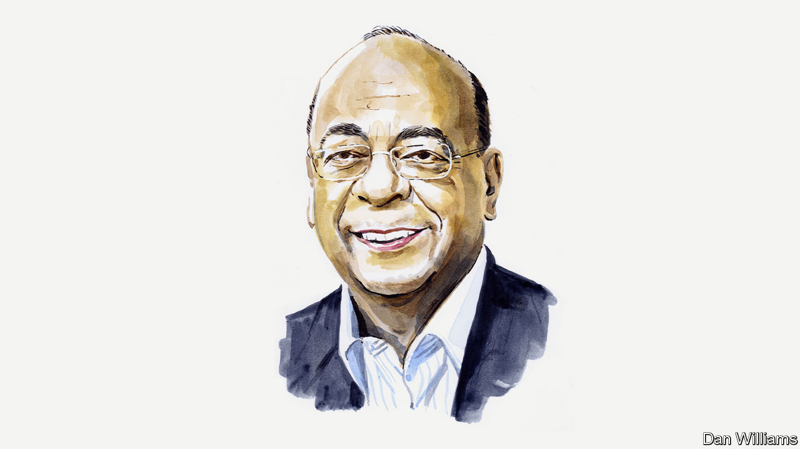

###### Africa and the world

# Mo Ibrahim on the need to reform international financial institutions 

##### The Sudanese-British billionaire says more African participation is crucial 

 

> Feb 21st 2023 

AFRICA IS AT the sharp end of the global “polycrisis”: the converging effects of climate change, the pandemic and the Ukraine war. None is of its own making. And the polycrisis comes as more than 800m people on the continent struggle to get enough to eat. More than half of low-income countries in debt distress or at risk of it are African. The continent is also home to the ten countries most vulnerable to the effects of , from storms to droughts and beyond–despite its low carbon emissions. On top of this, Africa is the continent with the lowest rates of  Some 600m people lack electricity and more than 930m are without clean cooking fuels. 

Africa is a huge continent with many countries. The challenges facing Morocco are not the same as those facing Mauritius or Mozambique. Yet there are improvements that could help all. African governments need to strengthen their governance and their institutions, as some have already begun to do. They also need additional money. This problem is exacerbated by Africa’s lack of representation at, and participation in, the global institutions that matter so much to its development. These institutions comprise the global financial architecture set up at Bretton Woods after the second world war. 

Faced with shared modern challenges, from climate change to pandemics, the current architecture is creaking. No wonder the global forums–from the G20 and COP meetings to the World Bank and the International Monetary Fund (IMF)–are not delivering. Significant reform is necessary. Voting at the IMF and the World Bank is skewed towards rich countries. Power is concentrated among a handful of developed countries that fund institutions in the knowledge that they will have a big say in how those bodies spend money. Wealth matters more than population. That means the system talks about Africa while rarely talking with Africans. 

To help the continent, the governments of America, Britain and France and their allies must update the systems they built two generations ago. Although African countries often could offer solutions to problems, their priorities are still largely excluded from boardrooms. Alongside other developing economies, African countries should instead be part of decision-making, and not just subject to the decisions of others. That way it can help to influence policies and processes from their inception.

I am not proposing a great switch where all of a sudden borrowers become more influential than donors. But there should be a rebalancing. At present at the IMF, for example, member countries are assigned a quota which determines the maximum amount of money they should each commit to the fund. That quota reflects a country’s “relative position” in the world economy. It is also the key determinant of a country’s voting power and how much IMF finance it has access to. Instead I think that population size and need should count for more than they currently do in voting allocation. This would grant borrowers greater voting rights, but donors should still retain considerable influence. It would be too easy otherwise for borrowers to lend out donors’ money!

There is far more to be done. Consider the commitment at the 2021 G7 Leaders’ Summit and at the 2021 G20 meeting to rapidly recycle $100bn in special drawing rights, a quasi-currency the IMF created in the 1960s to supplement reserve currencies and gold, as a means of boosting financing for African development projects. The scheme is still $40bn short of the target. And even if the $100bn were to emerge, the allocation of SDRs remains deeply unfair as it relates to the IMF’s quota system.

Take another example. The G20’s Common Framework is meant to assist countries on the verge of serious debt distress or default, but it moves far too slowly to be effective. As requested by African ministers at the IMF and World Bank meetings in October, the framework needs to become more effective and transparent. For starters, middle-income countries should become eligible for it. A new IMF trust to help countries weather economic shocks is an important step in helping countries with debt. But to really answer Africa’s needs, the IMF must increase its flexibility, its eligibility criteria, and how quickly it can provide support.

In addition multilateral development banks (MDBs), such as the World Bank, also need to update the way they do risk assessments and countenance more risk. That would allow their significant leverage–MDBs hold some $2trn–to be used more effectively. Nor should cautious managers, executives and board members overly rely on assessments from the main credit-rating agencies. Debate rages over whether they review African countries fairly. Happily, G20 governments are finally starting to make some positive noises about modernising MDBs. A recent independent report the G20 commissioned suggests that, among other steps, MDBs should make their data more available and that credit-rating agencies should update their approaches to such institutions. 

But Africa cannot, and will not, wait for the benefits of glacial reform. Faced with urgent needs and inadequate answers from the West, the continent is bound to work more closely with other countries. Admitting the African Union as a full-fledged member of the G20–supported by countries such as France and now America–is welcome. So too is the Bridgetown Initiative, launched last year by the prime minister of Barbados, Mia Mottley. It aims to tackle fiscal concerns and increase resilience to climate-related shocks in vulnerable countries through the IMF’s SDRs. But if we fail to find a way for young Africa to fit into the ageing multilateral system, then the system will become sclerotic and irrelevant. This is not just about responding to the crises of the moment. It is also about ensuring the multilateral system is fit for purpose in a changing world. ■


