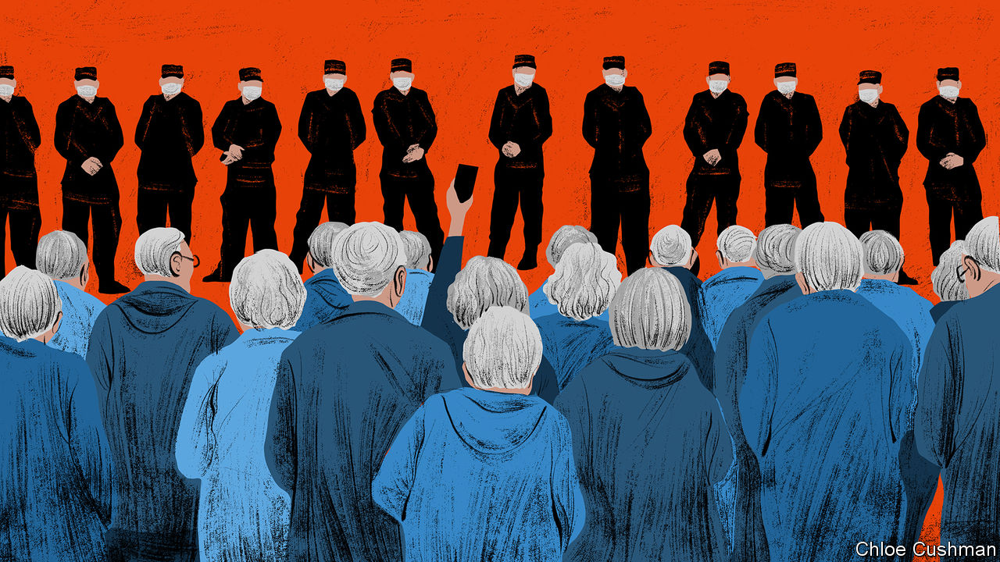

###### Chaguan

# China’s public is fed up, but not on the brink of revolt 

##### Why Chinese pensioners are protesting, in their own words 

 

> Feb 23rd 2023 

In China a show of discontent can matter without being a call to revolution. Currently, bold claims are being made for a spate of pensioner  provoked by changes to a health-insurance scheme for city-dwellers. It is true that the demonstrations have lasted an unusually long time, and have spread countrywide. Since January old people have gathered, from Guangzhou in the south to Dalian in the north, massing near government offices or in public squares to accuse authorities of robbing them. The largest crowds were seen in the central city of Wuhan, where in mid-February hundreds of retirees confronted policemen twice in the space of a week. To some overseas Chinese commentators, this all amounts to a  or a “white-haired movement”. That casts the unhappy pensioners as successors to the youngsters who protested against strict pandemic controls last November. Some of them held up blank paper to mock free-speech curbs, earning the label “white-paper movement”. Going further, some overseas Chinese outlets call today’s demonstrations a “white-haired revolution”, equating gatherings in Wuhan and elsewhere to a colour revolution, or 

It is also true that the Communist Party’s machinery of repression is taking these displays of anger seriously. Censors have laboured to scrub protest videos from the internet. Social-media platforms have deleted comments by netizens that charge the authorities with inflicting austerity on old people, and that blame spending cuts on costly “zero-covid” controls that emptied local-government coffers and battered the broader economy. There are reports of police warning pensioners that their adult children will suffer if they protest again. In Wuhan residents posted screenshots of messages from schools asking parents to urge older relatives to shun demonstrations and to study official explanations of the new insurance rules.

Yet for all that, to cast unhappy pensioners as dissidents is to do them a disservice, twice over. For one thing, it mischaracterises the protests, whose roots are more economic than ideological. To simplify, in future a greater share of China’s (relatively stingy) health spending will be directed to a pooled fund that helps urban workers and retirees needing hospital care for serious conditions. Less money will go into a parallel system of personal-insurance accounts covering minor ailments. It is those proposed cuts that are sparking pensioner protests, though officials argue that the planned redistribution will actually favour the oldest and sickest urbanites (they also insist that this restructuring of urban health insurance was planned many years ago, before zero-covid policies strained public budgets). Some demonstrators have sung the communist anthem, the “Internationale”, to emphasise that what they want is more socialism, not less.

Talk of a white-haired revolution does older protesters another disservice, too. It implies that dissenters must demand the party’s overthrow to be taken seriously. That is to ignore a less dramatic but important trend. Today a striking number of Chinese people are anxious and fed up, and are willing to say as much in public.

Chaguan flew to Wuhan to ask older residents to explain recent protests in their own words. His straw poll found unanimity on one point. Protests over insurance rules are not an anti-government revolt, locals agree. Instead, they fit into the Chinese tradition of petitioning authorities for redress. That some demonstrators now face police threats causes no surprise. China allows citizens to vent frustrations within limits, says a retired bus driver out walking her dog. “It is not like foreigners say, that Chinese don’t have any freedom,” she suggests. In her telling, China offers not total freedom, but “orderly freedom”, which is as it should be, though she hints that different limits apply to the rich and powerful. For her own part, she thinks older protesters have misunderstood insurance reforms that will bring them more benefits than harm. Still, she ventures, younger people understand why pensioners are unhappy, “because lots of old people died of covid.”

There is less consensus about whether petitioning helps. Speaking up about government policies “changes nothing”, say a couple in their 60s. A man heading home to cook for his son and grandson murmurs that opposing the party is a quick way to get arrested. In contrast, a former worker at a state-owned enterprise, sitting by one of Wuhan’s many lakes, is confident that the party will change course now that it knows that ordinary residents find the insurance reform “unreasonable”. A majority of those interviewed exempt President Xi Jinping and the central government from blame for recent protests, though in reality the insurance reform is a national policy. “Top leaders and the system itself are quite good,” says the former state-enterprise worker. “But how the local government acts now is not making people happy.”

More talk of fairness than of freedom

Less happily for Mr Xi, a common explanation for the protests is that China has grown more unequal and unfair. In particular, Wuhan locals charge that senior officials and party cadres receive more generous pensions and health insurance than other workers. An 80-year-old woman in Zhongshan Park, scene of two protests, calls China a society of “two extremes”: government employees and ordinary workers on low incomes and pensions. She urges pensioners to leave public parks and shout outside municipal and provincial government offices so that leaders can hear them. “I am old and can’t walk fast, so I can’t join them,” she laments.

Unprompted, several people make the same point: that for all China’s faults, America is worse. Echoing lines heard each night on state television, Wuhan locals cite American gun violence, racism and inequality as evidence that Western-style democracy is harmful. That is a warning for the future. Should slower growth turn popular grumbling into anything approaching a colour revolution, China’s rulers will see nationalism as their best defence.■


