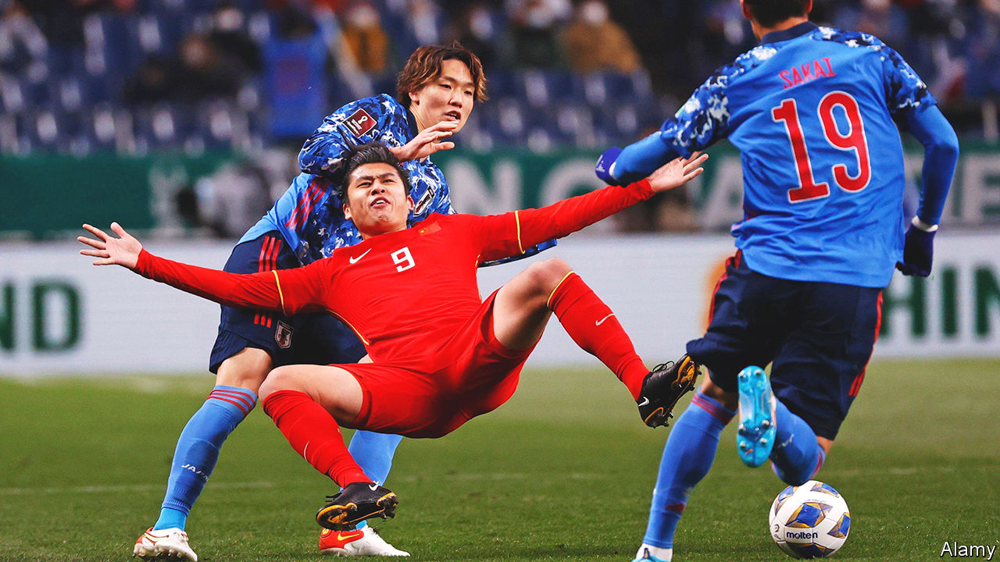

###### In the net

# China’s war on graft in football 

##### The country does some soul-searching about a glaring national weakness 

 

> Feb 23rd 2023 

Most of the time, Sima Nan is a cheerleader for his country and its ruling Communist Party. His posts on Weibo, China’s equivalent of Twitter, are often venomous about the West. But on February 20th his ire was triggered by affairs at home. In a lengthy message to his nearly 3.2m followers he excoriated , suggesting that “fundamental flaws” in the Chinese game were hampering the country’s efforts to compete in the international political arena, too.

Many Chinese fans share Mr Sima’s bleak assessment that . Their mood could hardly be more sour. At the finals of the football World Cup, which were held late last year in Qatar, China’s team was absent yet again. It has qualified to take part only once, in 2002, and even then was knocked out after losing all three of its matches without scoring a goal. Now the sport is under another dark cloud thanks to a series of arrests at the highest levels of its administration. It is by far the most sweeping campaign against corruption in Chinese football since China’s leader, Xi Jinping, came to power in 2012 and set about trying to turn his country into a soccer giant. 

The first high-level target was Li Tie, a former head coach of the men’s national team, who was arrested in November. In January two more were taken into custody: Liu Yi, who had just been replaced as secretary-general of the Chinese Football Association (CFA), and Chen Yongliang, a serving senior manager of the CFA. Among the latest to be detained is Chen Xuyuan, the CFA’s president. On February 14th the government agency in charge of sports said Mr Chen was being investigated for “serious violations of discipline and law”. Also that day it was announced that an executive of a big property firm who had served on the board of a provincial football club was being questioned. Rumours swirl on social media that other “big fish” may be netted. 

No details of any alleged offences have been released. But Chinese football is notorious for corruption involving match-fixing and “black whistles”, as bent referees are known. State media are comparing this campaign with another big anti-graft effort in 2009 that led to the jailing of several CFA chiefs, referees, coaches and players. It also prompted much soul-searching about the root causes of the malaise. Many blamed excessive involvement by officials in a cash-flush business. In 2015 the government unveiled a reform plan. It aimed to reduce the role of the state in football’s administration. The CFA was cut loose. 

In 2019 the appointment of the recently detained Chen Xuyuan as the CFA’s president was a sign of change. He was the first businessman to get the job. Mr Chen had previously worked as the boss of a state-owned port operator in Shanghai which had bought a local football club and made it successful. At the CFA, however, some of his decisions reflected the government’s interfering style, such as capping salaries and transfer fees. He even required clubs to stop naming themselves after sponsors. These were blows to the football business, which has also suffered from the country’s tough pandemic controls (they were scrapped in December).

Penetrating the defence

In China, where political debate is stifled, complaints about football can sometimes look like pokes at the way the country works. The post on Weibo by Sima Nan, the nationalist blogger, was blocked by Chinese censors. But the , a newspaper in Beijing, managed what could be construed as a gentle dig. “In the realm of football, a lack of separation between government and society, between government and business…inevitably breeds corruption,” it said. ■


