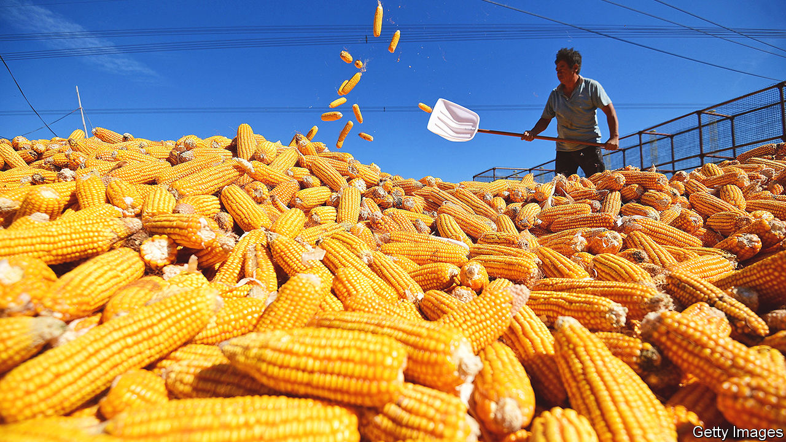
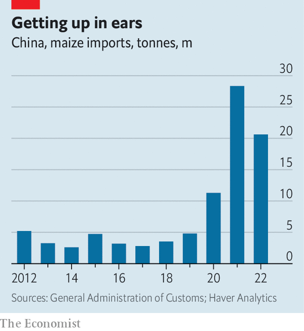

###### Policy maize

# Is China’s attitude to genetically modified crops changing? 

##### A loosening of restrictions may be in the offing 

 

> Feb 23rd 2023 

Three decades ago, when it allowed the commercial production of virus-resistant tobacco plants, China was on the cutting edge of genetic modification in . Back then there was heady talk of growing most of the country’s rice, wheat and maize using genetically modified (GM) strains by 2010. That did not happen. But China’s supreme leader, Xi Jinping, renewed the optimism in 2013, when he argued that GM crops were needed to ensure the country’s food supply. An official five-year planning document issued in 2016 called for commercial production of GM maize and soyabeans to begin by the end of 2019. That did not happen either.

Is , the world’s largest soyabean market and second-largest maize market, at last ready to embrace genetic modification in agriculture? Not exactly. But according to Reuters, a news agency, the agriculture ministry is set to authorise the planting of 267,000 hectares of GM maize in selected counties across four provinces. If undertaken, the planting would cover less than 1% of the acreage China has earmarked for maize this year. Still, it would represent a rare loosening of China’s strict controls on GM crops.

Though most scientists think GM crops are safe—and much of the world has been eating them for decades—they have faced stubborn opposition in China. Some of the concern is similar to that seen elsewhere. The public has expressed worries about “Frankenfood”, the danger of toying with nature and unverified health risks. But there is also a uniquely Chinese element to the opposition. Nationalists fear that a reliance on GM crops will leave China at the mercy of foreigners, especially Americans, who control much of the relevant technology and intellectual property.

 


China’s aversion to GM crops is causing other problems, though. As domestic meat consumption rises, and livestock and poultry breeding expands, the demand for feed grains such as maize and soyabeans is growing. (Feed grains already account for much of the country’s total grain consumption.) More GM crops would help. According to the Food and Agriculture Organisation, an arm of the United Nations, Chinese maize yields were 6.3 tonnes per hectare in 2020, compared with 10.8 in America, where GM varieties predominate. But instead of embracing the technology, China has increased maize imports from countries such as America, Argentina, Brazil and Ukraine (see chart). That carries risks of disruption resulting from tensions with America or the war in Ukraine.

Some in China see the government’s rumoured move, small though it may be, as a turning-point. Zhu Zijun, the manager of an investment fund that focuses on agriculture, recently told a local trade publication that the debate over GM maize is all but finished. Regulators and grain companies, she said, have started to prepare for reforms. Also raising hopes is an emphasis on agricultural biotechnology in the official document outlining policy priorities in rural areas for 2023.

Opponents of GM crops may grumble, but in some ways they have already lost the fight. For years China has depended on imported GM soyabeans for its animal feed and food oil. Much of the cotton grown in China consists of GM varieties. And investigations by reporters and ngos have revealed that a good bit of the maize produced in China also comes from illegally sown GM seeds. Even if “Frankenfood” were a real problem, the monster is already on the loose in China. ■


