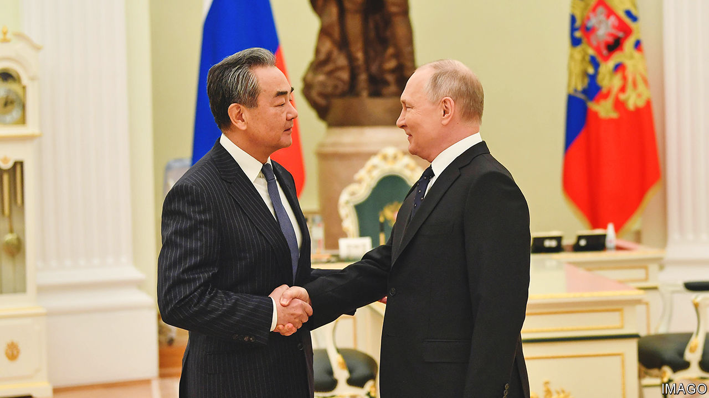

###### Proxies and peril

# The conflict in Ukraine risks inflaming the Sino-American rivalry 

##### If China teams up with Russia there will be a world war, says Ukraine’s president 

 

> Feb 20th 2023 

THE SYMBOLISM could not have been clearer. As America and China drift towards a new cold war, the conflict in Ukraine has increasingly resembled a  between the two powers and their rival ideological systems. So when China’s top diplomat, Wang Yi (pictured), travelled to Russia on February 20th, it was only fitting that President Joe Biden should  on the same day. China, which dislikes instability, probably did not welcome Russia’s bloody invasion of Ukraine, but it has sought to make the best of the war, manoeuvring to undermine the unity of Western countries. Mr Biden’s trip, planned in secret, was designed to demonstrate .

It all comes amid a flurry of Chinese diplomacy surrounding the one-year anniversary of the war. On February 18th, at the Munich Security Conference, Mr Wang announced that China would offer a proposal to stop the fighting. Days later his government re-released its “Global Security Initiative”, nearly 3,500 words of Communist Party-speak filled with calls to respect countries’ sovereignty and territorial integrity. China’s leader, Xi Jinping, is expected to give a “peace speech” on February 24th, the date of Vladimir Putin’s invasion.

These efforts ring hollow to American and European officials. Just weeks before Mr Putin launched his invasion, Mr Xi agreed to a “no-limits” partnership with Russia. While in Moscow, Mr Wang said the relationship remained “rock solid”. China claims to be neutral in the war, but it is a pro-Russian pseudo-neutrality. Officials in Beijing have spent a year promoting Kremlin talking-points. China accuses America of prolonging the fighting in order to boost the profits of its arms dealers. Chinese firms have supplied non-lethal aid to Russia, according to American officials. Now China is considering sending weapons and ammunition to Mr Putin’s regime, warned Antony Blinken, America’s secretary of state, in Munich.

Relations between America and China were already at a low point. Each side has come to believe that the other is bent on doing it down. Earlier this month an attempt to lower tensions with a visit to Beijing by Mr Blinken was derailed by a different incursion, that of a Chinese balloon into American airspace. Claiming China was spying, the Americans shot the inflatable down on February 4th. A subsequent discussion between Mr Blinken and Mr Wang in Munich was described as confrontational. America claims Chinese balloons have intruded into the airspace of more than 40 countries across five continents. But Mr Wang insisted that the balloon over America was for research purposes, and called the Biden administration’s response “absurd and hysterical”.

The stakes of that squabble seem small compared with what is on the line in Ukraine. China does not care who controls this or that bit of territory. Its national interests lie in discrediting American-led defence alliances and sanctions, because its rulers could one day face a comparable American response over a Chinese invasion of Taiwan. Mr Xi calls Mr Putin his “best friend” and the pair share a common loathing of Western liberal democracy. But their partnership is based on a cold-eyed calculus of Chinese interests. Russia is making itself useful by tying up America in Europe and creating opportunities for Mr Xi to woo those leaders in the global south who wonder why their countries’ woes do not receive as much attention as those of Ukraine. China also shares Russia’s desire to see a world run not on the basis of what the West calls “universal values”, but of the security interests of big states. Mr Putin may be brutal and his armies dismayingly incompetent, but China believes his invasion advances this worldview.

That will inform any peace initiatives put forward by China—and probably doom them. Officials in Beijing like to portray the conflict in Ukraine as “America’s war”, provoked by NATO expansion rather than Russian aggression, and paid for by Europe in the form of higher energy prices, larger armies and the burden of hosting Ukrainian refugees. In this way it has tried to divide America and Europe. In Munich Mr Wang made a pitch to European leaders that China wants to improve relations and play a constructive role in Ukraine. Some might be inclined to take him at his word. 

But China does not want Mr Putin to pay any price for his invasion, lest that reaffirm the rules-based order that it seeks to break. This does not sit well with European leaders. Even the more cautious among them, such as Emmanuel Macron of France and Olaf Scholz of Germany, told the conference in Munich that Mr Putin cannot walk away from his war rewarded for his aggression. For all that some European leaders grumble about American moves to divide the world into blocs, or fret about isolating China, their view that Mr Putin cannot be seen to win his war puts them in close alignment with the Biden administration—and far from Chinese visions of a peace deal paid for with concessions and security guarantees for Mr Putin. 

America, for its part, has warned against any ceasefire that would allow Russia to regroup, or that would lock its territorial gains in place. Tactically, the Biden administration is treating China much as it did Russia on the eve of its invasion, by publicising intelligence about its actions, such as Chinese aid to Russia, in the hope of increasing global scrutiny. It appears to be working. Ukraine’s president, Volodomyr Zelensky, told German reporters that “if China allies itself with Russia, there will be a world war.” The European Union’s foreign-policy chief, Josep Borrell, said it would be a “red line” for the EU if China sends arms to Russia. 

Mr Putin says that Mr Xi will visit him in Moscow soon, as relations between their countries reach “new frontiers”. Meanwhile, China is hunkering down. “It is the United States, and not China, that is endlessly shipping weapons to the battlefield,” said Wang Wenbin, a spokesman for the foreign ministry in Beijing. “We urge the United States to earnestly reflect on its own actions and do more to alleviate the situation, promote peace and dialogue, and stop shifting blame and spreading false information.”

Statesman or troll?

China wants to be seen as a peace-loving giant that sticks up for forgotten parts of the world and counters Western hectoring. Its argument that states should focus on economic advancement and poverty alleviation rather than civil liberties and human rights gets considerable traction in developing countries. So does China’s portrayal of the war as the latest example of Western-inspired global disorder, sending food and energy prices higher. By offering a peace proposal, no matter how unrealistic, it can pose as a benign world leader with more legitimacy than America. 

But that message is received differently in the capitals of liberal democracies. Europeans may not like everything about America’s hawkishness on China, but they know a self-serving Chinese argument when they hear one. If China keeps putting out anti-American apologias dressed up in Communist Party jargon about security, peace and development, it will only strengthen fears that a proxy conflict on the blood-soaked plains of Ukraine risks becoming a global confrontation. ■


