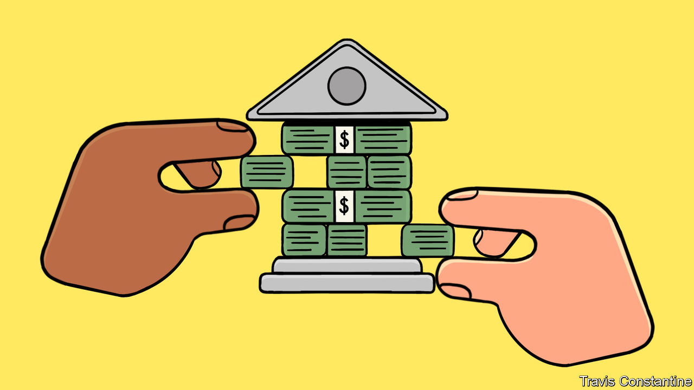

###### America’s Federal Reserve

# A new book traces the evolution of the Fed’s extraordinary powers 

##### After saving the economy, the mighty central bank confronts its limits 

 

> Feb 23rd 2023 

By Jeanna Smialek. 

“There’s an infinite amount of cash at the Federal Reserve.” This comment, made in March 2020 by Neel Kashkari, president of the Fed’s branch in Minneapolis, was intended to provide reassurance. As covid-19 struck, markets were in meltdown and economic disaster loomed. The central bank swung into emergency mode, injecting vast, if not quite infinite, sums of cash into the financial system in order to avert a crisis.

The actions worked a little too well. Before long, growth was recovering, markets were booming and price pressures were building. The Fed ended up having to fight America’s worst outbreak of inflation in decades—a fight .

This sharp duality poses a dilemma for any appraisal of the Fed’s record during the pandemic. Should the focus be on the potential chaos early on and its courage in devising unprecedented solutions? Or on the aftermath of its rescue operations and the bank’s slowness to realise that its new and  was inflation? In the thick of the inflation battle, it is tempting to emphasise the Fed’s missteps. “Limitless” by Jeanna Smialek of the  is a useful corrective. She provides a bracing account of just how badly things could have turned out when covid shutdowns led millions to lose their jobs overnight—and pushed the financial system to the brink of collapse.

In one passage she describes a meeting in late February 2020, a couple of weeks before most Americans started paying close attention to the pandemic. Jerome Powell, the Fed’s chairman, asked Richard Clarida, his second-in-command, whether this might turn into a repeat of the global financial crisis of 2007-09. “No,” Mr Clarida replied, “the worst-case scenario means it basically looks like the Great Depression.”

That warning soon seemed prophetic. Global commerce ground to a halt, stocks plunged and long queues formed at food banks. A deep freeze in credit markets portended a still graver calamity, striking at core parts of the financial system that had remained safe even in the darkest days of 2008. By the end of March 2020 the central bank had announced that it would buy corporate bonds for the first time in its history. Ultimately, the Fed’s balance-sheet swelled to nearly $9trn, a breathtaking increase, and more than double its size at the start of the pandemic.

It only got to that point because of the institution’s rapid evolution over the previous two decades—a history crisply laid out by Ms Smialek. It was , the Fed’s chairman during the global financial crisis, who pioneered many of the tools deployed and enlarged by Mr Powell. More than that, though, an intellectual shift had persuaded officials that they could let the labour market run hotter than once believed without triggering an inflationary spiral. 

Ms Smialek paints nicely textured portraits of the main participants in these debates, spanning the gamut from one near-libertarian regulator to his more interventionist sparring partner. In late 2020 Mr Powell ushered in a new policy framework which, in effect, committed the central bank to keeping interest rates lower for longer than it might have previously done. In retrospect critics have singled that out as a dangerous mistake.

The title of the book refers not just to the Fed’s seemingly endless support for the economy when disaster strikes but also to its mission creep over the years. Some want it to aim for greater racial equality or to treat climate change as a financial risk. Others think it should craft a new digital currency. These are important issues. But contrary to the perception of boundless powers, the fact is that the Fed faces two kinds of very real constraints. 

The first are political: central-banking independence is a precious inheritance from hard experience and can be preserved only by staying, as far as possible, above the ideological fray. The second are economic: stubbornly high inflation is a stark reminder that loose monetary policy can go too far. From today’s perspective, the Fed looks more limited than limitless. ■


