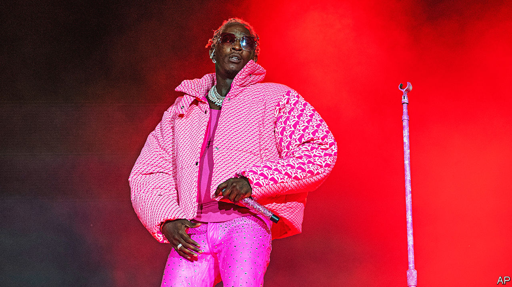

###### The singer and the song

# At Young Thug’s blockbuster trial, rap lyrics are used as evidence 

##### Their use in court raises issues of prejudice and free expression 

 

> Feb 23rd 2023 

READ ALOUD in court, the words sounded like a confession: “Fuck the judge…this that mob life…cookin’ white brick.” Not long ago the defendant, Jeffery Williams, was rapping these lines on stage. Now the songs that propelled him to fame as “Young Thug”, earning him a Grammy award and an appearance on “Saturday Night Live”, are being used against him. Prosecutors in  allege that his record label, YSL, which stands for Young Stoner Life, is both a music collective and a violent gang. They say Young Thug (pictured) is its kingpin—and cite his lyrics as evidence. Mr Williams denies criminal wrongdoing of any kind. 

The trial, which began in January and could last several months, involves numerous other defendants associated with YSL who also protest their innocence (though some have taken plea deals). It is far from the first to enlist  as evidence. In both America and Britain the practice has become increasingly common. But most cases involve amateur artists, usually young black men. Young Thug’s is the most high-profile yet, crystallising questions of freedom of expression, racial bias and the place of art in court. 

Rap music first went on trial in the 1980s when gangsta rap, a new genre, was the sound of America’s streets. In a break from some early hip-hop artists, whose lyrics rarely mentioned crime, gangsta rappers evoked drugs and violence in provocative songs, such as NWA’s “Fuck Tha Police”. At first some such lyrics were themselves considered a crime: 2 Live Crew, a rap group, were tried under obscenity laws. The music became only more popular, so authorities found a different way to stigmatise rap, says Erik Nielson, co-author of “Rap on Trial”: using lyrics as evidence against artists charged with other offences, typically relating to drugs or violence.

The number of trials involving rap lyrics has surged since the late 2000s, boosted partly by social media. More rappers can now reach a wide audience online, but in doing so they unwittingly provide material for the authorities. In America and Britain police monitor social media for lyrics and music videos, which are sometimes used in trials (in London the Metropolitan Police  to that task). Belonging to a rap “crew” is sometimes conflated with membership of a criminal gang, says Jack Lerner of the University of California, Irvine School of Law.

Meanwhile the internet and streaming data have affirmed the appeal of violent themes in rap music. To stand out, artists must “sound as real as possible”, said Loski, a British rapper who makes  that uses grisly lyrics, at a recent trial. “If rapping about a sunny day in the neighbourhood made the most money, many young African-Americans would,” says Mac Phipps, who spent 21 years in jail for manslaughter after a trial featuring lyrics.

Atlanta, home to Young Thug and YSL, produced , the most popular rap subgenre of recent years. Drugs and crime are staple themes: “I told them to shoot a hundred rounds,” runs a line in Young Thug’s track “Anybody”. As Atlanta became a hip-hop capital, and as its music grew gorier, gang , says George Chidi, a local crime journalist. The authorities think rappers have fuelled gang disputes, including between YSL and a rival group known as YFN, headed by YFN Lucci, another popular rapper.


Prosecutors say Young Thug’s lyrics mention real crimes committed in that gang rivalry; he stands accused of conspiracy to commit racketeering, along with weapons-related charges and others (all of which he denies). One line included in the case against YSL is “She getting robbed by Tick”, a possible allusion to a YSL artist previously arrested for robbery who has taken a plea deal in the current trial. “If you decide to admit your crimes over a beat, I’m going to use it,” said Fani Willis, district attorney for Fulton County, which includes most of Atlanta. She thinks lyrics should be treated in the same way as other evidence that, according to prosecutors, implicates Young Thug in serious crimes. 

Others disagree. Politicians including Stacey Abrams have expressed concern about the use of lyrics as evidence. “Rappers are storytellers,” protested Drake, Coldplay and other recording artists in a joint open letter; the trial, they maintained, is “an attempt to criminalise black creativity and artistry”. Young Thug’s lawyer says his lyrics should be barred from court and that they are written from the perspective of a fake persona. That is a common trope in rap, which is replete with metaphor, exaggeration and violent motifs—yet in court, generic or fictional lines are sometimes presented as facts, or as if they refer to specific crimes. 

Other art forms are rarely treated in this way. A recent  investigation found just four American cases since 1950 in which other kinds of lyrics or fiction were enlisted as evidence of assault or violence. Hundreds of criminal cases involved rap. Murder ballads are common in country music; country stars are not arraigned for them. Then again, says Mr Chidi—invoking a famous country song about a killing—“there was no dead body in Reno to track to .” By contrast, “people in Atlanta were murdered.”

Jurors, who may not know much about rap, are often told little about its conventions. Prosecutors may employ “experts” to parse lyrics, typically police officers. Some reportedly use the online Urban Dictionary or Wikipedia to translate slang. One told a jury that “bredrin” meant “associate” in a gang, when it usually just means “brother”, says Richard Bramwell of Loughborough University, who has defended rappers as an expert witness in Britain.


Some argue that even if lyrics do refer to real crimes they should be kept out of court. The term “rap music” can itself invoke racial biases, prejudicing jurors against defendants and leading them to misconstrue other evidence, says Mr Lerner. A recent study showed that people were more likely to consider lyrics to be threatening, and drawn from life, when told they came from rap rather than country. If a case is strong, critics say, guilt can be proved without involving music.

Lawyers, artists and activists have called for restrictions on the use of lyrics in trials. In 2022 California passed the first such law, which requires judges to consider whether “creative expression” would “inject racial bias” and “undue prejudice” before admitting it as evidence. It applies to all forms of art, but was inspired by rap. In New York a proposed bill—backed by Jay-Z, a hip-hop star—would ban rap lyrics from court if they do not have factual links to the case. A federal bill has been mooted. Others believe making more use of genuinely expert witnesses would make trials of amateur rappers fairer. 

Mr Nielson will soon be performing that service for Young Thug. In court in Atlanta, he will attempt to put into context such lines as: “I never killed anybody but I got something to do with that body.” ■


