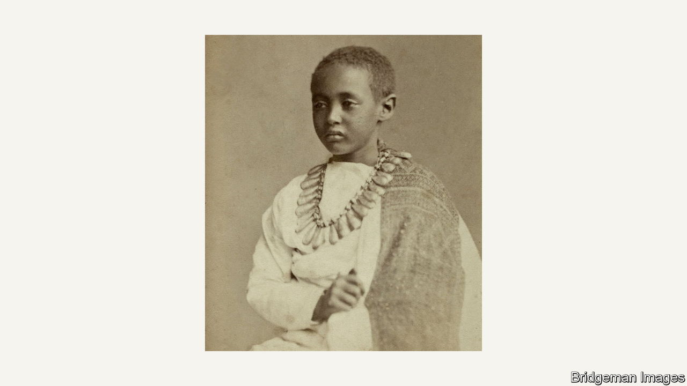

###### Back Story

# How an Ethiopian prince came to be buried at Windsor Castle 

##### His story is a parable of the pain and guilt of colonial-era looting 

 

> Feb 23rd 2023 

In a corner of St George’s Chapel at Windsor Castle, beside a 500-year-old chantry, is an ornate bronze plaque inscribed in English and Amharic. Nearby, it explains, lies buried Alamayu—the son of Tewodros II, Abyssinia’s king of kings—who died in 1879. “This tablet is placed here to his memory by Queen Victoria,” the plaque records, sentimentally concluding: “I was a stranger and ye took me in.”

That is one way of putting it. The story of how Alamayu came to be buried at Windsor Castle is a wild, sad saga of violence and looting. Today Ethiopia (as Abyssinia became) wants his remains back. Unusual as his case is, it cuts to the heart of the wider,  over the restitution of colonial-era plunder.

A sometime moderniser and now a hero to many (though not all) Ethiopians, Tewodros became irked with Britain and held several dozen Europeans captive at Maqdala, his highland citadel. In 1868 an Anglo-Indian military force, complete with elephants and artillery, freed the prisoners and killed hundreds of Tewodros’s men. He shot himself as his fortress fell. Crowns, robes and jewellery were pillaged by the British, along with sacred artefacts and .

As Andrew Heavens relates in his vivid new book, “The Prince and the Plunder”, they also grabbed Alamayu, then seven years old. Photos of him taken soon after his father’s demise suggest a heartbreakingly glum child. His mother died on the march from highlands to coast, having supposedly requested that he be cared for in Britain. 

Alamayu means “I saw the world”. He did, but it was an unhappy odyssey with no homecoming. Back in Britain, Queen Victoria took a shine to him. He crossed paths with Tennyson and Darwin. After brief stints in India, Singapore and Malaysia, he had testing spells in British boarding schools, then a miserable one at Sandhurst military college—officialdom having decided he should join the British army, which, writes Mr Heavens, had “invaded his country, killed his father and blown his first home to pieces”. He died of pneumonia at 18 and, at Victoria’s behest, was buried in the catacombs at Windsor.

As for the rest of the Maqdala loot: in 1871 Gladstone, then Britain’s prime minister, decried the pillage in Parliament. A few items have trickled back to Ethiopia, including hair cut from the king’s corpse. But much of the booty remains in British institutions such as the Victoria and Albert Museum (V&amp;A) and the British Museum (BM), which in 1868 even sent a collector on the raid. The BM holds—but does not display—11 tabots, plaques that are supremely sacred to the Ethiopian Orthodox church, itself a pillar of national identity for many Ethiopians. 

All this is part of “the history and story of Ethiopia”, comments its embassy in London, which has asked for its treasures, too, to be returned. Both the V&amp;A and BM say that, as it stands, British law prevents them releasing the objects from their collections—as with other contested items such as the  and Parthenon sculptures. As for the tabots, the BM says it aspires to lend them to an Ethiopian Orthodox church in Britain.

The basic problem, thinks Frezer Haile, a former adviser to the Ethiopian government, is that there is no effective international mechanism for resolving claims over colonial-era plunder. The UN’s culture agency, UNESCO, has a sleepy committee on the subject, but redress tends to come through ad hoc concessions by individual countries or museums. The widely agreed principles on dealing with art stolen by the Nazis offer a model, he reckons.

That is a sensible if ambitious aim. Yet quite apart from the bureaucracy and the rules, there are other hurdles, emotional and political, in this and similar discussions—hard, unpalatable truths to which poor Alamayu testifies. 

The authorities at Windsor say it would be difficult to exhume him without disturbing the resting places of others (some hope Britain’s new king will take a different view). While his remains are there, though, immured in the walls of the royal chapel with English monarchs, Alamayu embodies a key historical fact: responsibility for the sins of  goes right to the top. Museums like the BM take a lot of flak for retaining looted goods, but the ultimate culprit, in this and other ransackings, was the state.

Alamayu bears another message too. Many objects taken from places such as Maqdala are precious and revered. But the pain and debt of imperial exploits are measured not just in artefacts but in people; not in treasure, but in blood.


