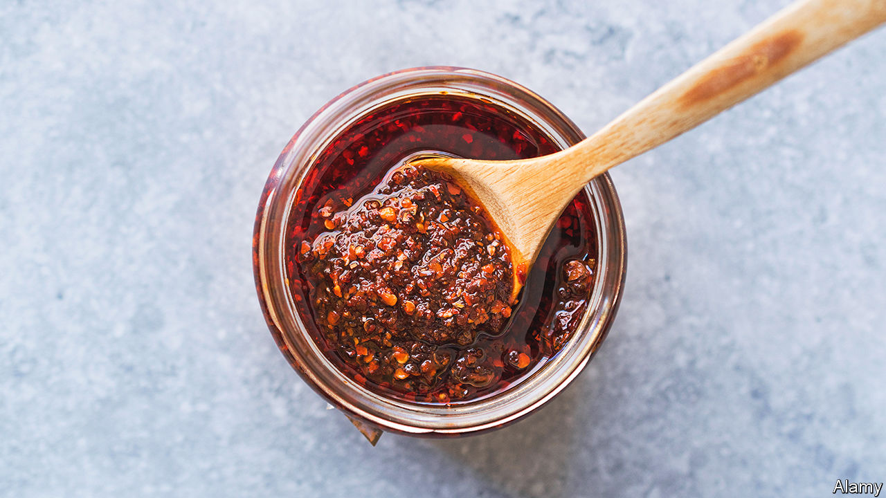

###### World in a dish

# The rise of chilli crisp is a study in how foods become fads 

##### In lockdown, people in the West discovered an age-old Chinese condiment 

 

> Feb 23rd 2023 

For some, cooking during lockdowns was a chance to try out the kind of time-consuming, intricate food preparation that the rush of ordinary life makes impossible. Endless loaves of  were produced, along with bubbling kombucha. For others, it was an experience of drudgery. Making three meals a day, especially if your diners included small children, was tedium defined—an endless loop of eggs and beans and eggs and toast and beans and toast and eggs.

Enter condiments. They satisfied both tribes. For the enthusiasts, it was a chance to make the dips and drizzles usually provided by the local deli. For the weary, a jar of something spicy or sour was an easy way to enliven the umpteenth cheese toastie. Chilli crisp—a glowing red oil, heady with chilli and heavy with crisp fragments of garlic and shallots as well as fermented black beans and sesame—became the sauce of the moment. The place it has secured in many fridge doors since then hints at how foods become fashionable.

People in China may have been bemused by the revelatory joy with which those in countries such as America . They have been eating varieties of the stuff for centuries. Lao Gan Ma, made in the south-western province of Guizhou, is the most famous brand. Its founder, Tao Huabi, started selling noodles coated with the sauce in 1989, setting up a factory a few years later. Her face peers out sternly from every label on the 1.3m bottles the company says it now produces a day. (Heinz’s plant in the Netherlands makes about 10m bottles of ketchup a week.) 

It took a pandemic to bring the delicacy to the rest of the world’s attention. Chilli crisp had many of the necessary characteristics to be a hit. It is spicy, but not overly so. It is delicious slathered on noodles, as originally intended, but it can also be added to fried eggs and other dishes familiar to Americans. It satisfies humans’ love of crispy foods, rooted in an evolutionary preference since crunchiness is often an indicator of freshness.

Usually tastemakers visit restaurants and interview chefs to immerse themselves in what people are cooking and eating, says Kevan Vetter of McCormick’s Flavour Forecast, which predicts and influences which tastes become popular. In lockdown that was no longer possible. Instead they had to watch what cooks, both home and professional, were making via social media. The answer, along with banana bread, was chilli crisp. 

Today’s question is not whether people will keep eating it. The liberation of  has not dulled the delight of the condiment. The East Asian population in America and Britain is growing. Many new brands have joined Lao Gan Ma. Like salsa, which once seemed exotic, chilli crisp is set to become a pantry staple. 

The question is whether amateurs will keep making it. Nobody bothers making ketchup: as a condiment is assimilated, people develop a taste for the mass-produced version. And in the case of chilli crisp, Ms Tao might argue that the commercial option is as authentic as it gets. ■


