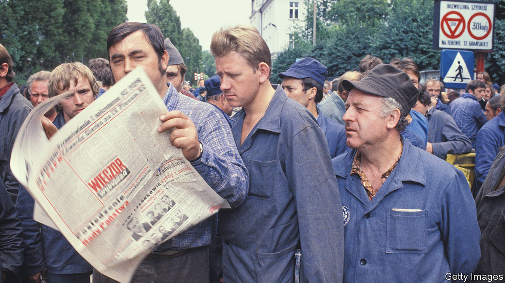

###### European history

# Timothy Garton Ash travels across Europe and into its past 

##### “Homelands” is a trip down memory lane on a continental scale 

 

> Feb 23rd 2023 

 By Timothy Garton Ash. 

History can be found not only in books and archives, but in people, too. Take the white-haired Jewish lady whom Timothy Garton Ash, a British historian, met at an art gallery while living in Berlin in the 1970s. Hailing from the Soviet-controlled eastern part of the city, she had first-hand experience of not one, but two totalitarian regimes. After a hasty departure from Berlin in the 1930s, she had ended up in one of Stalin’s labour battalions while her husband languished in a gulag. Mr Garton Ash praised her in his diary; later he learned she had informed on him to the Stasi, the East German .

Personal memories matter in Europe, where the remembrance of recent horrors has shaped modern politics—notably the (nearly) continent-wide push towards ever-closer union in the aftermath of the second world war. A prolific essayist who teaches European studies at Oxford, Mr Garton Ash has over five decades’ worth of other people’s recollections to add to his own. “Homelands” is a trip down  on a continental scale.

The period he describes starts, roughly, with his first solo visit to the continent in 1969 (to France, for a language exchange). The mainland was different from its offshoot island—then, as now, on the sidelines of European institutions. Still, Mr Garton Ash describes the curious feeling of being “at home abroad”. Every trip to the continent, including stints living there, reinforces his notion that as a European you can have more than one homeland.

Unusually, Mr Garton Ash grasps the mood not just in France or Germany, but in bits of Europe farther east (speaking Polish, his wife’s mother tongue, helps). He is most insightful in recounting travels in the 1980s to the then-communist bloc to meet striking Polish dockers (pictured) or Czech revolutionaries. His book can be downright chilling, too. In 1994 he came across a little-known aide to the mayor of St Petersburg. Few listened as , a “short, thick-set man with an unpleasant, vaguely rat-like face”, railed about former Soviet territories that “belonged to Russia”. The rest is not so much history as current affairs.

The book’s tone shifts as it describes more recent times. Mr Garton Ash notes how, in the wake of the cold war, and particularly after the terrorist attacks of 2001, his homelands gradually disappeared from the front pages of newspapers, often in favour of rising Asia. “Europe led only in the Style pages,” he bemoans. Historians like big-ticket events, and Europe for many years became in large part a story of the dull grind of building a single market, and expanding the EU eastwards. Then came Brexit, which Mr Garton Ash treats as a personal affront. And finally, the unwelcome return of events as that rat-faced fellow turned his attention to Ukraine.

“Homelands” is not an organised chronicle of modern Europe. Led by anecdote, there is no sweeping narrative that explains why the continent is the way it is. That is occasionally frustrating. Stories of protests, revolutions and chance encounters are gripping, but often the reader is assumed to know the wider context in which they happen. The manner in which once-poor parts of the continent have converged with the world’s richest countries in record time features too little.

There have been other personal histories of Europe. During a more extreme bout of continental turmoil, the Austrian writer  fused memoir and history in “The World of Yesterday”. The day after he submitted the manuscript in 1942, he and his wife committed suicide in Brazil. Despite the tragedy of Ukraine, Mr Garton Ash remains more hopeful about the place he still calls home. ■


