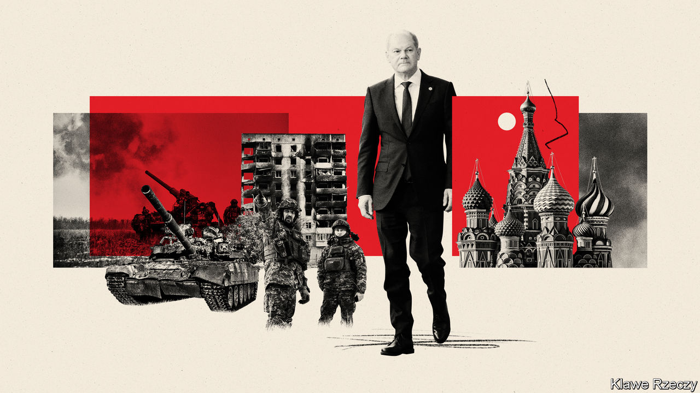
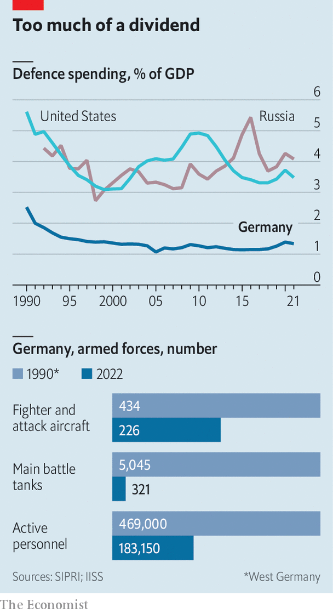

###### The slow shift of Mr Scholz

# A year on, Olaf Scholz’s promise of transformation is only partly kept 

##### Germany’s armed forces are woefully run down 

 

> Feb 23rd 2023 

Just three days after Russia unleashed its “special military operation” to grab Ukraine, Olaf Scholz, Germany’s freshly elected chancellor, proclaimed a moment of epochal change. The term he used in a speech to parliament on February 27th last year was , a “turning in time”. The last such shift, known to Germans simply as , was the movement of 1989-90 that reunited communist East Germany with the capitalist West.

Listeners in Germany and abroad, notably those who have long pleaded for the EU’s biggest and richest state to take its security more seriously, cheered. Not only did the dour Social Democrat, whose party has since the 1970s preached pacifying Russia, condemn its aggression and lend full support to Ukraine. Mr Scholz pledged an extra €100bn ($107bn)—double the annual defence budget—to boost Germany’s defence, as well as to push future military spending above the goal of 2% of GDP that NATO members have promised since 2006, but mostly failed to sustain. He also vowed to end dependence on Russian energy.

 


One year later, where is Mr Scholz’s going? The easy answer is that while his government has met some promises, including generously aiding Ukraine and greatly boosting Germany’s energy independence, Mr Scholz’s three-party coalition has often moved unsteadily. It has flailed badly over the toughest promise, to overhaul the rusted and neglected German army. “In my view we have lost a year because almost nothing was done,” says Heinrich Brauss, a former lieutenant-general and top NATO official. 

A more complicated answer is that, given Germany’s pinched geography, heavily loaded history and complex politics, the process of changing course is necessarily clumsy. Yet although this may be taking more than many would like, there are indications that sweeping changes are indeed happening. Asked to score the government on its overall  achievement, Mr Brauss at first awards a meagre three or four on a scale of ten. But on second thoughts, taking in the scale of Germany’s help to Ukraine, its energy transition, the sea-change in public attitudes towards security and the government’s current trajectory, he raises the score to five. He is delighted with the belated appointment, in January, of Boris Pistorius as defence minister. The man fits the task and is clearly engaged, enthuses the ex-general. “At least in defence, I feel like the is now about to start.”

Turning a supertanker

When a horde of fancy guests packed into the plush Bayerischer Hof hotel in mid-February for the 59th annual Munich Security Conference, their German hosts projected confidence and satisfaction. Mr Scholz could tick off plenty of achievements for the ballroom audience. Ukraine remains free, the NATO alliance strong. German help to Ukraine, starting with taking in over a million refugees, has been vital: its commitment of €13.3bn in combined financial and military aid ranks second only to America’s. Having on January 25th approved the supply of German-made Leopard tanks to Ukraine, the chancellor could even take a swipe at countries that had for months charged him with foot-dragging, but were now failing to deliver their own tanks. 

In truth the scrap over Leopards brought little glory to any of Ukraine’s allies. A far clearer success for Germany has been its disentanglement from energy dependence on Russia. This is indeed a sharp U-turn. When Russia shut off gas supplies in midsummer last year, the talk was not just of recession but of Germany’s doomed economic model. Instead, helped by a mild winter and a temporary boost to coal-burning, gas consumption fell by 20% even as the government splashed out to secure alternative supplies, and at record speed set up multiple terminals to unload liquified natural gas. As energy prices then tumbled, fears of an economic slump softened into predictions of mild dip before a return to normal in the spring. 

A success less easy to quantify is Mr Scholz’s deft navigation of dangerous politics. The taciturn chancellor is no great communicator. Among opinion-makers, many chafe at his penchant for consensus-building over bold action. Whether you call it plodding or plain stubborn, however, Mr Scholz’s patience seems to tow opinion to where he needs it to go. Until the speech few Germans would have consented to breaking an unspoken ban on sending weapons into war zones. By letting such notions percolate rather than forcing the pace, the chancellor has kept his public on board. Polls show that his slow decision on tanks matched a lumbering shift in opinion, leaving the opposition little room to snipe at his overall policy on the war. Though the dithering exasperated allies to the east of Germany, where passions against Russia rage highest, it reassured some in the west who remain wary of escalating the conflict. 

Delaying Germany’s own military transformation cannot be so easily excused. At the end of the cold war, no country embraced the “peace dividend” with as much enthusiasm. The Bundeswehr has shrivelled from Europe’s biggest land force to a shadow. In 1990 it fielded over 5,000 main battle tanks. Today it has 321. By some estimates its ammunition stock would last just two days in a real war; restoring adequate levels could cost €20bn. In December the Bundestag’s defence ombudsman revealed that the army has more than 20,000 unfilled posts. She has suggested that beefing it up and filling it out would cost not €100bn, but three times that. 

Before appointing the tough and capable Mr Pistorius, Mr Scholz had seemed to be as blasé about defence as his predecessors. During haggles over tanks his team failed even to start planning, meaning more delays now before the Leopards can be deployed. Despite the wallet-waving, defence spending last year did not move, and is budgeted at barely more this year. But Mr Pistorius is off to a racing start. He is already demanding an extra €10bn for defence, and wants 2% of GDP to be the minimum to be spent rather than a target. Breaking with Mr Scholz’s careful mantra that Germany “will do what it takes” to support Ukraine, the new defence minister says plainly that Ukraine must win. That does sound like a . But Mr Pistorius is not the chancellor. ■

