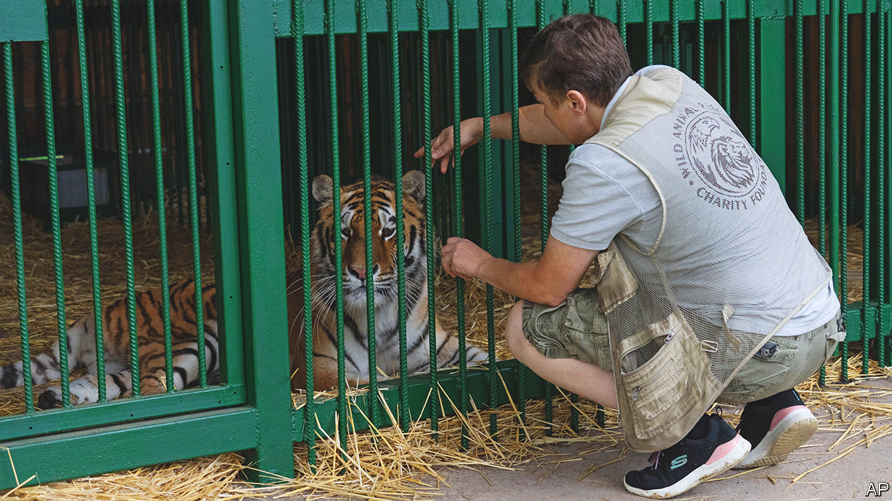

###### Ukraine’s tiger queen

# Meet the woman who is saving Ukraine’s wild animals 

##### No place for a white tiger 

 

> Feb 23rd 2023 

ALEX has gained some weight, and started walking. The bloody welts that covered his body when he arrived at Natalia Popova’s shelter in January are gone. He still suffers from gastroenteritis, and his roar sounds like a chain-smoker’s cough, but he will live. Alex also needs a new home. A shed on the outskirts of Kyiv, the Ukrainian capital, is no place for a white tiger. 

Ukrainian troops found Alex near Vovchansk, a town they recaptured from Russian forces last year, locked in a cramped enclosure and starving. They then called Ms Popova, who hopped into her van, drove for 600km (370 miles) and brought Alex back to her stables. 

Since the start of Russia’s invasion, Ms Popova, a former horse-riding club owner, has rescued at least 600 wild animals, many of them once kept as pets in homes or private zoos near the front lines, and since abandoned. Ukrainian soldiers accompany her, often under fire, and help her load the animals into her van. Recently, while she was preparing to anesthetise a bear in Bakhmut, the bombing became so intense they ordered her to pull back. She refused. Moments later, a grenade landed metres away. “We’ll die together,” she remembers telling the bear. The grenade failed to explode. “Since then,” she laughs, “the soldiers say I’m crazy.” 

Some of her rescues end up at the Kyiv Zoo, which has its own problems. Blackouts mean some of the animals have to spend much of the day in the dark. One of the elephants has learned to take cover during Russian missile attacks, says Kyrylo Trantin, the director. Other animals continue to panic. The zoo has stocked up on firewood, in case the heating stops working. 

Because the zoo is short of space, and conditions at Ms Popova’s compound are even worse, many of her charges are evacuated abroad. Their first destination is a zoo in western Poland, where the animals undergo rehabilitation before being sent to zoos elsewhere in Europe. 


Grenades aside, Ms Popova and the group she works with, UA Animals, have to brave Ukrainian bureaucracy. Arranging the paperwork to move the rescued animals abroad can take months. Ms Popova complains of having to provide officials with information she cannot possibly have. “I don’t even know who the owner of the animal is, not to mention where it’s from,” she says.

Such delays compound the animals’ suffering. “They need to be taken to Europe as soon as possible, because it’s impossible here,” she says. During blackouts she relies on generators to heat the stables where she keeps her wild cats. During missile attacks near Kyiv, she has to keep them on sedatives. 

Ms Popova recently managed to secure a passport for a lioness she had rescued from the outskirts of Russian-occupied Donetsk. The animal had been putting on a surprising amount of weight. A day before the evacuation, she gave birth to three healthy cubs. 

