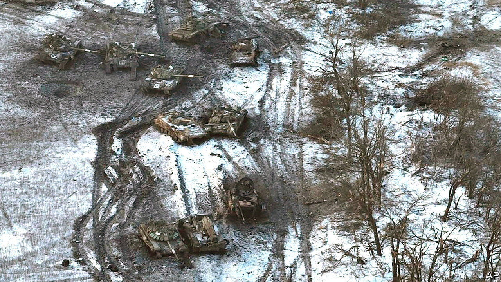

###### Neither shock nor awe

# Russia’s vaunted second offensive is a damp squib 

##### Vladimir Putin is running out of ideas and ammunition 

 

> Feb 23rd 2023 


For months Ukrainian officials had warned that Russia was getting ready to launch a big new offensive. It was mustering forces “beyond the Urals”, said General Valery Zaluzhny, Ukraine’s army chief, in December, and could even once again target Kyiv.  had gathered half a million fresh troops and would “try something” around the anniversary of , suggested the defence minister, Oleksii Reznikov. In fact, Russia’s offensive began weeks ago. It has underwhelmed.

Since late January Russia’s army has been hurling troops and shellfire along wide swathes of the front lines in the east. To the north, in Luhansk province, Russia is attacking towards Kupiansk, a rail hub, and Lyman, a small city, both of which Ukraine liberated in the autumn. In the south, in Donetsk province, Russia is pressing Avdiivka and Vuhledar, which lie either side of Donetsk city. The focus of its efforts, unchanged since August, remains , an unassuming town that has acquired talismanic status for Russia.

Russia has little to show for this onslaught. Its gains this year have been trifling: 60 square kilometres around Bakhmut and the nearby town of Soledar, estimates Konrad Muzyka, an analyst. Bakhmut is likely to fall in the coming days or weeks. But Ukrainian troops will simply reset along a new defensive line to the west. And such gains will have come at a steep price. On February 17th British defence intelligence said Russian military casualties, including those for the Wagner Group, a mercenary firm which leads the fighting in Bakhmut, had reached 175,000 to 200,000, with 40,000 to 60,000 deaths. 

 


Russia’s attack in Vuhledar epitomises the campaign. The city, in Donetsk province, sits on a high point astride key Russian supply lines running west into neighbouring Zaporizhia province. A Russian effort to seize Vuhledar in November ended in disaster. So too did the latest attempt, which began in January. Russia’s 40th and 155th naval infantry brigades, a pair of elite units, are thought to have suffered enormous casualties, with over a thousand deaths in just two days, according to Ben Wallace, Britain’s defence secretary.

Nor does Russia have much in reserve. Though it has mobilised over 300,000 troops since September, half were sent straight to the front to replace casualties, running to 1,000 a day killed and wounded, reckons another Western official. The rest, says Michael Kofman of cna, an American think-tank, have probably been used to fill out under-strength battalions and build a reserve to rotate front-line units out of Ukraine. A much-rumoured new wave of mobilisation has not materialised. 

Russia has also held back four brigades of naval infantry around Mariupol, in Donetsk province, and seven brigades of VDV airborne forces in Luhansk province, says Jack Watling of the Royal United Services Institute, another think-tank. “That’s not enough to do some massive offensive that breaks through and starts carving up everything.” Moreover, says Mr Kofman, although these elite units have done most of the serious fighting, their quality has deteriorated as mobilised personnel pad out their depleted ranks.

Manpower is not the only problem. Western security officials say that, come spring, Russia’s rate of artillery fire will be 20% of the level it managed in late 2022—a serious handicap in what has been an artillery-dominated war. Russia’s defence industry, despite being on a war footing, is struggling to keep up, say officials. Military demand for main battle tanks outstrips production by a factor of ten. Precision-guided munitions (pgms), central to Russia’s air campaign against Ukraine’s power grid, are dwindling. Russia’s air force used up half of its air-to-ground missiles in the first month of the war alone. This year Russia is likely to have half as many pgms available as it expended in 2022.

Russia’s army is fragmented after a year of war and increasingly resembles a militia of disparate forces, says Captain John Foreman, Britain’s defence attaché in Moscow until September. Sergei Shoigu, Russia’s defence minister, and General Valery Gerasimov, chief of the general staff, have reportedly feuded with Yevgeny Prigozhin, the head of Wagner, and General Sergei Surovikin, his ally, for months. On January 12th General Gerasimov was put in charge of the war army, with General Surovikin demoted to serve under him. On February 21st Mr Prigozhin accused Mr Shoigu and General Gerasimov of treason, claiming they had cut off Wagner’s access to ammunition and air transport.

The question is whether Ukraine can exploit this disarray. One scenario is a repeat of last summer, when Russia’s conquest of Severodonetsk, a town in Luhansk, came at such a high price in casualties that Ukraine was able to punch through Russia’s thinned-out lines in Kharkiv two months later. If Russia expends shells and manpower in pyrrhic victories in Donetsk, that could pave the way for a Ukrainian counter-offensive in the spring or early summer—bolstered by Western armour that is on the way.

But there are other forks in the road. In December, General Zaluzhny told  that he was holding back resources to prepare for future offensives. Mr Muzyka says that Ukraine has indeed repelled most, if not all, Russian attacks using only units that were already deployed: “We have seen no indications that the main elements of Ukrainian reserve forces have been utilised.”

Mr Watling says he is optimistic about Ukraine’s prospects. But he points to the risk that Russian assaults, if kept up for long enough, force Ukraine to commit these reserves merely to hold the line, which would result in a protracted conflict—one in which Russia could gradually rebuild and recapitalise its forces by turning to China and fixing its defence industrial base. Mr Putin continues to believe that time is on his side, say officials.

Even if Ukraine can keep its powder dry, it faces an ammunition crunch of its own. Moreover, some Western officials who work closely with Ukraine’s army remain sceptical of its ability to conduct complex offensive operations at the level of brigade and above. Many were disappointed that Ukrainian commanders were not bolder in exploiting their successes in Kherson in November. As Russian military power approaches its nadir, Ukraine’s task is to make the most of an opportunity that might not come around again. ■

