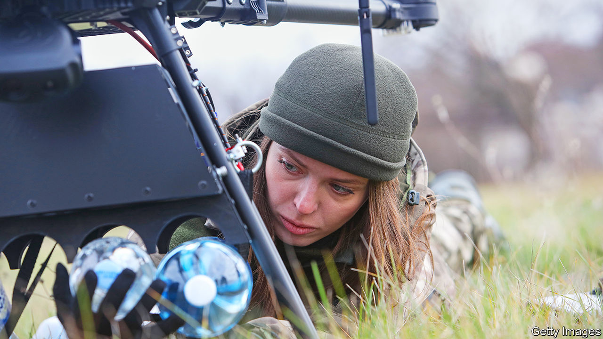

###### The might of miltech

# Ukraine’s tech entrepreneurs turn to military matters 

##### Drone and targeting systems are being improved by dozens of entrepreneurs 

 

> Feb 23rd 2023 


ON A PROMOTIONAL video a dog-biscuit hurtles into the air and two dogs fly upwards to intercept it. Until the Russian invasion in February 2022, Yaroslav Azhnyuk ran a company that makes pet monitors which can distribute treats. Now he is helping entrepreneurs intercept cruise missiles. Ukraine’s war has led to an explosion of engineering talent being diverted from the humdrum to war fighting. As a result, he says, his country is becoming “a sort of military Silicon Valley”. 

With friends in high places in the tech sector, business and government, Mr Azhnyuk’s contribution to the war effort is connecting people. Soldiers at the front say, “Hey, we need this,” and he introduces them to engineers who can try to solve their problem. “Everyone has only one goal,” he says, “and that is to free Ukrainian territories and destroy the occupiers.” 

Hundreds of teams are now working on military technology. Many are garage start-ups but there are also companies that were founded in the wake of the first phase of the conflict in 2014, or pivoted towards defence at that point. Some of what they are producing is cutting-edge; some is well established, but export controls or cost mean that Ukraine’s armed forces cannot get their hands on it. The work spans the whole gamut of what the military needs, from drones and targeting systems to cyber-defences and electronic warfare. 

One of the most developed systems is called Delta and provides soldiers with real-time intelligence about the battlefield on their phones or tablets. Or there is Kropyva, mapping software that helps the user pinpoint artillery and send that information instantly to several positions which can then blast away at it simultaneously. To date, much of Ukraine’s military technology is more advanced than what the Russians possess. But, say developers, the Russians are catching up fast. 

In freezing wind whipping in from the Black Sea a drone lifts off on a test flight. A two-man crew directs it and identifies targets. These spotter drones use specialised new software to correct artillery and can fly in high winds, unlike many others. When his company, Spaitech, was founded in 2012, says Pavlo Hrozov, the CEO, it originally aimed to supply the civilian market. Now, says Mr Hrozov dryly, the Russians “are hunting for us”. Two teams operating Spaitech drones have been killed on the front. Last year a missile struck a field where an hour before soldiers were being trained to use them. 


A year ago, says Mr Hrozov, there were about ten different types of drones being made in Ukraine; now there are 68. Roboneers is one of the 2014 generation of companies which already made military drones and which is now diversifying. These days it makes dozens a month, and by the end of March production will be in the hundreds. The company also makes buggy-style unmanned land drones and tech-packed gun turrets that can be operated remotely. The turrets are like tripods with guns that can defend fixed positions or be mounted on a land drone. Their aim, says its director, who asks not to be identified, is to save Ukrainian lives and to “help soldiers understand what is going on in the battlefield”, for which software is key. Some of the software is new but some replicates that which already exists elsewhere. A big difference is the cost. Their gun-turret system, for example, costs less than 10% of a similar one from Israel.

Dmytro Bielievtsov runs a company which has developed voice-cloning software for the entertainment industry; he has an Emmy award statuette in his office to prove it. One of his wartime projects is Zvook, which is already filling gaps in Ukraine’s air-defence systems. Working with engineers in the 125th Brigade who built the hardware, Mr Bielievtsov and his colleagues developed algorithms that filter out unwanted sounds like cars and mooing cows to give warning of incoming cruise missiles. Lieutenant “Dancer”, who is in charge of a similar military-civilian unit which is about to begin production of kamikaze drones, says he knows of about a dozen such groups. 

The way in which Israel married investors, engineers and the military is “100% of the idea that we have”, says Alex Bornyakov, Ukraine’s deputy minister of digital transformation. Next month he is launching a platform to bring together everyone involved, giving grants to startups, linking them with investors and giving them access to equipment owned by Ukroboronprom, the country’s massive Soviet-legacy defence conglomerate. 

Zvook has already found potential investors, says Mr Bielievtsov. They understand that while its aim is to protect the country now, afterwards the company will have potential as a defence manufacturer “for the global market”. The director of Roboneers says that after the war he wants to start a space company “to build something on the moon”. For that he says, “you need to have systems that have already been tested” and replaced men in situations that are “very uncomfortable for human beings”. Where better than the front line? ■

