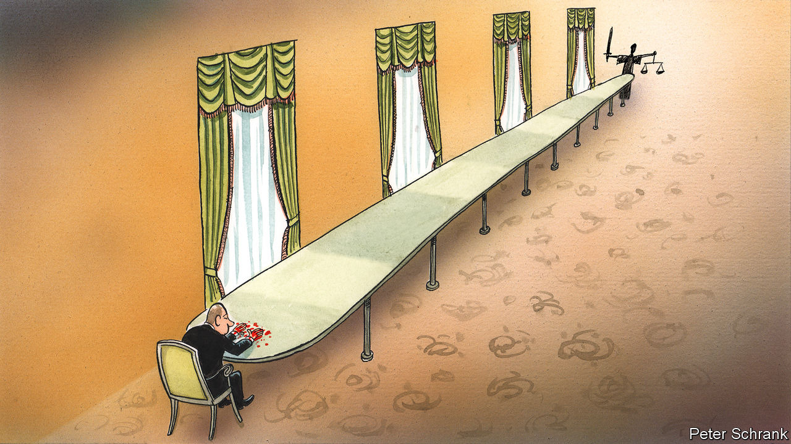

###### Charlemagne

# Why Vladimir Putin will never stand trial in The Hague 

##### Here is what could happen instead 

 

> Feb 23rd 2023 


On a recent Monday morning Alfred Yekatom stared impassively into the courtroom as a witness described how her family survived a night of pillaging he is alleged to have orchestrated. The former Central African militia leader is facing a daunting rap sheet. Besides the murders, the torture, the raising of a child army and the ransacking of a mosque in 2013, one charge stands out: for crimes against humanity. That is why Mr Yekatom, who denies all the charges, was in the dock far from home in The Hague, the Dutch city that hosts the International Criminal Court (ICC), wearing a scarf to fend off the early spring chill. Proceedings are slow. The trial is now in its third year. If a trio of blue-robed judges finds him guilty, a lengthy prison sentence awaits.

Where thugs from the Central African Republic linger, might a Russian president follow? “Vladimir Putin in The Hague” has become a rallying cry for those who want the Ukrainian war’s mastermind to face a judicial response commensurate with the carnage he is causing. The case is morally overwhelming, born of the atrocities committed by Russian troops, the bombardment of civilians and the very act of invading a neighbour. All this surely deserves punishment. Volodymyr Zelensky, Ukraine’s president, has made the prosecution of top Russian leaders one of his ten points for securing peace. Annalena Baerbock, Germany’s foreign minister, is among those demanding that Mr Putin face justice. Foreign investigators are in Ukraine preserving evidence for a future trial.

Now for the obvious reality: Mr Putin will not soon find himself in the dock at the ICC. The limited international criminal justice that currently exists simply does not apply to the leaders of nuclear-armed countries. Yet there are still possibilities for some Russian crimes to be prosecuted. 

Mr Putin’s effective immunity is an upshot of the frailty of the international judicial system. Whereas justice within countries has clear statutes and established tribunals, international law is determined by legal scholars as treaties are signed and norms established. Countries can opt in or out at their discretion; no global police force exists to enforce it anyway. A first obstacle for those who would like to see Mr Putin jailed is that Russia has not signed up to the ICC. No matter, say some legal experts: an ad hoc tribunal could be established by the UN, as it was for Rwanda or Yugoslavia in the 1990s following mass slaughters there. Slobodan Milosevic, the Yugoslav president, spent his last years in court and died in a Dutch detention centre. That might be just the thing for Mr Putin. 

Precedent matters in international law, and none exists that might land Mr Putin in jail. There are two broad categories of charges Russian perpetrators of the war might face. One includes war crimes and crimes against humanity: when civilians are targeted during a conflict, say, or troops rape and pillage. The soldiers who commit these outrages can be tried (as some Russians already have been in Ukraine). In theory their commanders and political masters can ultimately be held accountable, too. In practice it can hardly ever be proved that they ordered such behaviour.

For that reason, Ukraine and its allies talk up the second category of charges: the crime of aggression. The act of invading a neighbouring country is one that can be placed squarely on the shoulders of politicians. But prosecuting such a crime is nigh-uncharted legal territory. In the only two instances in which it has happened—the Nuremberg and Tokyo trials that followed the second world war—the countries involved invited the prosecutions (both governments were run by America and its allies). Short of Russia being invaded or Mr Putin toppled, that will not happen.

The Rwandan and ex-Yugoslav courts offer no more hope. Both were set up by the UN Security Council, which endorsed other such tribunals in places like Sierra Leone. Given Russia wields a veto there, a repeat is improbable. Some legal experts think the UN General Assembly (where each country has one vote and no veto) could call for such a court instead. But this workaround would push international law beyond its current limits. And winning such a vote is not guaranteed: lots of countries, including America, are not keen on giving international courts more power. 

Two options remain, neither of them satisfying. One is to prosecute Russians via the Ukrainian legal system, perhaps in a court endorsed by foreigners and featuring international judges. This would lack the symbolic value of a trial in The Hague: only lowly Russians would be prosecuted, in what would look like retributive justice. The other would be to allow the ICC to prosecute Russian war crimes and crimes against humanity—but not the crime of aggression, which is outside its current remit in the case of Russia. For that, it is enough that Ukraine recognises the authority of the Hague court, which has thus launched an investigation into Russia’s actions. But few think a case against Mr Putin could be built. In any event, it generally does not try suspects in absentia.

Objection!

Ukraine’s preferred plan is for the creation of an ad hoc tribunal in The Hague, separate from the ICC and able to prosecute the crime of aggression—and thus target the Kremlin. That, too, is unrealistic. Worse, it could discredit the ICC in its budding quest to prosecute such cross-border aggression in future, says Olivier Corten, a professor of international law at the Université Libre de Bruxelles. Chasing battlefield war criminals at the ICC, while it would eschew the big prize of nailing Mr Putin, would be no mere symbol. Anyone who might fear prosecution from the ICC—generals and Wagner Group types, say—will hesitate ever to leave Russia, lest they be rendered to The Hague. That would be a punishment of sorts. 

Settling for such an approach need not mean letting down Ukraine. For if the international community cannot prosecute Mr Putin’s crime of aggression, it must double down on making sure such crime does not pay: by giving Mr Zelensky the weapons and money he needs to defeat the invading force. ■


