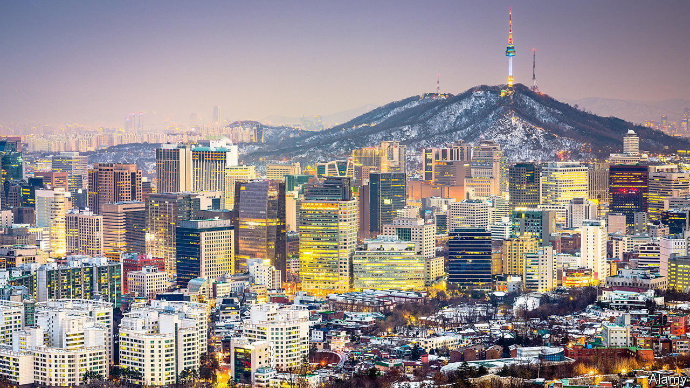
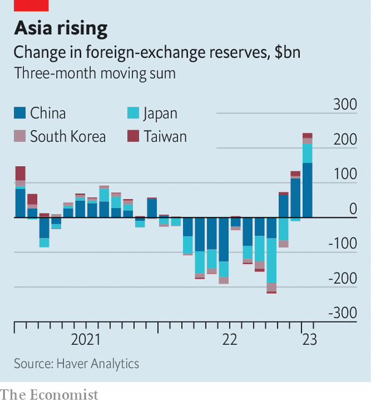

###### Reserve judgment

# Big Asian economies take on the forces of international capital—and win 

##### They are now rebuilding their arsenals 

 

> Feb 23rd 2023 

Battling currency markets used to be considered unwise by central bankers and policymakers. Burning foreign-exchange reserves to take on the forces that push and pull a currency’s value was foolish, so the thinking went, and almost certainly futile. Orthodoxy held that a country seeking to defend its currency should raise interest rates, not sell reserves.

This was put through a real-world test last year as America raised rates and the dollar climbed in value. Officials in many emerging economies deployed their holdings to defend local currencies. According to the imf, global foreign-exchange reserves fell by $1.1trn between the end of 2020 and the third quarter of 2022, with holdings of dollar-denominated assets accounting for half the decline.

During the past few months, however, the process has begun to reverse, as the dollar has fallen and pressure on countries that intervene to defend their currencies has abated. The combined holdings of large Asian reserve holders—China, Japan, South Korea and Taiwan—have risen by $243bn since October, through a combination of revaluation and new purchases, to a total of $5.6trn. India’s foreign-exchange reserves are up by $42bn since October, too, recovering more than a third of their decline in the preceding 12 months.

 


A recent paper by Rashad Ahmed of America’s Office of the Comptroller of the Currency and co-authors suggests that big reserve accumulators may, in fact, have reason to rebuild. Countries that entered 2021 with larger reserves and greater credibility in their capacity to intervene saw smaller depreciations in their currencies, all else equal. The authors calculate that additional reserves worth ten percentage points of national gdp were associated with 1.5% to 2% less depreciation in the domestic currency, relative to the dollar. 

Meanwhile, a number of countries which began this period with modest reserves have suffered deep depreciations. The Egyptian pound, which traded at 16 to the dollar at the start of 2020, now trades at 31. The official exchange rate of the Pakistani rupee has also weakened, from 154 to the dollar at the start of the covid-19 pandemic to 278 more recently. In both places black markets offer even weaker rates. 

Mr Ahmed and co-authors note that healthy foreign-exchange reserves could have another benefit. Removing the need for interest rates to be used to defend the currency enables “domestic monetary policy to better target domestic objectives”. 

The danger, however, is that currency intervention comes to be seen as a way to avoid more painful interest-rate rises. Although the imf is not as vehemently opposed to foreign-exchange intervention as it once was, it still draws some limits. As recently as October, around the time when the dollar peaked, Gita Gopinath, the institution’s deputy managing director, and Pierre-Olivier Gourinchas, its chief economist, warned developing economies not to use currency intervention in place of tighter monetary and fiscal policy.

The experience of large currency-reserve holders during the dollar’s recent surge might give governments other ideas. Being able to resist the pressure to follow the Fed’s interest-rate movements is a goal held by many developing economies—and the more reserves they hold, the more resistant they seem to become. ■


