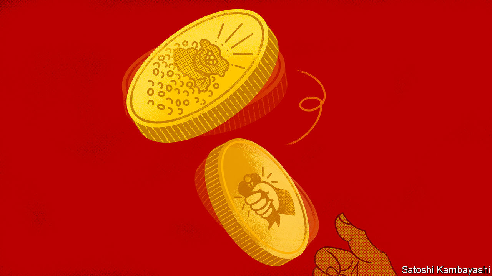

###### Buttonwood

# Despite the bullish talk, Wall Street has China reservations 

##### The growth juggernaut is trading at a discount 

 

> Feb 23rd 2023 

Any fool, with a bit of luck, can make a spectacular return by betting on a coin flip. Yet they risk losing everything in the process. The ultimate outcome for investors is a high return adjusted for the risk associated with it, an idea most famously captured by the “Sharpe ratio”. This divides the expected return of an asset, minus the risk-free rate that an investor could earn by parking their money in super-safe government bonds, by its standard deviation, a measure of the return’s volatility. A ratio above one is considered good. The Sharpe ratio of a double-or-nothing coin flip is negative. 

These sorts of calculations are on the minds of Western financiers who have made, or plan to make, investments in China. Over the past three years risks associated with the country have piled up. Power seems more concentrated than ever in the hands of Xi Jinping, China’s leader. His attitude to business is capricious: he has kneecapped tech firms including Alibaba and Tencent; Ant Group, an affiliate of Alibaba, was forced to call off its American initial public offering in 2020. A string of top executives have vanished. The most recent disappearance is that of Bao Fan, boss of China Renaissance Holdings, who was reported missing on February 17th. The investment bank’s shares plunged by 50%, before recovering a little. 

Relations between China and the West continue to sour. America has introduced vast subsidies to boost home-grown industry. This month it shot down an apparent Chinese spy balloon. The prospect of China eventually invading Taiwan, and the West’s readiness to impose sanctions, as illustrated by the measures imposed on Russia, raise the prospect of further economic estrangement between the two powers.

Yet China’s rewards are tantalising. This has long been true, but not quite to the extent it is now. The country is opening up after years of hair-trigger lockdowns. Given its economic heft, a rebound in activity as Chinese people start visiting restaurants, travelling and shopping again means that the country alone could power much of global growth in 2023 and 2024. Maybe exposure to the growth juggernaut, adjusted for all of these risks, is worth it. 

There are noisy proponents of both sides of the position. On February 15th Charlie Munger of Berkshire Hathaway, a conglomerate, who is famously bullish on China, praised local firms as being “better and stronger” than their American equivalents, and available at cheaper prices. He also downplayed the idea that China might one day invade Taiwan. In contrast, analysts at JPMorgan Chase, a bank, and Jeff Gundlach, a bond investor, have called China “uninvestible” (although JPMorgan’s analysts later changed their minds).

In private, however, financiers are more cautious, and are cutting back their exposure to the country. The boss of a private-equity fund says that, although their firm still sees opportunities in China, it is tailoring its approach; avoiding any businesses that could end up ensnared in, say, nasty supply-chain disputes. Berkshire Hathaway reduced its stakes in byd, a Chinese electric-vehicle manufacturer, and tsmc, a strategically important Taiwanese semiconductor firm, in the last quarter of 2022. 

The most comprehensive information on foreign investment is found in balance-of-payments data, which track financial and trade flows. These showed growing “portfolio flows”, such as investments in stocks or debt securities, into China in recent years, before turning sharply negative in 2022. They are only published with a lag: the latest figures do not capture reopening. The real-time evidence on flows is mixed. While stocks are up and some evidence shows modest inflows to mutual funds, Bloomberg data suggest continued outflows from exchange-traded funds so far this year.

This indicates a certain trepidation among Wall Street’s finest. Even if they do not like to say so in public, worries about Mr Xi and Taiwan prevent them from embracing China. Perhaps the best way for Western financiers to get rich is not by putting their capital at risk by investing in Chinese firms or stocks, which might get clobbered on a government whim, but by offering the investing services Wall Street does best to rich Chinese investors. Last month it was reported that the assets in China managed by Bridgewater, an investment firm which first launched onshore funds in 2018, had doubled to almost $3bn. Such work has the added advantage that it does not need to be justified by calculations involving the Sharpe ratio.


