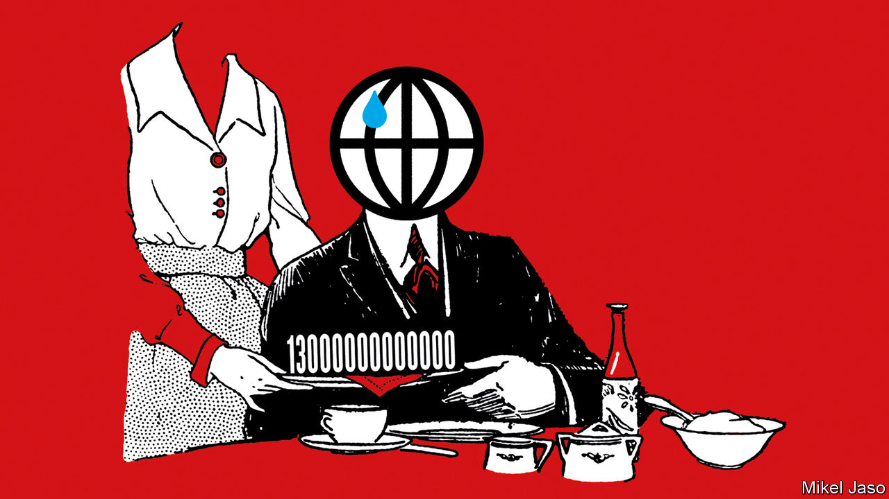
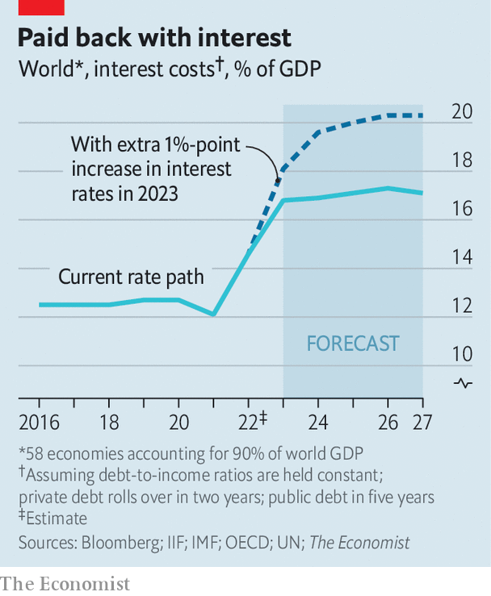
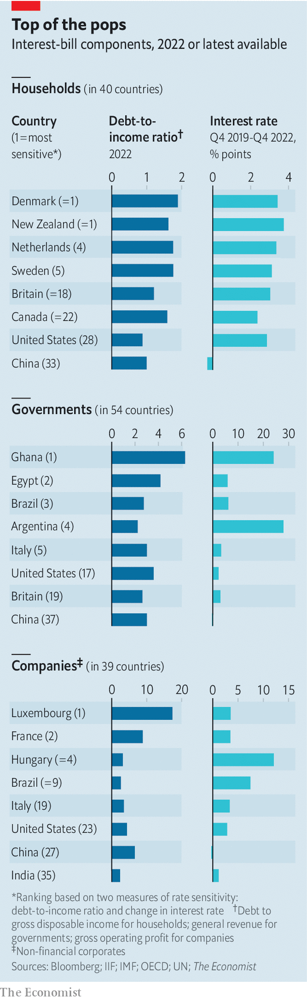

###### Time for the tab

# The world’s interest bill is $13trn—and rising 

##### We calculate who has been hit hardest by rising rates 

 

> Feb 19th 2023 

After a relaxing 2010s, in which interest rates hardly budged,  are putting central-bank officials to work. Indeed, policymakers have rarely been busier. In the first quarter of 2021, policy rates in a sample of 58 rich and emerging economies languished at an average of 2.6%. By the final quarter of 2022, this figure had jumped to 7.1%. Meanwhile, total debt in these countries stands at $298trn, or 342% of their combined gdp, up from $255trn, or 320% of gdp, before the covid-19 pandemic.

The more indebted the world becomes, the more sensitive it is to interest-rate rises. To assess the effect of borrowing and higher rates, has estimated the interest bill for companies, households and governments across 58 countries. Together these economies account for more than 90% of global gdp. In  their interest bill stood at a $10.4trn, or 12% of combined gdp. By 2022 it had reached a whopping $13trn, or 14.5% of gdp.

Our calculations make a series of assumptions. In the real world, higher interest rates do not push up debt-servicing costs immediately, except for those of floating-rate debt, such as many overnight bank loans. The maturity of government debt tends to be in the range of five to ten years; companies and households tend to borrow on a shorter-term basis. Therefore we assume that interest-rate rises feed through over the course of five years for public debt, and over a two-year period for households and companies. 

To project what might happen over the next few years, we make a few more assumptions. Real-life borrowers respond to higher rates by reducing debt to ensure that interest payments do not get out of hand. Nonetheless, research by the Bank for International Settlements, a club of central banks, shows that higher rates do raise interest payments on debt relative to income—ie, that deleveraging does not entirely negate higher costs. Thus we assume that nominal incomes rise according to imf forecasts and debt-to-gdp ratios stay flat. This implies annual budget deficits of 5% of gdp, lower than before covid.

 


Our analysis suggests that, if rates follow the path priced into government-bond markets, the interest tab will hit around 17% of gdp by 2027. What if markets are underestimating how much tightening central banks have in store? We find that another percentage point, on top of that which markets have priced in, would bring the bill to a mighty 20% of gdp.

Such a bill would be big, but not without precedent. Interest costs in America exceeded 20% of gdp during the global financial crisis of 2007-09, the economic boom of the late 1990s and the last proper burst of inflation in the 1980s. Yet an average bill of this size would mask big differences between industries and countries. Ghana’s government, for instance, would face a debt-to-revenue ratio of over six and government-bond yields of 75%—which would almost certainly mean eye-watering cuts to state spending.

Inflation may ease the burden somewhat by pushing up nominal tax revenues, household incomes and corporate profits. And global debt as a share of gdp has fallen from its peak of 355% in 2021. But this relief has so far been more than offset by the considerable rise in interest rates. In America, for instance, real rates as measured by the yield on the five-year Treasury inflation-protected security sit at 1.5%, against an average of 0.35% in 2019.

So who is bearing the burden? We rank households, companies and governments across our 58 countries according to two variables: debt-to-income ratios and the increase in rates over the past three years. When it comes to households, rich democracies, including the Netherlands, New Zealand and Sweden, look more sensitive to rising interest rates. All three have debt levels nearly twice their disposable incomes and have seen short-term government-bond yields rise by more than three percentage points since the end of 2019. 

Yet countries that have less time to prepare for rate rises may, in fact, face greater difficulties than their more indebted peers. Mortgages in the Netherlands, for instance, often have longer-term fixed rates, meaning the country’s households are probably better protected from higher rates than our rankings suggest. In other countries, by contrast, households typically either have shorter-term fixed-rate loans or borrow on flexible terms. In Sweden floating-rate mortgages account for nearly two-thirds of the stock, which means problems may emerge more quickly. In emerging economies the data are patchier. Although debt-to-income ratios are lower, this partly reflects the fact that formal credit is hard to obtain. 

 


In the business world, surging consumer demand has lifted profits. In 33 of the 39 countries for which we have data, the ratio of debt to gross operating profit has fallen in the past year. Indeed, parts of the world look surprisingly strong. Despite the woes of Adani Group, a conglomerate under fire from a short-seller, India scores well, thanks to a relatively low debt-to-income ratio of 2.4, and a smaller rise in rates.

Big debt burdens and tighter financial conditions may still prove too much for some companies. s&amp;p Global, a research firm, notes that default rates on European speculative-grade corporate debt rose from under 1% at the start of 2022 to more than 2% by the end of the year. French firms are especially indebted, with a ratio of debt to gross operating profit of nearly nine, higher than any country bar Luxembourg. Russia, cut off from foreign markets, has seen short-term yields spike. Hungary, where the central bank has rapidly raised rates to protect its currency, could face a big interest bill relative to the size of its economy.

Last and most consequential is government debt. Daleep Singh of pgim, an asset manager, says a variable to watch is the risk premium on debt (the extra return markets demand to hold a country’s bonds over and above the yield on an American Treasury). Rich-world governments are mostly doing fine on this measure. But Italy, which has seen one of the biggest increases in bond yields among euro-zone countries in our sample, remains a risk. As the European Central Bank tightens policy, it has stopped buying sovereign bonds, and will begin to shrink its balance-sheet in March. The danger is that this prompts a crunch. 

Emerging economies increasingly borrow in their own currencies, but those struggling with external debts may require help. Argentina recently reached a bail-out agreement, which will require uncomfortable belt-tightening, with the imf. It sits near the top of this category, and already defaulted on its external debt in 2020. Egypt, which has medium-term government-bond yields around four to five percentage points above pre-pandemic levels, is trying not to follow suit. Ghana, which recently joined Argentina in the severely distressed camp, is now embarking on fiscal and monetary tightening in an attempt to secure support from the imf.

The fate of some governments, as well as the households and firms that eventually need state support, may depend on the goodwill of China. Despite high debt levels, China itself sits near the bottom of our rankings because of its placid interest rates. Yet its importance to global debt stress is only growing.  is now the largest lender to the world’s poor economies and gobbles up two-thirds of their inflating external debt-service payments, complicating debt-relief efforts. Western governments must hope they can shoot down this balloon, too. ■


