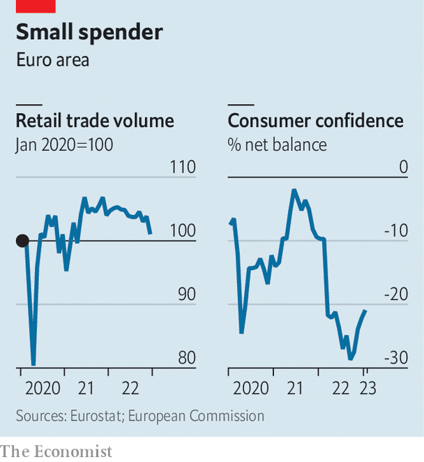

###### Budgeting for conflict

# What war has done to Europe’s economy 

##### After the energy crisis comes low growth and stubborn inflation 

 

> Feb 23rd 2023 

After three years of pandemic shutdowns, reopening booms, war, clogged supply chains and nascent inflation, European policymakers thought that 2023 would be the year the old continent returned to a new normal of decent growth and sub-2% inflation. Europe’s economy is indeed settling down. Unfortunately, though, the new normal is considerably uglier than economists had expected.

Start with the positives. The euro zone has proved remarkably resilient, considering the shock of Russia’s invasion of Ukraine and the energy crisis. Gas is now cheaper than it was on the eve of the conflict, after prices spiked last summer. Governments were not forced to ration energy as had been feared at first, in part thanks to unseasonably warm weather. Headline inflation, having reached a record 10.6% in October, is falling.

Nor, as doom-mongers predicted, has industry collapsed because of the cost of fuel. In Germany, energy-intensive factories have seen output drop by a fifth since the war started, as imports replaced domestic production. But production overall had fallen just 3% by the end of the year, in line with the pre-pandemic trend. The latest ifo survey shows manufacturers as optimistic as they were before covid-19.

 


Although Germany’s economy shrank slightly in the fourth quarter of 2022, the euro zone defied expectations of recession. According to the European Commission’s latest forecast, the bloc will avoid a contraction this quarter, too. Recent sentiment surveys support this projection. The widely watched purchasing-managers’ index (pmi) has risen in recent months, suggesting a rosier picture is emerging in manufacturing and, especially, services. 

Economic stability keeps people in jobs. The number in work across the bloc rose again in the fourth quarter of 2022. The unemployment rate is at its lowest since the euro came into existence in 1999; in surveys, firms indicate appetite for new workers. And jobs keep people spending. Despite high energy prices, consumption contributed half a percentage point to quarterly growth in the second and third quarters of 2022. In many countries, “the energy shock takes time to affect consumers because high prices are only passed on with a lag,” says Jens Eisenschmidt of Morgan Stanley, a bank. “In the meantime, financial help from governments has helped households spend.”

The question now is how long they will keep spending. Households began to tighten their purse strings in the fourth quarter of 2022. In Austria and Spain, for which detailed gdp figures are available, consumption dragged down quarterly growth by a percentage point. Retail trade in the euro zone fell by 2.7% in December, compared with the month before. State handouts and price caps will be withdrawn this year. Consumption could become a problem.

Meanwhile, inflation is proving stubborn. “In the eu we have 27 different ways in which wholesale energy prices are passed on to consumers, which is a nightmare to forecast,” sighs a commission official. Some price pressure may still be on the way—as looks to be the case in Germany, where energy prices in January rose by 8.3% from December. Even if wholesale prices stabilise at current lower levels, household prices may prove erratic. 

Europe’s strong jobs market could add to inflation. High prices and labour shortages, which are likely to worsen as oldies retire and fewer youngsters enter the workforce, are pushing up pay demands. In the Netherlands wages jumped by 4.8% in January, compared with a year earlier, after increasing by just 3.3% in 2022 and 2.1% in 2021. Germany’s public-sector unions are threatening more strikes. They want a whopping 10.5% raise, which could set the tone for comrades elsewhere. 

Data from Indeed, a hiring website, show that wages in the euro zone tend to follow underlying, or “core”, inflation. This shows no sign of softening. The consumer-price index, excluding food and energy, rose by 7% in the year to January. Services, in particular, face steeply rising costs, according to the pmi survey, which may lead to further price increases. 

This leaves the European Central Bank with little choice but to keep interest rates high. Markets expect them to rise from 2.5% to to 3.7% in the summer. Funding for firms and households is thus set to get more expensive, hitting investment. Credit standards are already tightening, according to the bank’s lending survey. And most of the impact of monetary tightening, Mr Eisenschmidt argues, is yet to be felt.

The euro zone may have escaped recession so far, but its prospects—stubborn core inflation, high interest rates and a weak economy—are hardly pleasant. The imf predicts 0.7% growth in 2023; the commission forecasts 0.9%. Even this might be optimistic. America faces equally stubborn inflation, and China’s reopening has not provided much of a boost to the bloc. Welcome to the grim new normal. ■


