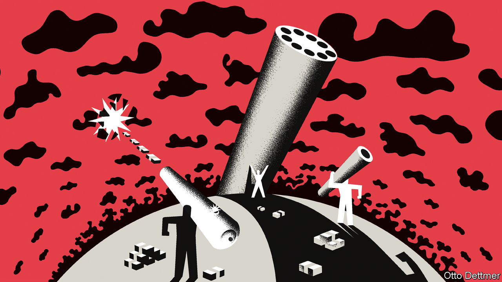

###### Free exchange

# What would the perfect climate-change lender look like? 

##### Welcome to a second Bretton Woods 

 

> Feb 23rd 2023 

Imagine, for a second, that you are a guest at the Mount Washington Hotel in the ski resort of Bretton Woods, New Hampshire. You have arrived to enjoy neither the slopes nor the hotel’s 18-hole golf course. Instead, you are here for the sort of conference that reimagined the international financial system at the end of the second world war. This time there is a green twist. Your job is to give the Bretton Woods twins—the imf and the World Bank—a sister in the form of a perfect climate-change lender. 

According to Nicholas Stern and Vera Songwe, two economists, by 2030 poor countries will need somewhere in the region of $2trn-$2.8trn a year of investment to combat climate change. The Climate Policy Initiative, a think-tank, estimates that in 2021 total climate investments, in both rich and poor countries, amounted to $650bn. In the catchphrase of the climate-change world, the financial system needs to “turn billions into trillions”. Getting these funds to flow, somehow, is the mission of your new Green Bank. 

The first question is a vexed one: who coughs up to pay for the lender? The struggle to create a climate-finance framework started at the so-called Earth Summit in 1992. The summit divided the world into two groups, the Annex II countries and the rest. Because of their historic emissions, the mostly rich Annex II countries were given the responsibility of paying up. 

The problem with the division is not the principle—that polluters should pay—but that it is stuck in the past. Israel, Singapore and Qatar are now affluent, and more responsible for emissions than many of the original Annex II gang. According to analysis by the odi, another think-tank, Kuwait, the United Arab Emirates and South Korea are also candidates for a revamped Annex II-style grouping. The new climate lender should establish a clear threshold for historic emissions per person. Once a country breaches this, it should have no choice but to pay up. 

Next on the agenda: how to get the most out of the Green Bank’s balance-sheet. The initial capital subscription, however generous, will never be enough for the vast scale of climate change. The Green Bank will have to turn to leverage. Too much borrowing, though, and the lender could find itself in hot water. A group of poor countries has railed against the idea that the World Bank could borrow more to tackle climate change. Such a policy risks undermining the rationale for the development bank, by raising its own cost of capital to the point where its loans can no longer be made on advantageous terms. The aaa-rating of the World Bank, higher than the American government, may be a tad too cautious for our new climate lender. The Green Bank can afford to lever up. 

This big balance-sheet will have to be used well. One option to get the most out of its firepower is to offer debt relief, allowing poor countries fiscal space to invest themselves. But just as the imf does when it provides assistance to highly indebted countries, the new climate lender would have to insist on some degree of reform in exchange. Instead of measures to right the fiscal ship, the Green Bank would want to ensure the firepower is used for environmental good, not giveaways or political patronage. 

One model could be “debt-for-nature” or “debt-for-climate” swaps, which currently excite donors, and involve offering debt relief in exchange for environmental protections or climate-change pledges. The problem with such arrangements is that they are inefficient: they in effect subsidise creditors which do not take part in the swap, since these creditors benefit from a borrower with more resources to repay them. Instead, the Green Bank should focus on “unlocking private finance”, to return to the phraseology of green wonks. Clean-tech investment is capital-intensive; the problem is that poor countries face a much higher cost of capital. The Climate Policy Initiative calculates a solar farm in cloudy Germany needs a return of 7% to be viable, compared with 28% for one in sunny Egypt. Exchange-rate fluctuations and the riskier investment climate offset gains offered by better weather.

Here is where the toolbox of the World Bank may be able to help. The Green Bank could offer concessional loans. Or perhaps the new lender could even take on a bit more risk, by taking stakes in projects. This would mean accepting the “first loss” if things did not work out, but also gaining some of the upside if they went well. Financiers are often frustrated that the World Bank has not done more to seize the opportunity of such “blended finance”, which combines high-minded philanthropy with a degree of old-fashioned money-grubbing. 

Green dreams

The most radical option, though, would be to give up on the Green Bank entirely. When it comes to cutting out carbon dioxide, the perfect climate lender may well be no climate lender at all. For the benevolent social planner, who does not have to worry about political constraints, the most efficient way to get to net zero would be some sort of global carbon tax, with the proceeds distributed to countries based on their population. Emissions reductions would not be dictated by a Bretton Woods-style institution but by the logic of the market: going to the lowest-cost opportunities to reduce emissions, whether in Somaliland or Sweden. The proceeds of the tax would mostly flow to the populous poor world, which could use them to adapt to a warmer planet, if it desired.

Such a vision might sound more utopian than a new Bretton Woods institution, or reforming ones already in existence. Yet talks over Article 6 of the Paris agreement, which would create a version of an international market in carbon offsets under the un’s auspices, are ongoing. The eu, China and India—three of the world’s four big emitters—already have an emissions-trading scheme in place, or will implement one this year. According to the World Bank, nearly a quarter of the world’s emissions are covered by some form of carbon pricing. Even without a new institution, climate-change dreams are fast turning into reality. ■


