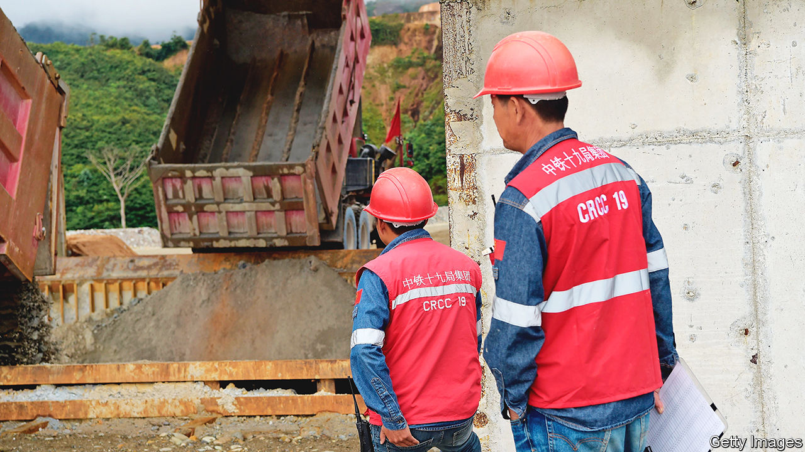
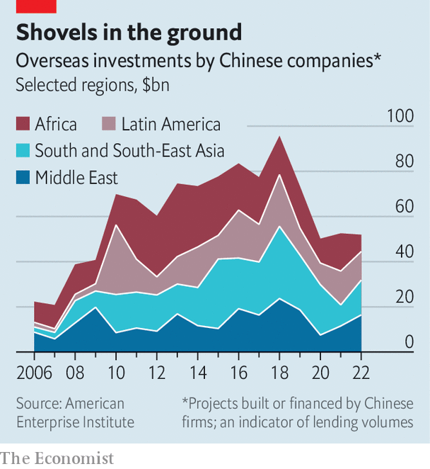
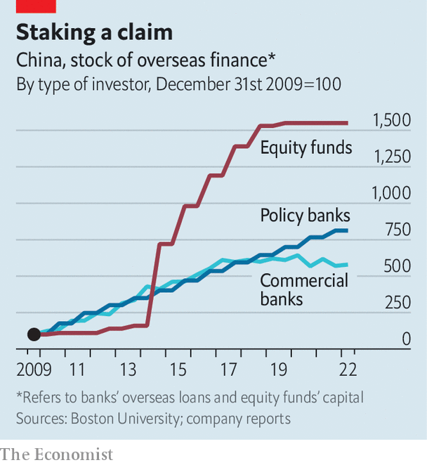

###### Farewell to Africa

# Xi Jinping’s next overseas-lending revolution 

##### Welcome to a new era of Chinese debt 

 

> Feb 22nd 2023 

China has plastered slogans on its loans for as long as it has lent overseas. The “Going Out” strategy in 1999 gave way to the “Community of Common Destiny” in 2011, which was swiftly overshadowed by Xi Jinping’s “Belt and Road” vision two years later. Throughout this period, even as the slogans changed, one type of project dominated: overseas infrastructure funded by Chinese loans. The country’s banks have financed everything from the Mecca Metro, a railway in Saudi Arabia being built at a cost of $16.5bn, by the same construction firm that once laid tracks for Mao; to the start of Bandar, a shiny new development in the Malaysian state of Johor, an attempt to establish a rival to Singapore.

 


By the time the covid-19 pandemic struck, and lending dried up, China’s approach had begun to seem unsatisfactory. According to our estimates, the world owed China’s eight biggest state-owned banks at least $1.6trn, equivalent to around 2% of global gdp. Critics accused China of luring poor countries into debt traps to advance geopolitical aims. Technocrats worried about how to fit China into structures the rich world used to relieve poor countries’ debt. Chinese officials, meanwhile, were growing concerned that they would fail to get a return on an uncomfortable number of projects. As lending ticks up once again, China is changing tack. The system that is emerging is leaner and more sophisticated, but just as determined to reshape the world to Beijing’s advantage.

It is not the institutions that have changed. Poor countries borrow from the West via multilateral outfits, aid agencies, banks and bond markets. China’s overseas lenders, including the two biggest, Exim and China Development Bank, are state-owned, blurring the lines between lending for profit and aid. Whereas Western lenders entrust loans to borrowers, or charities in recipient countries, almost all of China’s lending finances infrastructure built by the country’s state-owned firms, meaning money may never leave the country. 

In its early days, the system seemed to benefit everyone. In China, weak demand for some types of construction left the industry’s state-owned giants at a loose end. State-run banks had an overflow of dollars from rocketing exports. The bosses of both not only won valuable business by looking abroad—they also scored points with officials. In return, these officials acquired diplomatic pull over borrowers. Loans flowed to Africa, in particular, which was home to receptive governments and a wealth of untapped resources. But the eight big state-owned banks lent everywhere. The stock of worldwide loans owed to China grew from $390bn at the end of 2010 to $1.5trn in 2017. 

Cracks began to emerge towards the end of this period, however. Mr Xi’s orders, to focus on a “road” of global shipping lanes and a “belt” of land routes connecting remote China to the farthest tips of Africa and Europe, failed to transform lending. Belt-and-Road loans continued to flow to countries too hostile or far away to be useful. Poor countries struggled with repayments, meaning more and more projects were abandoned. State-owned construction companies, the part of the lending system that dealt most with borrowers, had little skin in the game. If a loan turned sour, banks lost money and officials were embarrassed, but the builders still got their cut. According to the American Enterprise Institute (aei), a think-tank which keeps tabs on China’s lending, new construction projects began to dry up even before covid struck, suggesting officials were finally reining in lenders. 

Western observers expected the brake applied at the start of the pandemic to last until China dealt with the restructurings left behind by earlier profligacy. Instead, policymakers are now instructing lenders to head overseas again, and senior diplomats are going with them to smooth the process. China never acknowledged the pandemic halt, which was only visible in figures from recipient countries. But these figures are now on the rise. Meanwhile, data from fdi Markets, a consultancy, show announcements of new projects, which indicate forthcoming loans, ticked up in the latter half of 2022. 

The characteristics of this new era are starting to emerge. In 2020 officials told construction firms that future Belt-and-Road projects should resemble “meticulous drawings”. In a speech in 2021 Mr Xi reminded them that “small is beautiful”. Sinosure, a state-run insurer, now refuses to allow loans to countries already heavily indebted to China. Construction firms also have to take a small stake in projects they work on. According to the aei, the value of the average construction project fell from $526m in 2012-17 to $423m in 2018-22. Another database, maintained by researchers at Boston University, shows that footprints are also shrinking, from an average of 90km in 2013-17 to 16km in 2018-2021.

Chinese policymakers are taking greater control over disbursement, too. Before the pandemic, equity funds owned by ministries, policy banks and other parts of officialdom were the fastest-growing source of overseas finance, according to Boston University’s data. These help officials direct state money to where they want it, without having to go through state-owned construction firms. Some funds are partnerships between China and Gulf countries; others act in a manner akin to private-equity outfits. Fund managers make the big decisions. So far they have chosen to invest in fintech and green tech. In time, China could even use these channels to make investments in rich countries that have little desire for debt.

Many of the new generation of projects are in commodity hotspots that are crucial to the green transition. China’s manufacturing industry used to demand oil and iron ore. Now it makes more electric vehicles than anywhere else in the world, and seeks enormous quantities of cobalt, copper and lithium. From 2018 to 2021, even as state-owned banks stopped lending elsewhere, they sent billions of dollars to partnerships between Chinese state-owned enterprises and local metal-mining operations in Latin America. This spurred a buying spree by state-owned enterprises and equity funds, three of which are dedicated specifically to the region. 

Lend your money, lose your friend

In this leaner, more centralised system, money goes to two kinds of borrowers: those with a good chance of repaying (either because projects are likely to turn a profit or governments are sufficiently rich) or those for which any lost money represents a price worth paying for diplomatic or military advantage. Loans to friendly countries with limited geopolitical use, such as Angola and Venezuela, have dried up. But the China-Pakistan Economic Corridor, a label for $60bn-worth of megaprojects in a country that already owes more than 30% of its external debt to China, appears to be an exception to Sinosure’s new lending rule. The Centre for Research on Energy and Clean Air, a think-tank, reckons that there are at least four power plants in Pakistan which would have been scrapped had officials stuck to recently adopted climate policies. 

Thus the map of Chinese overseas finance is being redrawn. Banks are offering fewer loans to Africa. Instead, they are going to nearer countries, fresh commodity sources and places where Chinese firms are able to dodge Western trade tariffs. Malaysia and Indonesia have benefited because of their proximity; Latin America owing to its minerals. A small but growing number of state-owned manufacturers are heading to countries that get on with both Beijing and Washington, making use of loans from state-run banks to set up shop with local governments and firms. One such arrangement is Kuantan industrial park in Malaysia, the infrastructure for which cost at least $3.5bn and was financed by a joint venture between the countries and their state-owned enterprises. The Middle East, where Oman and Saudi Arabia host Chinese manufacturing clusters, offers similar access to Europe. 

 


The new era presents unknowns. One is about the scale of investment. Money from equity funds passes through places like Hong Kong and the British Virgin Islands, making it difficult to track. Although loans from state-owned banks are shrinking, they are also being doled out faster. Another unknown concerns decoupling. In the earlier era, China’s overwhelming ambition was to plug itself into the global economy. Now it also wants to insulate itself from America’s economic warfare. If relations continue to deteriorate, China may ramp up efforts to avoid tariffs, lock-in allies and secure global supply chains. A final unknown is whether such efforts will be hindered by the country’s desire for a more sustainable approach to debt. Some question whether China’s behaviour has truly changed. Over time, will it return to building and financing megaprojects, on top of its various new activities?

Previously Chinese banks lent to poor countries for massive, useless projects. But the same banks also lent for massive, useful projects, such as dams and roads, in countries that could not borrow from anyone else, because they could not really repay anyone. Oxford Economics, a consultancy, estimates that from now to 2040 there will be a $15trn global “infrastructure investment gap”, between the funding for construction that economies require and that which will actually be available to them. With its change of approach, China seems unlikely to step in, and other countries are no keener. China’s new era of lending will be more focused, and better for its own public finances. Some countries, particularly in Africa, will nevertheless miss the old way of doing things. ■


