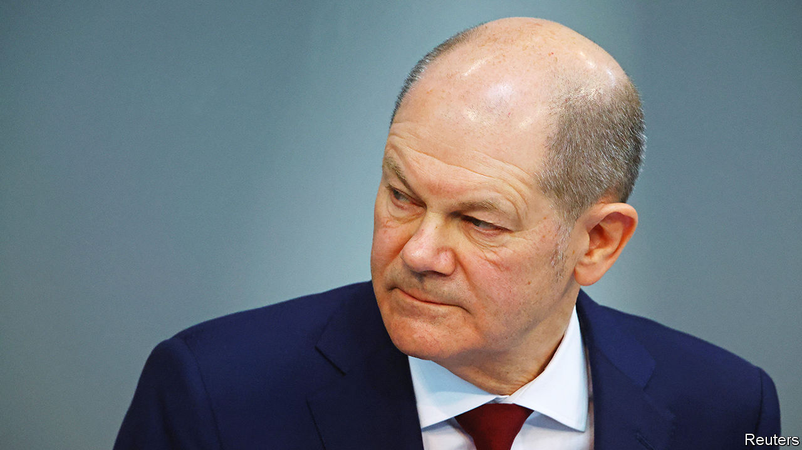

###### Not enough Wende

# A year after he promised a transformation, Olaf Scholz has done too little 

##### Energy policy has radically altered; defence, much less so 

 

> Feb 23rd 2023 

FOR DECADES, Germany aimed to engage with Russia. It was a policy that allowed cheap hydrocarbons to flow westward and power Europe’s mightiest industrial machine. Luxury cars, manufacturing equipment and consumer goods flowed out around the world—increasingly to autocratic China. The hope was that the benefits of trade would over time transform the hungry Russian bear into a well-fed pussycat, saving Germany hundreds of billions of euros in defence expenditures while filling its corporate coffers. Everyone would win.

That policy looked foolish after Vladimir Putin first attacked Ukraine in 2014, and collapsed altogether a year ago. Three days after Russia’s invasion, Chancellor Olaf Scholz announced the , or “epochal change”, to an emergency session of the Bundestag. He identified two giant tasks—to “invest much more in the security of our country” and to “guarantee a secure energy supply”. Twelve months on, how much has changed? The stakes could not be higher for Germany, or for Europe. If the continent is to become militarily effective and able to protect itself from economic coercion, it needs its biggest country to take the lead. 

When it comes to energy, Germany has had little choice but to act. Even before Europe got around to discussing a gas embargo, Vladimir Putin turned off the gas taps. But Mr Scholz’s government has acted with agility, building LNG terminals, increasing gas reserves, acquiring new suppliers and adapting faster than anyone predicted.

Germany is also busy building clean-energy infrastructure. Renewable power generation hit a record level in 2022, and the new target is for its share of total generation to reach 80% by 2030. Auctions for offshore wind sites in the North Sea and Baltic Sea are under way and, even before the invasion, some 2% of Germany’s land was to be reserved for onshore wind farms. 

The trouble is that the record on defence is far less good. In January, after months of prevarication, Germany agreed to send tanks to Ukraine, and to allow other countries that had bought German-made Leopards to send theirs. Mr Scholz’s pivot was welcome but so far has made little difference: Germany is sending only 14 tanks and other countries are dragging their feet. 

A bigger long-term problem is the  of Germany’s armed forces. Decades of underinvestment have left the EU’s largest and richest country with tanks that can’t drive, planes that can’t fly and demoralised soldiers housed in filthy barracks. Not for nothing has the job of defence minister been called a graveyard for politicians; Germany is on its fifth in the past decade.

Reforming the Bundeswehr was always going to be a tall order. Even so, in the year since Mr Scholz made the speech his record has been disappointing, perhaps because he spoke at the moment when the danger was at its height; as the threat to Kyiv receded, so did the chancellor’s sense of urgency. He wasted the next nine months hanging on to a defence minister who everyone could see was not up to the job. 

Great ambiguity surrounds the precise purpose of the “special fund” of €100bn ($107bn) for the armed forces that Mr Scholz announced. There is little sign of a sustained surge in new military contracts or procurement. The speech also promised Germany would “now, year after year”, spend more than 2% of its GDP on defence, a non-binding target set by NATO back in 2006, but which Germany has never approached. Despite the promise, the target was missed in 2022 (it spent only about 1.5%), and will be again this year and probably next, too. 

It is hard to imagine a noisier wake-up call than Europe’s in the past few years. Russia’s invasion of Ukraine came only a year after Donald Trump left the White House. Had he defeated Joe Biden in November 2020, Ukraine might well have fallen last February. Poland, an EU and NATO member, might have had Russian armies at its border. Mr Trump’s chances in 2024 may look slender, but they are not insignificant. Voices, on the left and right, arguing that America should pull back from Europe may start to make themselves heard, or reappear in a less chaotic form. 

A blast of realism

The dangers posed by autocracies and a dependence on America mean that Europe needs to build up its own defences. But unless Europe’s biggest country acts, the effort will be doomed. There are still politicians and industrialists in Germany who hope that, when the war ends, relations with Russia will eventually go back to how they were. The country has yet to confront the risks from its close economic links with China, another autocracy prone to bullying: a government strategy paper on Sino-German relations has repeatedly been delayed. The must not be the turning point at which Germany fails to turn. ■

