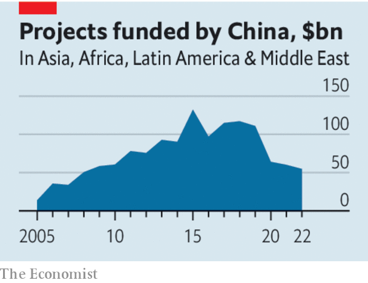

###### Tighter belt, shorter road

# China has not resolved its past lending mistakes. But it is learning from them 

##### How to speed up debt-relief talks 

 

> Feb 23rd 2023 

China emerged as a big overseas lender with astonishing speed. In the early 2000s it lent paltry amounts to poor countries. Today it is a larger creditor than either the imf or the World Bank. This largesse was a boon for poorer places seeking to finance infrastructure projects. But as borrowers have hit trouble, it has become a complication. China is not a member of the Paris Club, an informal group of mostly rich-country creditors, and has been slow to work with other lenders to relieve the debts of governments that cannot now repay them. Zambia and Sri Lanka are mired in debt-restructuring talks with Chinese and other creditors. They may soon be joined by Pakistan.

Finance ministers from the g20 group of economies will meet this week in Bangalore to try to hurry things along. The picture is not all gloomy. Although China has not yet resolved its past lending mistakes, it is learning from them.

 


, China is now lending with greater caution. The construction firms that used to pick up overseas contracts at little risk to themselves now have more skin in the game. Regulators have imposed more explicit limits on external lending. 

Xi Jinping, China’s president, has urged investors to recognise that “small is beautiful”. Loans have accordingly shrunk in value. In 2016 new commitments to sovereigns and state-backed entities made by China’s two big “policy banks” were twice as large as those of the World Bank, reckon researchers at Boston University. In 2021 China’s two banks promised less than a tenth as much. The average length of China-financed roads, railways, pipelines and the like has also diminished, from 238km in 2013-17 to 157km in 2018-21. The belts are tighter and the roads shorter. 

This caution should be good for Chinese balance-sheets. Yet new prudence will be a mixed blessing for many poor countries, which may have to abandon their hopes that China will be incautious enough to continue to finance their vital, but unbankable, infrastructure. 

Moreover, China’s existing stock of loans could also still hit trouble. The fear of losing access to Chinese finance is one reason why poor countries have been slow to ask for forgiveness on their debts. But if future Chinese finance is no longer on offer, requests for debt restructuring may rise, because borrowers know that they have less to lose. 

If more countries do ask for debt relief, how can the talks be accelerated? There have been various sticking points. China sees the World Bank as the West’s policy bank, and wonders why its loans are exempt from restructuring when China’s banks must take part. It is reluctant to reduce the face value of its claims, preferring other forms of relief. And it doubts that private lenders will bear their share of the burden.

Bailing in the World Bank is a non-starter. But China’s other concerns can be allayed. If it refuses to cut principal, it should be possible for it to make an equivalent contribution by lengthening maturities and reducing interest rates instead. The role of private creditors can also be clarified. Lazard, a firm that has represented many borrowers, has proposed a simple formula that would give each lender, public and private, a better idea of how every creditor’s share of the effort will be calculated. 

None of this will be easy; nor does it represent the ideal solution. Reductions in the stock of debt, for example, tend to be more effective at restoring growth in borrowing countries than longer maturities. But just as China has become stricter in its lending, so it should be possible to streamline its debt negotiations, too. The future of its overseas finance should be tighter belts, shorter roads and quicker talks. ■

