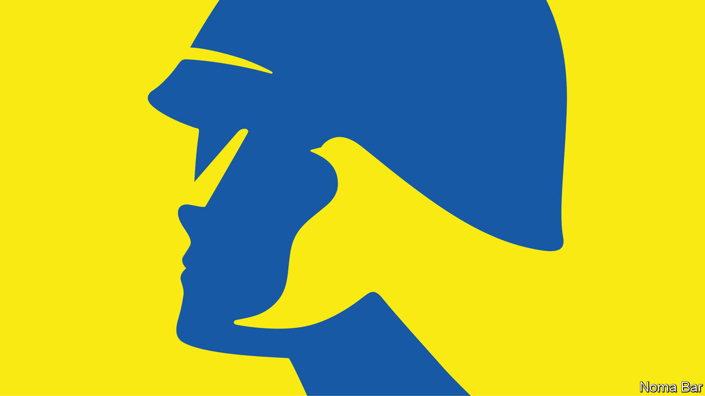

###### The future of Ukraine

# How to win the hot war in Ukraine and the cold war that will follow it 

##### After a year of fighting, what comes next? 

 

> Feb 23rd 2023 


AFTER A YEAR there is so much to mourn. The dead, on both sides. The living, scattered across Europe by Russian missiles. The world’s poor, struggling to buy bread. But, addressing his nation this week, Vladimir Putin was unrepentant.

Ukraine’s allies can congratulate themselves that they have done their part to counter Mr Putin’s remorseless assault—though, with its courage and resolve, Ukraine itself deserves most credit. They have converged on two principles: that Ukraine must win, and that it is for President Volodymyr Zelensky to define what victory means. When he visited Kyiv on Tuesday, President Joe Biden was living proof of America’s commitment. 

Yet even the worthiest principles have a way of wearing thin, as Mr Putin well knows. He believes that the West will tire and, with the possibility of a new American president in 2025 and stronger backing from China, he may yet be proved right. His speech this week made clear that he is mobilising Russia for a war that—hot or cold—could last a generation. 

In the fighting and in the long years of the heavily armed stand-off that comes afterwards, Ukraine will prevail only when Mr Putin—or, more likely, his successor—concludes that further aggression would gravely weaken him at home. Western leaders need to signal their resolve to Russia and to prepare their own people for the confrontation ahead. That is why they should mark the second year of fighting by going beyond generalities and committing themselves to a credible blueprint for a long struggle.

The first task is to understand what is at stake. Some Europeans still harbour the belief that a peace deal  the world to its state on February 23rd 2022. In fact Russia, Ukraine and the West are locked in a contest between rival systems. The West believes that sovereign Ukraine should be free to become a prosperous, democratic nation. Mr Putin denies Ukraine’s existence, and says that the Russian civilisation is at war with the West. It is a war that will test the resolve and power of both sides. 

The second task is to gain the advantage on the battlefield. Russia’s and Ukraine’s spring offensives will show whether either side can take territory. Russia’s assault has already begun, and . Ukraine’s is likely in April or May. The Ukrainian army’s stated aim is to restore the borders of 1991 by seizing Crimea and the four provinces Mr Putin annexed in September.

It should take all it can. The strategic reason for this is that a rump Ukraine would be impoverished and hard to defend. The east and south of the country are sources of minerals and crops, and centres of industry. Unhindered access to the Black Sea provides safe passage for Ukrainian exports. The political reason is that the more territory Russian forces surrender, the clearer it is that the war was futile—and the harder it will be for Mr Putin or his successor to justify re-invading Ukraine with a new army. 

Should Ukraine’s ambitions include Crimea? In principle, yes. It lies within the country’s recognised borders. It controls access to Ukraine’s coast. It is also the territory that Mr Putin most prizes—and hence whose liberation would best drive home his defeat. In practice, Crimea will be hard to take. Mr Putin may issue a credible threat to use nuclear weapons. Mr Zelensky had better be sure of success: a failed assault could end up rallying ordinary Russians behind their leader. 

The stronger Ukraine’s territorial position, the stronger it will be in the cold war after the fighting is exhausted. This could come in a formal peace agreement, but more probably a ceasefire, like the 70-year-old stand-off between North and South Korea. Either way, Mr Putin will not simply give up, so Ukraine will require a credible guarantee of its security.

Ideally that would entail membership of NATO. Mr Putin is hard to deter, because America does not want to begin a war with Russia—and rightly so. NATO membership lowers the risk, by turning the tables on Mr Putin. It commits its members in advance to treat an attack on one country as an attack on all. If Mr Putin invaded, he would be the one choosing a superpower war. 

At the recent Munich Security Conference several countries said they were in favour—even France may be open to the idea. However, NATO membership requires consensus. If that is unattainable, Ukraine would need bilateral guarantees and lots of arms, so that it is like a European Israel, too indigestible for another Russian invasion to make sense. 

Whatever happens, Ukraine’s need for weapons will endure for at least a decade and possibly longer. Just now it is firing roughly as many shells in a month as America can produce in a year. Its spring campaign needs munitions, spare parts, air-defence systems, long-range artillery and, ultimately, aircraft. Post war, it will require an entire arsenal of NATO-quality weaponry.

Politicians insist they have woken up to these needs, but are being slow to act. They need to change their outlook. Western countries have to accept that they can no longer afford peacetime production levels of arms—not just to support Ukraine but also to defend themselves. Threats abound. They need to signal a long-term restocking of munitions, invest in surge capacity and do more procurement alliance-wide so as to create a robust industry. 

The long fight

Western powers can also signal their commitment with multi-year budgets for financial support. That matters because, if the Ukrainian economy does not thrive, then democracy will not thrive either. Gradually, the country’s defences would weaken. 

Aid is essential, obviously. Given that America has provided the lion’s share of the weapons, much of that should come from Europe. But private capital is essential, too, and that will flow into Ukraine only if it is seen to be a good place to invest.

As in Israel and South Korea, which have both thrived despite their neighbours’ decades-long hostility, Ukraine’s greatest resource is its people. Throughout this war, they have shown that they are enterprising and creative. It is vital that, when the fighting ends, the  do not stay put, but choose to rejoin their partners.

And Ukraine has to overcome a history of corruption and political capture. Here the promise of membership of the EU can help. The process of accession is a health regime for a country’s institutions. So long as Ukraine’s candidacy is handled in good faith by EU members, it could be transformative. Formal negotiations on accession should begin during 2023.

As the war enters its second year, some ask whether Ukraine is worth all this effort. Isn’t the cost-of-living crisis more urgent? Or climate change? Imagine if the money spent on weapons could finance development instead. 

It is right to regret the war, but unwise simply to wish away Mr Putin’s aggression. A Russian victory in Ukraine would frog-march the world down a bleak path where might is right and frontiers are drawn by violence. It may hasten the next, even worse, confrontation in Europe. And it would deepen a widespread sense that Western power, and the universal values it sustains, are in steep decline. 

Ukraine’s victory, by contrast, would bring hope that a sovereign democracy need not bow to its much larger, dictatorial neighbour. It would be a world that took heart from the resolve and courage of Mr Zelensky and the Ukrainian people. ■


