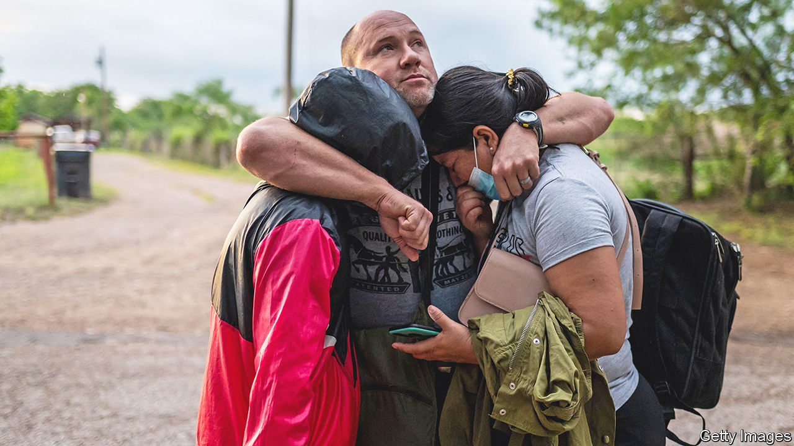

###### Making America greater

# Joe Biden’s new border policies irritate the extremes. Good 

##### They mix toughness with generosity and are a step in the right direction 

 

> Feb 23rd 2023 

“BORDER CHAOS!” began as a nativist dog whistle. Under the Biden administration it became reality. Problems in countries south of Mexico, the strength of America’s economy and a confused set of federal policies resulted in 2m undocumented people crossing the southern border in 2022 (many others surely crossed undetected). Since Democrats lost their majority in the House of Representatives after the midterms, though, the Biden administration has pivoted. Its new policies, some of which were announced this week, are a step in the right direction.

Both America and aspiring Americans yet to become citizens would benefit from a more generous immigration system. America’s labour market is exceptionally tight, which should mean new arrivals are both needed and can be readily absorbed. But support for legal migration is undermined when the government cannot control who comes in. Liberals therefore have an interest in secure borders, too.

One of the difficulties for both parties has been that migrants who cross into America from Mexico can claim asylum once they arrive (as indeed they should if they are fleeing persecution and torture). Instead of trying to sneak across, many people approach a border guard and claim asylum. At which point they are released, and left to deal with a labyrinthine system of overburdened courts, where the average wait for a case to be decided is two years.

During the pandemic it was easier to expel many migrants swiftly, on public-health grounds. But the pandemic is over, and in any case many migrants expelled under this legal authority (known as Title 42) just boomerang back. Forty percent of those removed under Title 42 try to cross again within a month. Something better was needed.

The administration’s new policy requires any adult who wants to claim asylum to try to secure an interview appointment, for which they must apply through a smartphone app before they arrive. If they don’t they will almost certainly be turned away. Separately, the administration has increased the number of refugees it will accept from Cuba, Haiti, Nicaragua and Venezuela to 30,000 a month, so long as they have advance authorisation to travel to America, and meet certain conditions, including having a passport, a financial backer and the ability to pay for a flight. For context, the Trump administration settled 15,000 refugees a year, from all countries. The hope is that this combination of toughness and generosity strikes a balance. Predictably, left-leaning pro-immigration groups and right-leaning restrictionists both hate it.

There are reasons to be sceptical of how much will change under the new policies. Plans are easier to announce than implement. Extra border-patrol officers and asylum officers will be needed. Legal challenges are expected.  would help but is far from guaranteed. The attractiveness of the United States compared with countries south of the border, and the number of people seeking to flee dysfunctional governments (there are 6m displaced Venezuelans alone in Latin America), creates a weight of numbers that is hard for any administration to manage humanely.

Yet if liberals conclude that this is all too difficult, nativists will come up with their own solutions to border chaos. As well as accepting genuine asylum-seekers, America needs more economic migrants. It also needs to regularise the status of the 10m undocumented people living within its borders, many of whom have been there for decades. Controlling the flows of migrants at the southern border is politically necessary for increasing the number of Americans—making America greater, if you will. ■

