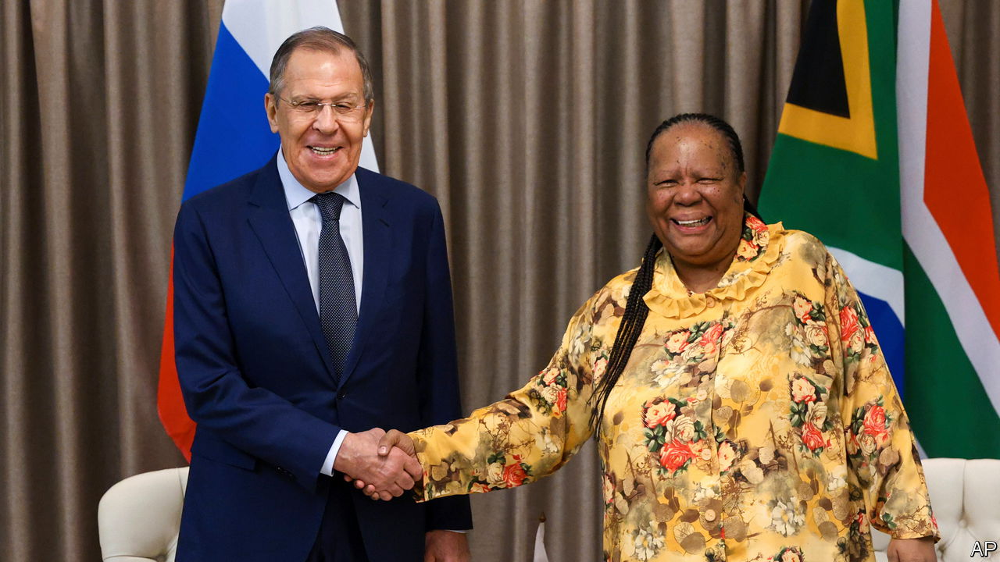

###### Irrational interest

# South Africa’s diplomatic descent 

##### Cosying up to Russia and China harms South Africa, and the world 

 

> Feb 23rd 2023 

Last August, as Russian missiles were pounding cities in Ukraine, South Africa’s foreign minister, Naledi Pandor, delivered a key foreign-policy speech. For a country that was once a symbol of universal rights, this might have been the ideal time to speak out against Russia’s slaughter of civilians. Instead, Ms Pandor unveiled a new policy, making national interest the lodestone of South Africa’s foreign policy. This overtly overturned its former principle that human rights should guide international relations. As if to emphasise this shift, she lashed out at some of South Africa’s closest friends, accusing America of bullying African countries, the EU of being underhand in its trade relations, and the West in general of being duplicitous when talking about its shared values with poor countries.

Last month South Africa welcomed Sergei Lavrov, Russia’s foreign minister, and this week it is hosting naval exercises with Russia and China. Ms Pandor’s comments reflect not just the ditching of a worthy principle. They also signal an acceleration of South Africa’s shift away from the Western democracies that are its main trading partners, investors and donors and . That will weaken universal rights, undermine Africa’s efforts to become more democratic and, most importantly for South Africa, harm its economy and diminish its diplomatic heft.

If the art of diplomacy is the balancing of principles and the national interest, South Africa seemed to have found a happy medium in the years after the end of apartheid in 1994. Nelson Mandela, its first black president, promised that human rights would be “the light that guides our foreign affairs”. Although he and his successor, Thabo Mbeki, did not always act consistently—any more than Western democracies do—they applied the principle often enough that South Africa emerged from international isolation and sanctions to become a diplomatic heavyweight, helping stop wars in Burundi and Congo. As its international stature rose, so did trade and investment. 

Yet these principles have since given way to a muddle of competing ideas. Some, such as loyalty to old friends and allies, are understandable enough. But in practice they have led South Africa into backing tyrants and authoritarian regimes such as Russia and Cuba because a generation ago they had provided arms to fight against apartheid (Ukraine helped too, but never mind). A Marxist leaning acquired by many in the ruling African National Congress (ANC) while in the Soviet Union has left the party with a worldview stuck in the 1960s. Many of its leaders believe Western countries want to subjugate Africa again—and that its firmest allies in the struggle are once more Russia and China. 

At the same time the national interest has been subordinated to narrower party and sometimes personal business. The anc is surely grateful to Russia not just for the support it got from the Soviet Union decades ago, but also for more recent donations to the party from Russian tycoons.

By lining up with Russia, which accounts for less than 0.5% of its international trade in goods, South Africa risks harming relations with its biggest trading partners, the EU (22%) and America (7.5%). Both give it preferential access to their markets—which can easily be withdrawn. There is a case for stronger ties with China (16%), but South Africa is wrong to think that to trade more in Asia it needs to be hostile to the West.

Lose-lose 

South Africa’s diplomatic descent causes harm. By backing strongmen and condoning rigged elections, such as those in Angola or Zimbabwe, it is smothering African democracy. By refusing to condemn Russia’s invasion of Ukraine under the guise of neutrality, it is emboldening warmongers everywhere. By snubbing its liberal friends for autocrats, South Africa is wrong in principle. It is also acting against its own interests. ■

