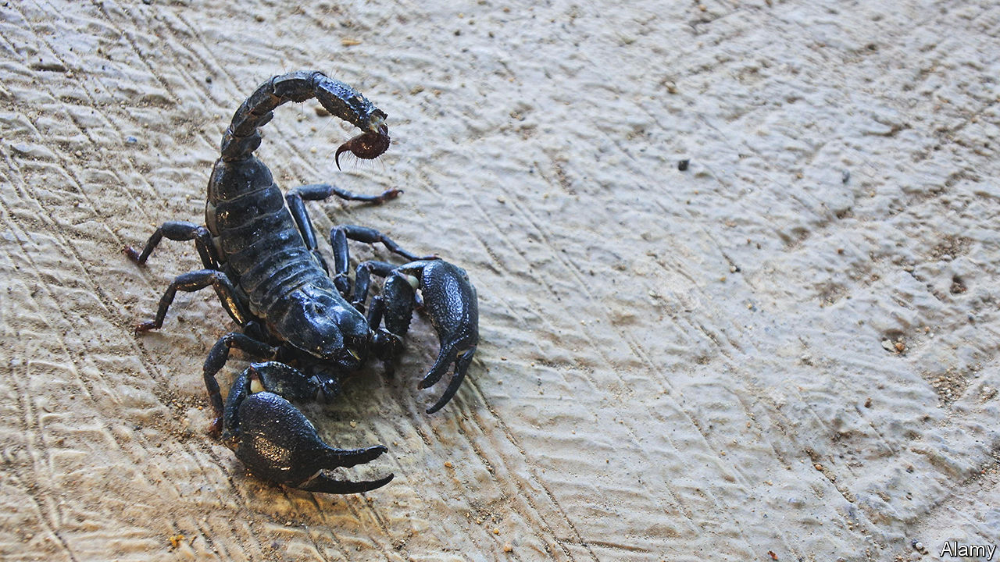

###### Scorpions can be cuddly

# A Nigerian trade in insects that bite 

##### While politicians prick each other, a scorpion-breeder offers herbal remedies 

 

> Feb 23rd 2023 

Looking at the middle-aged man in a grey robe ruffled by the breeze, one hand raised in greeting, you would never guess what is in the old black shopping bag dangling from his other hand. Ambling across the courtyard of the grandest mosque in Nigeria’s capital, Abuja, he stops to greet a group of men who are sitting on benches under a tree. Their response is familiar and warm. He reaches into his bag, brings out a small box and coaxes a black scorpion into the daylight, perching it on his hand. The men are fearful and fascinated, but keep their distance. 

They know the bagman as Usman Maikunama, the self-proclaimed Scorpion King of Gwoza, a town in the far north-east of Nigeria, where the murderous jihadists of  once held sway. His surname means scorpion-owner in Hausa, the main language of the Muslim north. “That’s what everyone calls me,” he says. “That black one has enough poison to kill a man,” he declares, putting a scorpion back in its bag, where it nestles with a host of others. 

Evidently he has no fear of the arachnids. He feeds them liver and cow dung “to boost their poison”. He has spent his entire life, gloveless, among scorpions. His father bred them. He has brought up his children among them, too.

His grandfather taught him how to handle and care for them, not as pets but as a source of income. “Under the rocks, in the forest, anywhere I find a scorpion I take it,” he says. His grandfather also taught him how to make herbal remedies from tree bark and roots. He would sell the scorpions—along with their antidote. He would make potions to fend off a variety of afflictions, including the effects of sorcery. Mr Maikunama offers other services, such as smoking out snakes from people’s houses. He has taught the secrets of his trade to his sons.

His prices vary according to the status and needs of his customers. “I don’t sell them without selling the inoculations,” he says. “When I give you the medicine, you can even put the scorpion in your mouth and it won’t harm you.”

The scorpion man has plied his trade all over the region—in Benin, Burkina Faso, Chad, Ghana, the Ivory Coast, even as far as Ethiopia and Sudan. But these days he stays closer to home, limiting his trips to Abuja, where he has found useful patrons such as the Guards Brigade, the unit responsible for protecting Nigeria’s president and much of the capital. Its insignia is a black scorpion. Some officers, he proudly reveals, now keep the biting creatures as mascots and pets.

