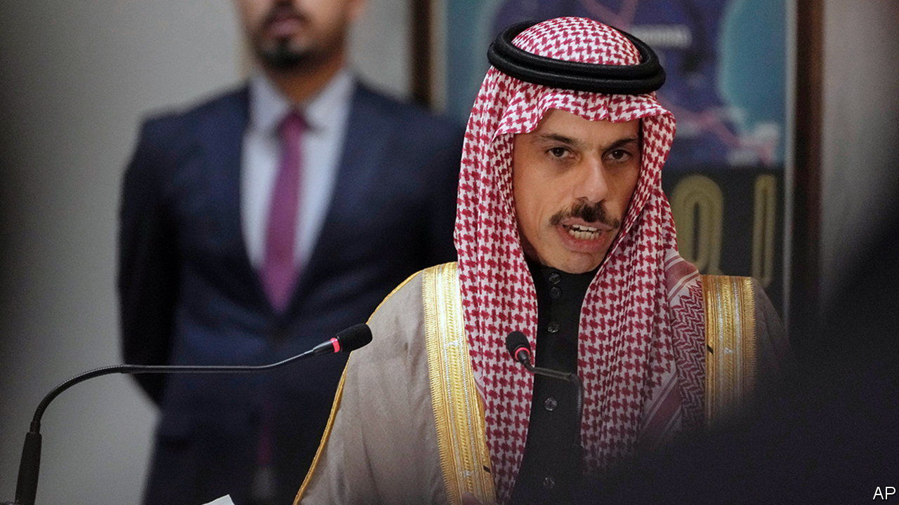

###### Cutting your losses

# Saudi Arabia is reconciling with regimes it once tried to topple 

##### The kingdom now sees the Arab world as a nuisance 

 

> Feb 23rd 2023 

Diplomats rarely admit , but that is precisely what the Saudi foreign minister did on February 18th at the Munich Security Conference, an annual security gabfest. The kingdom has sought to keep Bashar al-Assad, Syria’s blood-soaked dictator, a pariah. Asked about rumours that his country may change course, though, Prince Faisal bin Farhan hinted that Mr Assad’s isolation was nearing an end. “There is a consensus growing that the status quo is not workable,” he said.

Over the past decade, Saudi Arabia has spent tens of billions of dollars working to overthrow two unfriendly regimes: , and that of , a Shia rebel group that controls much of Yemen. In the coming months it will probably admit that both efforts have failed. This is not because the Saudis have developed an affinity for their foes. Rather it is another sign of how the kingdom, like some of its Gulf neighbours, increasingly sees the rest of the Arab world as a tiresome nuisance.

The Saudis were early supporters of the uprising against Mr Assad. They began sending arms and money to Syrian rebels in 2012. The insurgency, of course, would go on to end in defeat: light arms from the Gulf and the West could not match a larger investment by Iran and, later, Russia. But even after Mr Assad’s Pyrrhic victory, the Saudis (along with Qatar) refused to restore ties with him, or to allow him to resume his place at the Arab League, from which Syria was suspended in 2011.

They are no longer so adamant. Prince Faisal said in Munich what other Gulf diplomats say in private: there is no longer any clear route to remove Mr Assad. “We all have policies, but we don’t have any strategy to implement that policy,” he said. “There is no pathway towards achieving the maximalist goals that we all have.”

Diplomats think the kingdom could announce a  at the next Arab League summit, which is usually held in March (and this year will be hosted by the Saudis). A foreign-ministry official says it would have conditions attached. Mr Assad, for example, would be expected to distance himself from his Iranian patrons, something he might agree to in principle, but not in practice.

Warming to Mr Assad would be much less of an about-face than the one that may be looming over Yemen. The country has been in turmoil since the uprising in 2011 against Ali Abdullah Saleh, its longtime dictator. His replacement, Abd Rabbo Mansour Hadi, was an empty suit who proved incapable of holding the country together. That left a vacuum, eagerly filled by the Houthis, who had fought an on-and-off insurgency since the 1990s.

In late 2014 they marched on the capital, Sana’a, and then Hodeida, the main port on the Red Sea. By March 2015 they had reached the southern city of Aden. Mr Hadi fled on a boat. That drove the Saudis to intervene at the head of an Arab coalition. Operation Decisive Storm, as it was called, has dragged on for eight indecisive years and plunged Yemen into humanitarian crisis. An estimated 19m Yemenis need food aid to survive; three-quarters of the people live below the poverty line.

It has been costly for the Saudis, too. There are no official figures, but the kingdom has spent tens of billions of dollars on the war. Some put the tab as high as $1bn a week in periods of the heaviest fighting.

The Saudis are negotiating a deal that would allow them to withdraw. It would not remove the Houthis from power, nor end Yemen’s messy internal civil war. But it would give them assurances that the Houthis will stop lobbing drones and missiles across the border into Saudi Arabia. “It gives the Houthis more than they could have imagined,” says one frustrated Yemeni observer. It could be signed in the coming months—perhaps in the holy city of Mecca around the Ramadan holiday, which starts this year in late March.

Ask Gulf diplomats about their foreign-policy priorities for the coming years, and they tend to offer high-minded lists that would not sound out of place at a Scandinavian embassy: economic ties with developing countries, bigger foreign-aid programmes, joining efforts to fight climate change. When they talk about their Arab neighbours—and they often prefer not to—they describe the region as a burden.

Frustrated with Lebanon’s endemic corruption, the Saudis have cut funds to their traditional clients. They are reluctant to pour more money into Egypt, which is now struggling through its second economic crash since 2016: it seems a bottomless pit of need. They may offer a fillip to Tunisia, which is mired in its own debt crisis—but only because the price tag (perhaps $1bn or so) is, relatively speaking, not that big.

Restoring ties with Mr Assad does not mean the Saudis would pour money into rebuilding his ruined country. Nor does ending their war in Yemen mean they will do much to fund reconstruction efforts, which the World Bank estimates will need $25bn. Taking a page from former President Donald Trump, many Saudis, including officials, call this an era of “Saudi first”, a time to spend money at home and cut back on foreign entanglements—especially the failed ones. ■

