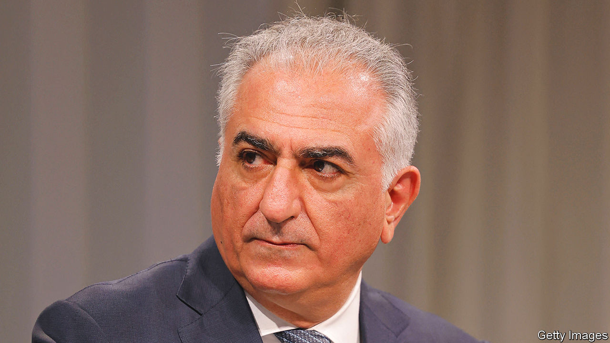

###### Could his kingdom come?

# The son of Iran’s last shah bids to regain the throne 

##### A spasm of royal enthusiasm hints at a lack of alternatives 

 

> Feb 23rd 2023 

His father called himself Shahenshah (King of Kings), Aryamehr (Light of the Aryans) and Sovereign of the Order of the Lion and Sun. When the shah died in 1980, a year after being  by Ayatollah Ruhollah Khomeini, his son, a student aged 20, proclaimed himself king with similar grandeur. “I’ll leave it up to you to call me whatever you want,” Reza Pahlavi says nowadays, modestly.

It is for the Iranian people to decide whether the peacock throne should have a new royal incumbent, he says. If they were to opt for a secular democratic republic, he would consider it his duty to back it. He merely hopes to help steer his people peacefully out of the current rotten religious dictatorship.

A posse of leading lights in the protest movement that erupted in Iran last September have pledged allegiance to him. So has Ali Karimi, a footballer with 15m followers on Instagram. Opposition satellite channels beam interviews into Iran from the royal base in Washington, dc. On February 18th he took the podium at an annual gathering of global leaders in Munich to discuss world security. It was, he said, “incredibly empowering”. Despite his 44-year-long absence, one recent poll suggested he could be the people’s favourite, if they had a choice. “He’s our new Cyrus,” says a young fan in Tehran, the capital, referring to the Persian emperor of 2,500 years ago. 

Since the shah was overthrown two generations of Iranians have been raised on stories of the horrors of savak, his vicious secret police, and the one-party state they oversaw. But savak’s brutality pales in comparison with the ayatollahs’, say some of today’s protesters. Widespread poverty, rigid social restrictions and the country’s pariah status all foster the yearning of many for the past. “We wronged him when we expelled him,” says one student. “We must repay the debt to his son.”

All the same, Mr Pahlavi will find it hard to oust the clerical order remotely. His network within the country is limited. His own dedication has been questioned. During a  against the ayatollahs in 2019, when protesters chanted his name, he apparently remained aloof, on a scuba-diving holiday in the Caribbean. 

“There’s a huge demand for the monarchy,” says a former aide to the would-be shah. “If he was up to the job, the Islamic Republic wouldn’t have lasted 43 years.” That may be harsh but realistic. The peacock throne may remain unoccupied for a while yet.

