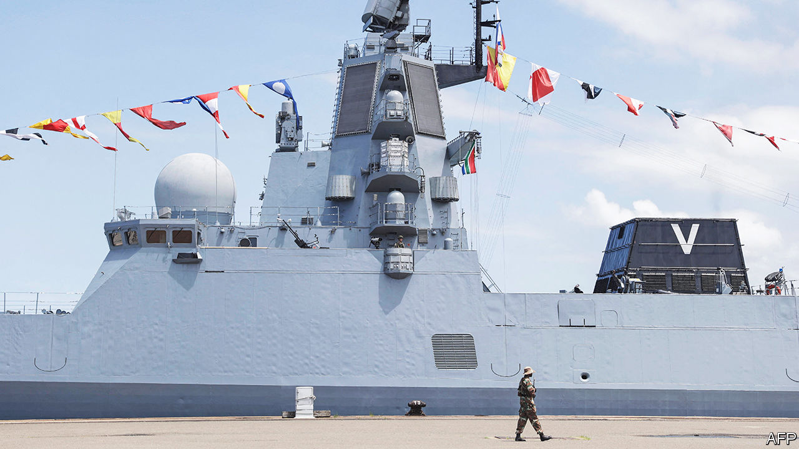

###### Not so neutral

# Why South Africa is drifting into the Sino-Russian orbit 

##### The ANC elite is full of Russian sympathisers 

 

> Feb 19th 2023 

South africa’s navy, like much of the country, is dilapidated. Its fleet spends less than half the time on the seas that it did a decade ago. It has few working ships, a result of budget cuts by the ruling African National Congress (anc). So it makes sense that the country would welcome better fleets that might teach it a thing or two. 

But the hosting of Russian and Chinese navies for exercises from February 17th-27th is not just a chance for sailors to salute each other. Coinciding with the one-year anniversary of , the operations underline how the anc government, despite claiming to be neutral over the conflict, is drifting into the Sino-Russian orbit, partly by choice. The West’s resulting frustrations with South Africa show that mid-ranking countries claiming to be “non-aligned” today are often performing a tricky balancing act.

The anc has long had a soft spot for Russia. Party stalwarts such as Naledi Pandor, South Africa’s foreign minister, are fond of telling Western diplomats how the Soviet Union supported the anti-apartheid struggle. (, also once part of the Soviet Union, never receives much thanks.) When Ms Pandor met Josep Borrell, the eu foreign-policy chief, in late January, she said that the West had no lessons to offer South Africa because the West never gave weapons to those fighting for freedom from white rule, according to two people with knowledge of the meeting. Russia also matters for pragmatic reasons; . In 2010 South Africa became the s in the brics, a group of big emerging markets. Membership matters to South Africa, by far the smallest economy in the bloc, because it gives it a seat at a table with powerful countries. 

For most of the 21st century the West has been understanding of South Africa’s desire to have it both ways. Guilt over their initial acquiescence to apartheid tempered rich countries’ criticism of the anc. South Africa was the gateway to the rest of the continent. As long as it was open to trade, investment and tourists from America and Europe, the anc was given a pass. Western countries still represent four of the five top destinations for South African exports. They also account for most of the country’s foreign direct investment and international holdings of South African assets. 

But the war in Ukraine has drawn attention to South Africa’s ostensible non-alignment. Last March it was one of 26 of Africa’s 54 countries that failed to condemn Russia’s invasion at the un General Assembly. That irked but did not surprise Western diplomats. On average South Africa echoed only 23% of America’s votes annually between 2017 and 2021, according to analysis by That was ten percentage points lower than the average for all countries—almost as divergent as nations such as Cuba and Zimbabwe. South Africa was among the minority of un members that did not condemn Russia’s invasion of Crimea in 2014. Public opinion is different: most South Africans seem to disapprove of Russia’s actions in Ukraine. 

South Africa’s abstention in October 2022, on whether to condemn  of Ukrainian territory, caused greater frustration in the West. A month earlier Cyril Ramaphosa had become the first head of state to receive a private tour of the White House from Joe Biden—a sign of America’s efforts to woo South Africa. Weeks later Mr Ramaphosa would become the first to conduct a state visit to Britain under King Charles III. Western diplomats say they consulted the South Africans on the text of the un resolution but ultimately Mr Ramaphosa overruled his diplomats and abstained. (His spokesperson declined to comment.) Charm offensives appear to be no match for real Russian ones. 

Choppier waters

Mr Ramaphosa was given the benefit of the doubt. He had an internal anc election to win in December, and needed to keep pro-Russian party members happy. But then in November a superyacht owned by a sanctioned Russian businessman was reported to be heading to Cape Town (in the end it opted for the Maldives). More disturbingly, later that month, a Russian merchant ship subject to us sanctions for its alleged role in carrying materiel was spotted in South African waters. The ship, known as , turned its tracking device off before docking at a naval base in early December. Eye-witnesses reported cargo being offloaded under the cover of darkness. Diplomatic sources worry that further materiel may have been put on the ship afterwards. Thandi Modise, the defence minister, has not given a full account of events, saying only that the ship was bringing an order of ammunition placed before the pandemic. “We remain unsatisfied,” says a Western diplomat. (A spokesperson for Ms Modise did not respond to requests for comment.) 

Then, in January, came the visit of Sergei Lavrov. Alongside her Russian counterpart, Ms Pandor said that calling for Russia’s withdrawal from Ukraine would be “simplistic and infantile” given the “massive transfer of arms” that the West had given Kyiv. She also said the brics bloc should be part of “a redesigned global order”—to Russian and Chinese delight.

Now there are the naval exercises. South Africa hosted Russia and China in 2019 to less outcry. It co-operates with Western navies, including France’s, and regularly welcomes Western politicians. But hosting a Russian ship emblazoned with the pro-war “Z” logo at a time when Vladimir Putin’s troops are slaughtering Ukrainians on the battlefield marks a shift.

The government’s actions are drawing attention to the links between individual anc politicians and Russia. In 2021 David Mabuza, the deputy president, spent more than a month in Russia for a “scheduled medical consultation”. Ms Modise, a rare female guerrilla for the anc’s armed wing during the struggle, attended a security summit in Moscow in August with defence ministers from 34 other countries. Western diplomats see engaging with her as a lost cause. There are echoes, notes one, of Russia’s  in more fragile African countries, such as Mali and the Central African Republic, where the Wagner Group of mercenaries is propping up regimes. Russia cannot match the West’s economic importance to South Africa, but it can try to pick off pliant elites, especially those with anti-Western sympathies.

The West is still figuring out how to respond to the anc’s pro-Russian moves. Some officials worry that speaking out or issuing threats will push anc politicians further eastward. Diplomats note that in South Africa, what can seem like conspiracy is often cock-up. Ministries are siloed; the foreign ministry was unaware of the arrival of . But officials on the ground all agree that defending a softly-softly approach to the anc government to their respective capitals is becoming harder. 

Some in the West favour a tougher line. American senators are privately asking why South Africa should have preferential trade terms with the United States, as it does through the African Growth and Opportunity Act, when it is de facto supporting a wartime enemy. Some American officials want their law-enforcement and intelligence agencies to take a closer look at Russia’s links to corrupt South African elites. Western governments are pondering whether to warn Mr Ramaphosa about the consequences should he attend a Russia-Africa summit due later this year. 

The tragedy is that South Africa needs all the help it can get. It is not the singular sub-Saharan African power it was in the 2000s. Nor has it gone unnoticed that the country is falling apart. There are  and the taps are when Janet Yellen, America’s treasury secretary, visited last month water tanks had to be delivered to where she was staying because the water was off. Organised crime is rampant. Yet just when it should be drawing closer to its main sources of trade and investment, it is veering away. To friends in the West, South Africa’s pretensions to global importance look increasingly ridiculous. Its sympathy for Russia only makes it more so. ■

