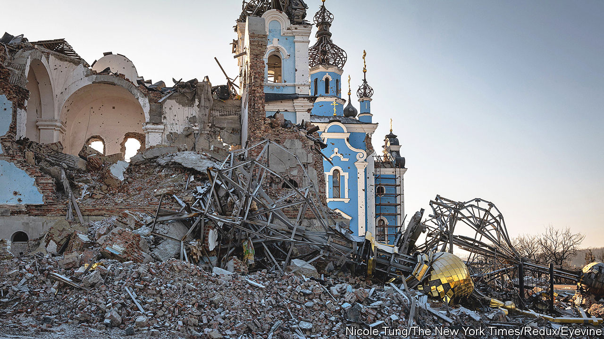

###### What madness looks like

# Gradually, the besieged city of Bakhmut is being abandoned by everyone 

##### The present focus of the war in Ukraine is merely a wasteland 

 

> Feb 23rd 2023 


The phrase had recently become a staple of President Volodymyr Zelensky’s nightly addresses to the people of Ukraine: “Bakhmut holds!” The city, at the edge of the Donbas region in the east, was his “Fortress Bakhmut”, stout-hearted and unconquerable. Then, in an interview published on February 19th, the president’s tone slightly changed. Bakhmut was “not a particularly big town”. It must still be defended against the Russian invaders, but not “at any price”. He had already conceded that there was “almost no life left”, and added: “This is what madness looks like.”

Russia’s main onslaught had begun in August, and had grown in intensity ever since. This was both close-contact shooting and trench warfare, as in early-20th-century conflicts. Artillery duels to the south-east of the city often prevented advance or retreat. Into this inferno the Russians, headed by the mercenaries of the Wagner group, threw all the troops they could, most of them new conscripts. They died in such numbers that Bakhmut was called “the meat-grinder”. But the defenders, too, were losing men in the high dozens every day. At least they took away their dead and wounded; the Russians did not bother. 

By mid-December, explosions and gunfire shook the city every few seconds. Metre by metre the Russians were advancing. By one estimate, 60% of the city’s infrastructure had been destroyed. The streets were empty save for rubble, burnt-out cars and foraging dogs. Since late summer there had been no power or piped water, and only rare internet connection. The main bridge across the Bakhmutka river had been blown up, replaced by planks. By February the two highways into town were within range of Russian fire; only a back road remained to bring supplies in or, when they had endured enough, to take people out. 

Several times they had been ordered by the government to leave. By February, almost all had. From a city of 70,000 people, around 5,000 remained. They were rarely spotted, on the dash to a rare open shop or to the lifeline of the mobile food vans, scooping water from streams, or cooking over firewood outside their shattered homes. They spent most of their time in “invincibility centres”, buildings with sandbagged windows and wood stoves, huddling to recharge their phones. At night many slept in unventilated cellars, regularly climbing the stairs to get a gasp of air. 

Those who stayed were almost all the old, the ill, their carers, the poor and, especially, the stubborn. A number felt safe while Ukraine still controlled the city. Some, though, were hoping hard for the Russians to come. For Bakhmut was a border city, used to being tussled over. It had begun life as a fort, then a fortified town: Fortress Bakhmut, indeed. There was a spell under Serb frontiersmen, a shorter period of Cossack rule, and an engrained habit of resisting, then accommodating to, both Kyiv and Moscow. With Russia’s revolution it was renamed Artemivsk, in honour of a communist revolutionary, and acquired a large statue of Lenin, a Soviet tank on a plinth and roads lined with dismal apartment blocks. Even after the fall of the Soviet Union, the statues and Soviet street names remained; people did not mind them. 

In 2014 pro-Russian separatists from the Donetsk People’s Republic took over parts of the city. After Ukrainian forces drove them out later that year, Lenin’s statue came down and the Soviet street-names were changed: Bakhmut was Bakhmut again. Yet its identity was still fluid. Two-thirds of the citizens thought of themselves as Ukrainians, but most had Russian as their first language. What they spoke was a blend of the two. Many had family in Russia, or business connections. The recent fighting had established a no-man’s-land at the edge of town, and this forced separation from Donetsk felt like losing a part of themselves. 

They were mystified too, by the way the war in Ukraine was now focused on their city. It was not famous. Some thought it beautiful, with the golden-domed church of St Vladimir, the Palace of Culture and views over fields and woods. But the main attractions lay underground, in the huge salt mines at neighbouring Soledar and the gypsum caves of the Artwinery, where 50m bottles of sparkling wine were laid down to mature. Salt and wine had made Bakhmut rich once the railway came, in the late 19th century. But by 2023 work had stopped in the glistening salt mines, the Artwinery was back under Russian control and the Palace of Culture had been fire-bombed. As for the views, they were now of smoke rising from Soledar and a wilderness of blasted trees. 

The city was not especially strategic, either. Two main roads crossed there, but it was not a logistics hub of any size. It opened the way, if Russia won it, to bigger cities in the Donbas; yet there were other routes. The Soledar salt mines were vast enough to run tanks and armoured cars around in, and for troops to infiltrate for miles underground; there were myths, too, of great stockpiles of weapons there. But mines could be blockaded from outside. To most strategists, the fierceness of the onslaught on Bakhmut far outweighed its military importance. It baffled them, to the point where some joked that the head of the Wagner group, Yevgeny Prigozhin, must have his eyes on those 50m bottles of wine and hopes of a quick fortune. 

All Mr Prigozhin wanted, though, was to take Bakhmut for Vladimir Putin; or simply for his own glory, once he had dared to publicly criticise the ineptitude of the men in charge of the war. The city had become an unlucky pawn in Kremlin power-politics. But for both sides, now, its value was almost entirely symbolic. For Mr Putin, victory there would mean the end of a humiliating run of defeats. For Mr Zelensky, Ukraine’s whole resolve had been summed up in his phrase, “Bakhmut holds.” 

For the sake of national morale, therefore—and for the sake of spurring Western allies to keep sending weapons—the city could not fall. As one weary Ukrainian soldier put it, “What sense to hold all these months if you need to retreat?” And yet, to all intents and purposes, Bakhmut was already dead. Whichever side prevailed, ghost-citizens in burnt ruins would be their only prize. ■

