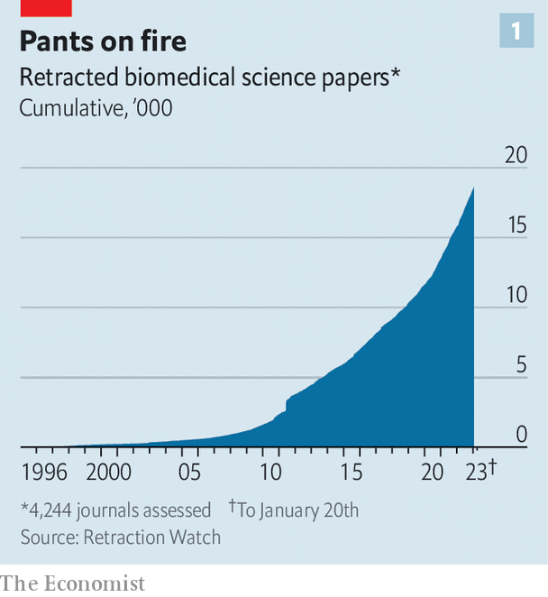
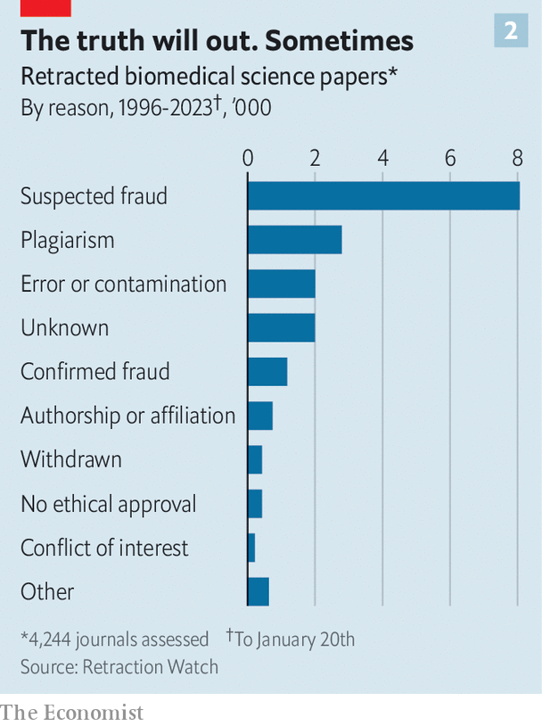
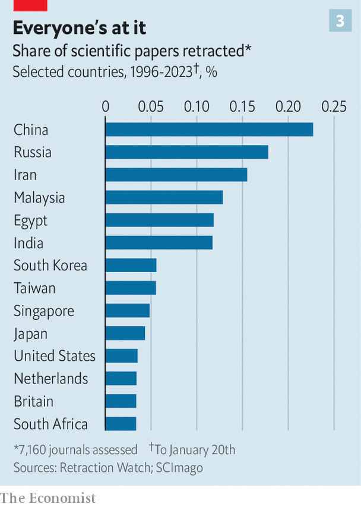
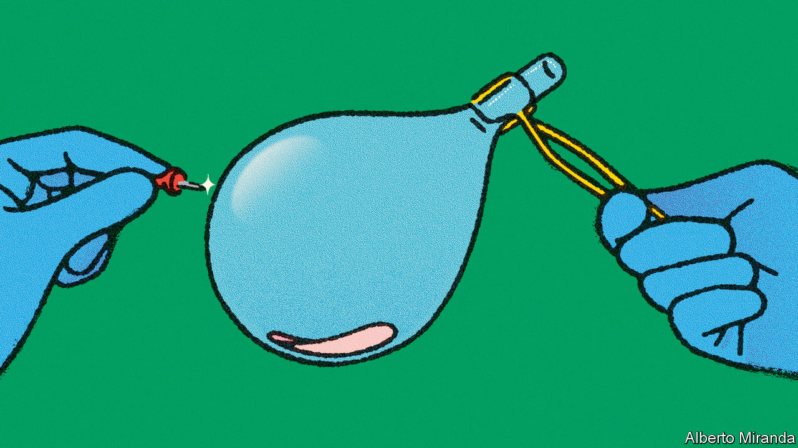

###### Scientific malpractice

# There is a worrying amount of fraud in medical research 

##### And a worrying unwillingness to do anything about it 

 

> Feb 22nd 2023 

IN 2011 BEN MOL, a professor of obstetrics and gynaecology at Monash University, in Melbourne, came across a retraction notice for a study on uterine fibroids and infertility published by a researcher in Egypt. The journal which had published it was retracting it because it contained identical numbers to those in an earlier Spanish study—except that that one had been on uterine polyps. The author, it turned out, had simply copied parts of the polyp paper and changed the disease. 

“From that moment I was alert,” says Dr Mol. And his alertness was not merely as a reader of published papers. He was also, at the time, an editor of the , and frequently also a peer reviewer for papers submitted to other journals. Sure enough, two papers containing apparently fabricated data soon landed on his desk. He rejected them. But, a year later, he came across them again, except with the fishy data changed, published in another journal. 

Since then, he has teamed up with other researchers to investigate groups of papers by authors he has spotted as data fabricators. Wherever he saw smoke, he found fire. There were tables on patients’ characteristics that contained only even numbers. There were values that were clinically unlikely. There was an implausible 40:60 sex ratio of babies when the mothers-to-be had, purportedly, been selected at random. Eye-popping speeds of completing clinical trials were common. 

The fabrication of unreality

Dr Mol and his colleagues have sent their concerns about more than 750 papers to the journals that published them. But, all too often, either nothing seems to happen or investigations take years. Only 80 of the studies they have flagged have so far been retracted. Worse, many have been included in systematic reviews—the sort of research round-ups that inform clinical practice.

Millions of patients may, as a consequence, be receiving wrong treatments. One example concerns steroid injections given to women undergoing elective Caesarean sections to deliver their babies. These injections are intended to prevent breathing problems in newborns. There is a worry that they might cause damage to a baby’s brain, but the practice was supported by a review, published in 2018, by Cochrane, a charity for the promotion of evidence-based medicine. However, when Dr Mol and his colleagues looked at this review, they found it included three studies that they had noted as unreliable. A revised review, published in 2021, which excluded these three, found the benefits of the drugs for such cases to be uncertain.

 


Partly or entirely fabricated papers are being found in ever-larger numbers, thanks to sleuths like Dr Mol. Retraction Watch, an online database, lists nearly 19,000 papers on biomedical-science topics that have been retracted (see chart 1). In 2022 there were about 2,600 retractions in this area—more than twice the number in 2018. Some were the results of honest mistakes, but misconduct of one sort or another is involved in the vast majority of them (see chart 2).

 


Yet journals can take years to retract, if they ever do so. Going by these numbers, roughly one in 1,000 papers gets retracted. That does not sound too bad. However, Ivan Oransky, one of Retraction Watch’s founders, reckons, based on various studies of the matter and reports from sleuths, that something more like one in 50 papers has results which are unreliable because of fabrication, plagiarism or serious errors. 

Most fabricated papers come from one of two sources. Some, particularly those claiming to report clinical trials, are the products of prolific individual fraudsters or groups of fraudsters. Those uncovered by Dr Mol fall into this category. Others, more often purporting to be about basic science, such as molecular biology, are written, for a fee, by outfits known as “paper mills”. Frequently, these are fabricated by copying published papers and substituting the gene or disease a legitimate paper refers to with another. 

According to the Retraction Watch database, the 200 authors with the most retractions account for over a quarter of all 19,000 retractions. Many of the most prolific fraudsters are senior scientists at big universities or hospitals. Few have spoken openly about their motives for making up research. But the confessions of those who have speak volumes about what may push others down the same path.

Cheats ever prosper

Scientific research is a hard slog, and the results are often disappointingly equivocal answers to a researcher’s bold hypothesis. Diederik Stapel, once a psychology professor at Tilburg University in the Netherlands, had 58 papers retracted after revelations that he fabricated studies. He did so, he said in his confessional memoir, “Faking Science”, because they otherwise failed to provide a solution that was “simple, clear, beautiful and elegant”. Like many similar fabulists, however, he was also driven by career incentives. The aphorism “publish or perish” reflects an academic truth. A long publication list is crucial for promotion, or for switching institutions to get a better job. But journals prefer studies that show strong, positive results—meaning much of a researcher’s effort is, in terms of career advancement, wasted. 

Publishing lots of studies has enabled some fraudsters to be perceived as leading experts in their fields, with the perks of professional prestige which go with that—at least until things unravel. As Dorothy Bishop, a retired experimental psychologist from Oxford University who volunteers her time identifying problematic studies observes, such fraudsters often run research groups or have collaborative networks with other research centres. When the fabrication is discovered, those colleagues are affected by the aftermath. “Quite often”, she says, “junior people get their careers completely derailed by this.”

It is a particular problem in China. Unrealistic publication quotas are often needed to obtain the best jobs in hospitals, and those who publish in top journals also get big cash bonuses. Not surprisingly, China is thus a country that has developed a thriving paper-mill industry. Indeed, almost all retractions linked to paper mills list Chinese authors. Of papers submitted to journals, about a fifth have at least one contributor from a Chinese institution, yet this fifth accounts for nearly half of papers subsequently retracted. 

A review of submissions to two journals specifically aimed at by paper mills does, however, show that the problem stretches way beyond China. It found that the fakes had authors from more than 70 countries. And, though those from middle income countries (China included, see chart 3) are the most numerous, some of the most consequential fabrications of clinical trials which have come to light were concocted in America, Canada, Europe and Japan. 

 


How much cheating is never caught is anyone’s guess. As Dr Bishop notes, “The only ones we know about are the ones that are not very good at it. If somebody is very good at fraud, you’re not going to detect it.” And it is not just a few bad apples. In 2009  published a round-up of 18 surveys of scientists, mostly in America, that had asked about fraud. Though only 2% of respondents admitted falsifying data themselves, 14% said they knew someone who had. Similarly, a third of those asked confessed to other questionable research practices, such as dropping inconvenient data points based on “gut feeling”, or making important changes to a study’s protocol while it was in progress. But they pointed the finger at 72% of their colleagues. 

America is not exceptional in this. In a survey of academics in Britain, published in 2016, nearly one in five reported having fabricated data. And in a recent survey of researchers in the Netherlands, 10% of those in the life and medical sciences admitted they had falsified or fabricated data.

Many fake papers are me-too studies, supporting treatments already backed by other work. For the most part, these are unlikely to sway clinical practice. But some fraudsters have been the inspiration for specific medical interventions which have turned out to be useless, or even harmful. 

For example, critically ill patients undergoing surgery were once sometimes given starch infusions to boost their blood pressure. This was based in part on seven now discredited studies by Joachim Boldt, a German anaesthesiologist. A revised round-up of the evidence published in the , in 2013, after his fabrications were discovered, concluded that giving starch infusions in these circumstances caused kidney damage and sometimes killed people. 

Likewise, for more than a decade cardiac patients in Europe were given beta-blockers before surgery, with the intention of reducing heart attacks and strokes—a practice that rested on a study from 2009 which was eventually determined to have been based, at least in part, on fabricated data. By one estimate, this approach may have caused 10,000 deaths a year in Britain alone. And a systematic review showing that infusion of a high-dose sugar solution reduces mortality after head injury was retracted after an investigation failed to find evidence that any of the trials included in it, which were all ascribed to the same researcher, had actually taken place. 

Bricks without straw

Spotting fabricated papers often starts with catching one by chance and then looking at others by the same hand, as Dr Mol did. “A lot of the problems are only apparent when you look across publications by an author. So if you had one paper, you wouldn’t necessarily identify them,” says Alison Avenell of the University of Aberdeen, who is part of a team that has raised concerns about hundreds of clinical trials published by several research groups. Common patterns in dodgy papers, she opines, include unusually big effects of the reported treatments, peculiar drop-out rates among participants, or the same data appearing in different trial reports. “You see things that are virtually statistically impossible,” she says.

Dr Carlisle and others have devised various statistical checks to catch unusual numbers in single papers. As an editor of , he used such checks on all 526 clinical-trial studies submitted to the journal between 2017 and 2020. When he looked at papers for which the authors had not submitted individual patients’ underlying numbers, he found that 2% included false data. This jumped to 44% for those for which he could also examine such individual numbers, including 26% which he judged as “fatally flawed”. 

Doing checks like these routinely could stop a lot of fake papers being published. Yet, though reviewers who vet journal papers for publication “get all of these supplemental files and links to data sets”, says Lisa Bero, of Cochrane, “most of them don’t look at it.” Moreover, though authors often say that the backup data for their papers will be made available on request, a study conducted in 2022 reported that 93% fail to provide them when so requested by other researchers. “You ask for the original data and then, my goodness, you realise we live in a dangerous world,” says Ian Roberts of the London School of Hygiene and Tropical Medicine. Floods, earthquakes, termites, stolen laptops—he has seen all sorts of excuses for lost data. 

Blots on the landscape

Cochrane maintains a database of retracted studies, and its systematic reviews are revised as needed. But that is rare for these types of reviews, partly because retracted papers are often not flagged prominently as such in online libraries and so continue to be cited as if they were valid research. Indifference plays a role too, with many researchers reluctant to set things straight even when told their reviews included fabricated studies. The attitude is, “it was right at the time”, says Jack Wilkinson, a biostatistician at Manchester University. 

For example, Dr Avenell and her colleagues assessed the impact of 27 retracted clinical-trial papers, covering several medical conditions. These papers were included in 88 systematic reviews and clinical guidelines. The researchers reckoned that in half of those the conclusions were likely to change if the retracted trials were removed. They notified the authors of all the reviews about the retractions. Only half of them bothered to reply. A year later, in 39 of the 44 reviews that would have been affected, no action was undertaken.

Similarly depressing discoveries have been made in recent years for paper-mill articles. Though lots of these are so sloppy that any serious researcher would consider them a joke, and they are thus often published in obscure periodicals which would print anything for a fee, some look solid enough to be accepted by leading scientific journals. These are now discovering they have published hundreds of them. One analysis of 53,000 papers submitted to journals in a variety of disciplines, spanning six publishers, flagged between 2% and 46% of them as suspicious. 

Molecular-biology articles, those paper-mill specialities, often include pictures of Western blots—a laboratory technique used to study proteins. Such images can be found, for example, in papers that investigate how a given drug affects human cells. No two Western blots should look the same, so a sharp pair of eyes can spot duplicates. Elisabeth Bik, a Dutch microbiologist turned full-time detective hunting for fabricated papers, has an exceptional talent for doing just that. Using her “pattern-matching eyes and lots of caffeine”, as she put it in a recent opinion piece, she has analysed more than 100,000 papers, and found blot-based evidence of error or cheating in 6,500 of them.

Studies with falsified Western blots may seem less consequential than fabricated clinical trials. But consider a recent controversy concerning a series of influential papers on the causes of Alzheimer’s disease of which the lead author is Sylvain Lesné of the University of Minnesota (which is investigating the matter). 

Dr Bik and others have recently found what they say is evidence of image-manipulation, including of pictures of blots, in these studies. And other scientists have tried and failed to replicate the results of a landmark study Dr Lesné published in  in 2006, which appeared to provide crucial evidence concerning a hypothesis that links the disease with so-called amyloid plaques in the brain, and which is one of the most cited papers in Alzheimer’s research. This particular article may have sent an entire line of scientific inquiry into that hypothesis in the wrong direction, by pointing a finger at one particular form of amyloid beta, the plaque-forming protein. In July 2022  published an expression of concern, while it investigates. 

Similar patterns are emerging in genetics. In a study published last year Jennifer Byrne, a cancer researcher at the University of Sydney, led a team that screened nearly 12,000 papers using Seek &amp; Blastn, a piece of software they developed themselves, to check details of substances called nucleotide-sequence reagents (NSRs). 

NSRs are short pieces of DNA or RNA that form part of many studies of genes. They are intended to bind to specific bits of natural genetic material. Seek &amp; Blastn extracts the sequences of these reagents from papers and compares them with those in Blastn, a public sequence database, to check whether they match their supposed genetic targets. The team found that 6% of papers contained errors suggestive of paper-mill production. 

The consequences of fake genetic studies such as these could be as far-reaching as those involving dodgy Western blots. Dr Byrne and her co-authors estimate that as many as 100,000 published papers about human genes may emanate from paper mills, and that a quarter of these are such that they “may misinform the future development of human therapies”. 

Disciplining the discipline

It is often asserted that science is self-correcting. And it is true that, if a claimed result is important enough, an inability to replicate it or of subsequent work to conform to it will eventually be noticed. In the short term, though, it is easy to hide in the shadows. Even co-authors of a data-fabricating scientist—those, in other words, who are closest to him or her—may not notice what the culprit is up to. In complex studies of a particular disease, several types of researchers will be involved, who are, by definition, not experts in each other’s fields. As Dr Bishop observes, “You just tend to take on trust the bits of data that somebody else has given you.” 

Moreover, even after a published paper is flagged as containing fabricated data, self-correction often fails to kick in. There is a “massive variation” in how journals and publishers react when alerted to problems, says Dr Wilkinson—whether they investigate at all, how long it takes to reach a decision, and what they do after that. 

Dr Avenell avers that in her experience it usually takes two to three years to get an expression of concern or a retraction published. “The only way we get retractions is to repeatedly badger the journals over and over and over again”, she says. “If you just send them a one-off email with details of all of your concerns, it’s very unlikely that anybody is ever going to do anything.” Dr Bero says that many Cochrane reviewers think it a waste of time to alert journal editors about problematic studies they have identified, so they don’t bother. “Many of our authors have written to editors and just gotten no response, or the editor doesn’t do anything to retract the article or doesn’t investigate at all,” she observes.

One problem is that journals rarely have staff, such as statisticians, with the expertise needed to deal with such matters. Publishers, for their part, make profits from publishing more, not from investigating potential retractions. They also fear being sued by belligerent fraudsters. They therefore often pass the ball to the institutions that employ the suspected miscreants. 

In America, institutions accepting federal grant money (which is almost all of the serious ones) are required to follow government rules which say that they should investigate allegations of research misconduct within 60 days. But many take more than a year or two, says C.K. Gunsalus, an ethicist at the University of Illinois, who has conducted such investigations. 

Just do it

In some cases, there are good reasons for delay. The difficulty of finding experts competent to conduct complex analyses is one. Another is that an investigation of one paper may turn up further suspicious publications. All too often, though, “there is very little sense of urgency”, says Dr Gunsalus. The goal is to decide whether a researcher should be fired, rather than a desire to protect the integrity of the scientific literature. Until an employment decision is made, the university usually stays mum. 

Even in America, the quality of such investigations often leaves a lot to be desired, says Dr Gunsalus. And many places have no relevant regulations. In Western countries people fired for research misconduct have sometimes gone on to do the same thing elsewhere, says Dr Bishop. And in their list of concerns with 172 papers published by a group led by Zatolleh Asemi at the Kashan University of Medical Sciences, in Iran, Andrew Grey of the University of Auckland, in New Zealand, and his colleagues note that five of the seven vice-chancellors at his university are co-authors of at least one affected submission. 

Nor do universities provide incentives for whistle-blowers to act, though that can stop fabricated studies being produced in the first place. Their rules usually say lots about the consequences of spurious allegations, but little or nothing about any duty to raise the alarm about fraud. 

 


Few whistle-blowers have Dr Bik’s perseverance. After she raised concerns about more than 60 papers by Didier Raoult, a now-retired professor at a university hospital in Marseille, she received online threats and her home address was posted on Twitter by one of his colleagues. Dr Raoult also filed a legal complaint against her for attempted blackmail and harassment, an action the French National Centre for Scientific Research, a government agency, condemned as “judicialisation of scientific controversy and criticism”. In 2021 she won the John Maddox prize—awarded jointly by Sense about Science, a British charity, and , of which Maddox was, for many years, editor—for “courage and integrity in standing up for sound science and evidence”.

There are some signs of hope. Besides scanning retraction databases for new additions, and redoing the analyses that include them, Cochrane has also started to check papers for integrity. A recent Cochrane review of research on drugs intended to prevent pre-term labour excluded 44 studies on such grounds, which was one in four of those on the starting list. 

In a similar vein, Britain’s National Institute of Health and Care Research pays for INSPECT-SR, a project run by Dr Wilkinson that is developing integrity-checking tools for systematic reviews like those conducted by Cochrane. STM, a publishing-industry association, is working on a similar system to detect fabrications in submitted papers. The idea, says Joris van Rossum, who leads this work, is that the system will give editors signals about suspicious features commonly used by paper mills, such as duplicated images, the same paper being submitted simultaneously to several journals, authors with no record of having expertise in the subject, and so on. 

Both Dr Wilkinson and Dr van Rossum worry about an arms race between fabricators and those employed to catch them. Such fears are amplified by the growing sophistication of artificial-intelligence (AI) tools like ChatGPT. In a recent study for which this was asked to generate 50 medical-research abstracts, both human reviewers and an AI-output detector failed to identify a third of the bot’s papers as such. 

Trust. But verify

In the end, however, keeping fakes out of the scientific record depends on the willingness of publishers to stump up more resources. Statistical checks of clinical-trial papers often involve laborious manual work, such as typing up specific data in spreadsheets. This would require journals to hire dedicated staff, cutting into profits. 

Many academics who have spent years trying to get fabricated papers retracted are pessimistic that better ways to detect fraud will, alone, make a big difference. Dr Roberts and Dr Mol want journals to be regulated in the way that social media and the news business are in some countries, with standards on what they publish. Peter Wilmshurst, a British cardiologist who has raised the alarm about numerous cases of research misconduct in his field, thinks there should be criminal penalties for those who fabricate data. Dr Gunsalus wants universities to make public the reports from their research-fraud investigations. And everyone agrees that publish or perish is a recipe for disaster. 

None of these solutions will be quick or straightforward. But it is now clear that choosing to look the other way is causing palpable harm to patients. As Stuart Ritchie of King’s College, London, notes in his book, “Science Fictions”: “For the sake of the science, it might be time for scientists to start trusting each other a little less.” ■


