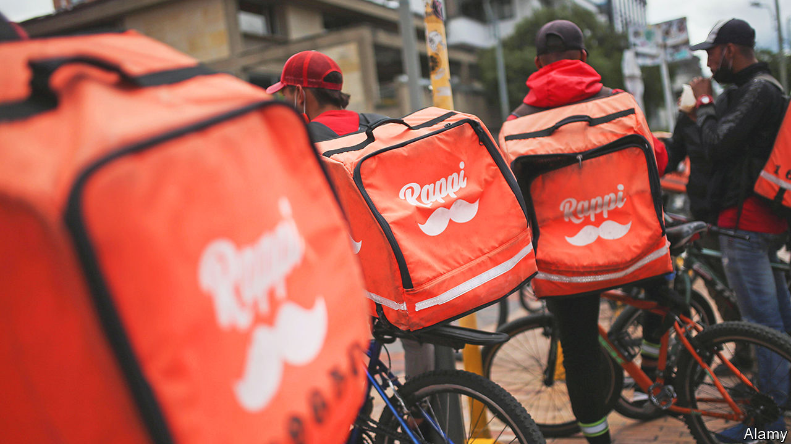

###### Not delivering the goods

# Gustavo Petro, Colombia’s president, wants to smother the gig economy 

##### The left-winger has angry taxi-drivers to deal with, too 

 

> Feb 23rd 2023 

On February 22nd fleets of taxi drivers went on strike and tried to block roads in over two dozen cities in Colombia. Their beef was with Gustavo Petro, the country’s recently elected left-wing president. They cheered when Mr Petro’s administration said that it was going to regulate transport apps, such as Didi and Uber, which are illegal in the country. But his government’s proposals, which were leaked in January, created uproar among ordinary Colombians: one draft suggested they would have fined users 10m pesos ($2,000) and blocked the apps. After hundreds of gig workers took to the streets in January Mr Petro put his plans on hold. On the evening of February 22nd the transport minister met striking taxi-drivers; they will now hash out a plan. The furore offers a hint of the political chaos that could become a feature of Mr Petro’s time in office.

Mr Petro has given himself a difficult task. The gig economy is thriving in Latin America, and particularly in Colombia. Rappi, the country’s first tech unicorn, was valued at $5bn in 2022 and is used across the region. It is not illegal in Colombia, but exists in a regulatory void, as it is not considered a formal employer. Around 40,000 Rappi couriers work in the country. Another 150,000 gig workers toil for competitors such as Uber, iFood and Cabify. 

Most of these gig workers are Venezuelan migrants, of which there are around 2.5m in Colombia. The apps provide them with a lifeline in the form of a daily income. But it is precarious. “There are days that are really bad,” says Robert Romero, a Venezuelan Rappi driver. His journey will involve winding his bike through Bogotá’s awful traffic, trying to avoid a deadly crash. 

Mr Petro’s concern is that the gig economy apps do not offer minimum wages, health insurance or pensions for workers. He thinks that their contracts create a “lying labour relationship”. His government wants to enshrine formal labour protections for gig workers into law, and is introducing a labour reform this year. Big tech is also an easy target for the new left-wing administration to rail against. “It shouldn’t be possible to accumulate wealth on the one hand and labour hazards on the other hand,” says Edwin Palma, the vice-minister of labour relations. 

Mr Petro also wants foreign tech companies to pay more in taxes. In November Congress approved the government’s new tax reform, one aim of which is to capitalise on the country’s growing digitisation. It includes a digital-services tax of 3% of gross revenue and stricter enforcement of a value-added tax on foreign digital services. It will automatically consider any company with more than 300,000 Colombian users as subject to taxation. José Antonio Ocampo, the finance minister, mentioned Uber, Spotify and Netflix when he announced the proposal last year. 

This approach is a departure from the laissez-faire techno-utopianism of previous governments. Iván Duque, Mr Petro’s predecessor, championed what he called the “orange economy” of startups (referring to Rappi’s distinctive colour) and creative entrepreneurship. Mr Duque even sometimes donned a Rappi-moustached hat. By contrast, today members of Unidapp, Colombia’s largest digital-platform workers’ union, now regularly appear at consultations with the ministry of labour. “The [previous] government never bothered to listen to our needs,” says Luz Myriam, Unidapp’s president. “But we are confident [this] government is a new beginning that will carry out our demands.” 

Critics fear that these reforms could backfire. A heavier tax burden could stifle innovation and discourage future startups. “This [tax] reform will increase unemployment, inflation and poverty,” says Miguel Uribe, a senator from the conservative opposition. Higher labour costs mean pricier and slower deliveries for delivery-app customers. It could also mean fewer jobs. In Colombia, most gig workers were previously unemployed or involved in other informal activities, according to a survey from Fedesarrollo, a think-tank. “The choice isn’t between formalisation and informalisation,” thinks Cristina Fernandez of Fedesarrollo, “but instead between an informal delivery job or no job at all.” ■

