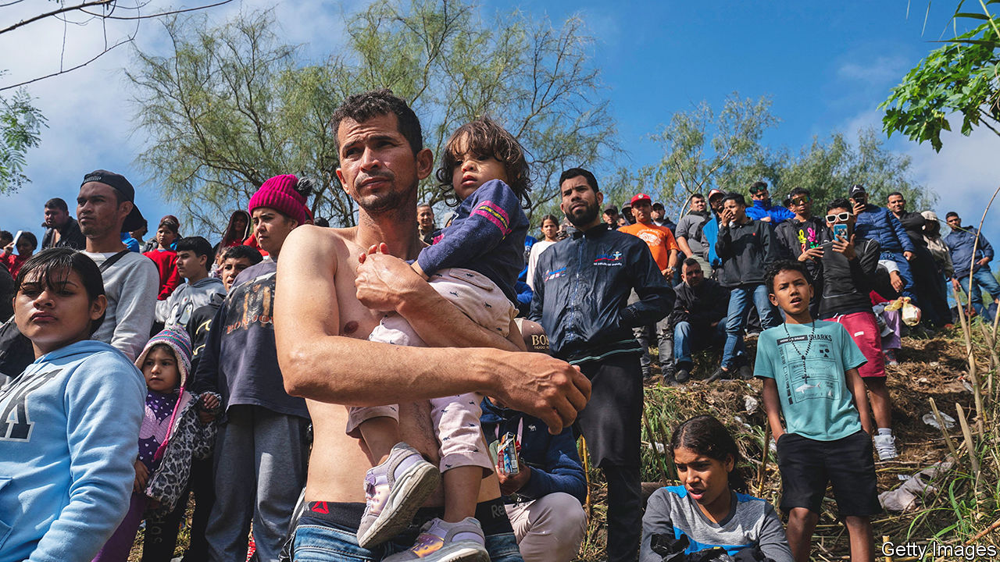
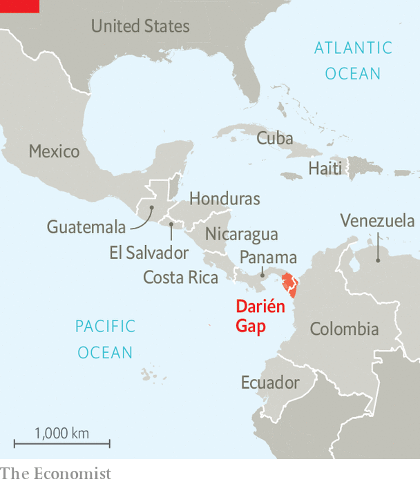
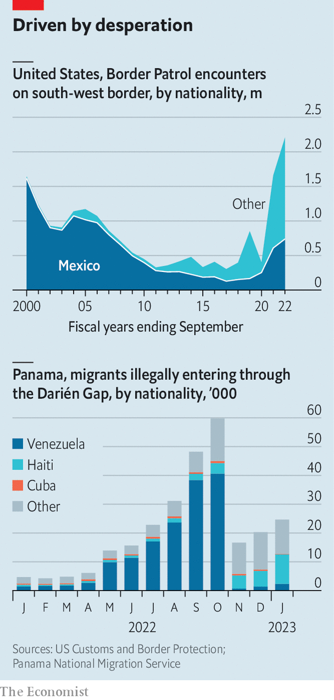
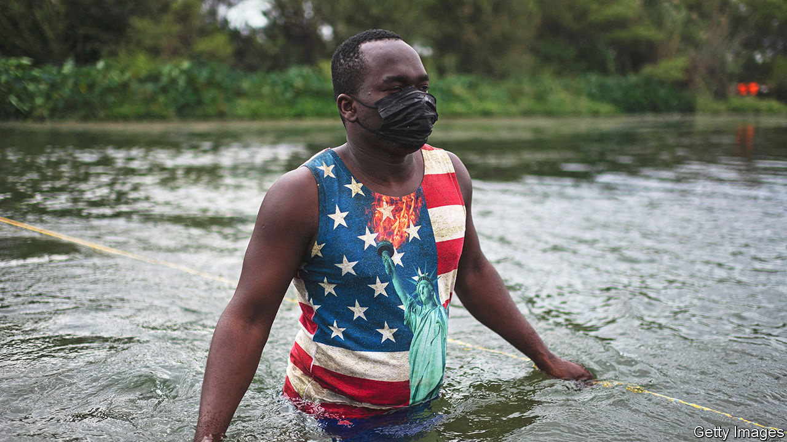

###### A new chapter

# Joe Biden needs Mexico’s co-operation on migration 

##### His administration hopes a new approach will be transformative 

 

> Feb 22nd 2023 

Over the past four decades migration flows over America’s southern border with Mexico have grown to become epic in scope—and an epic headache for American politicians. On February 21st President Joe Biden’s administration announced a new approach that it hopes could be transformative. The proposed policy allows the United States to immediately expel most people who cross its border illegally. It opens up a new, narrow, legal pathway for migrants: asylum-seekers will be able to try to secure an interview using a smartphone app. The policy also confirms other legal routes for some migrants in Latin America and the Caribbean.

These changes have the potential to significantly cut the volume of people entering the United States: the number of recorded attempts to cross its south-western border illegally in January, when some components of the new regime were put in place, fell to 128,410, or by 42% compared with December. But even as the United States asserts more control over its own border, the picture remains dangerously chaotic farther south, in Mexico and its southern neighbours. That raises the possibility that while the location of the migrant crisis may shift to Mexican soil, it remains unresolved. Mr Biden’s plans are being analysed by Mexican officials, who are unlikely to be impressed. They have long resisted pressure to be deemed a “safe third country”, requiring asylum-seekers who pass through their territory to seek refuge there instead of the United States—something Mr Biden’s proposal purports to do. 

Illegal migration across America’s southern border first accelerated in the 1980s, with the number of US Customs and Border Protection (CBP) “encounters” (apprehensions or expulsions) often exceeding 1m a year since then. In 2022, 2m unique individuals of all nationalities tried to cross and were apprehended or expelled (many more may have been undiscovered). The composition of people has shifted, away from single Mexican adults looking for work, towards families from Latin America, who are far more likely to claim asylum. That involves being assessed by immigration courts in the United States that have backlogs, which makes immediate expulsion hard. In March 2020 Donald Trump’s administration used a pandemic-inspired measure, known as , to seal the border. It allows migrants to be expelled on public-health grounds, either to their own country or, in some cases, to Mexico, which has agreed to accept some nationalities along with Mexicans. 

 


 has been working on a semi-permanent replacement for Title 42, which is due to expire this year. The proposed rules would require asylum-seekers to try to secure an appointment using a smartphone app. If they do not the rules would establish a presumption that people who enter the United States are doing so illegally and are ineligible for asylum, although in some circumstances this could be contested. At the same time the policy would confirm as permanent a new system of “humanitarian parole” in which some 30,000 people a month, from selected countries (Cuba, Haiti, Nicaragua and Venezuela), can enter the United States, providing they meet certain conditions. To be eligible, they must typically get approval before they travel to the United States, have a financial backer there, have a passport and pay for a flight.

Mexico has been pushing for more such legal routes for migrants. At the “Three Amigos” summit in January between Canada, Mexico and the United States, President Andrés Manuel López Obrador said, “Social problems cannot be solved only by coercion measures.”

So will the new strategy work? According to the CBP, the largest drops in migrant flows have involved the nationalities facing a mix of the Title 42 regime and the parole system. A week after visas were announced for Venezuelans in October, the number encountered at the south-west border of the United States fell from an average of over 1,100 a day to under 200. By November this had fallen to 67, and by January to 28. Likewise, the numbers of Cubans, Haitians and Nicaraguans fell to 92 per day on January 21st, down from 928 on January 5th, when the parole system was extended to them. The administration is betting the new regime will make it harder for people to get into the United States. It may hope that this in turn weakens the incentives for migrants to leave their home countries. 

Yet looked at from a Mexican perspective, the picture is more chaotic. Mr López Obrador, a populist nationalist who has often bristled at the policies of his northern neighbour, is co-operating closely with the United States. But Mexico still has huge problems controlling migration. Its borders are porous, particularly with Guatemala, where jungles are hard to patrol. 

Since 2019 Mexico has deployed the National Guard, a militarised police force, to beef up its control of the border, after the Trump administration threatened to impose sanctions if it did not do more. More recently drones have been deployed. But Mexico’s migration agency has a tiny budget, of 1.8bn pesos ($96m), compared with its American counterpart, which has $17.5bn. A system of corruption means there is a huge vested interest in the illegal migration business. Migrants say that Mexican officials are easily bribed. Mexican gangs control many routes, particularly in the north of the country.

If Mexico is not capable of controlling migration, it follows that a key issue is whether the Biden administration’s proposed regime will change the incentives of migrants so that the flow from the south into Mexico drops. The evidence so far is mixed. Despite the fall in illegal crossings into the United States in January, large numbers of people are still on the move. 

 


Since October far fewer Venezuelans have attempted the journey through the Darién Gap, a treacherous stretch of jungle between Colombia and Panama. But their numbers appear to be rising again. In the first four weeks of this year nearly 25,000 people crossed the Darién Gap, more than in the first four months of last year (see chart). And despite being part of the scheme, Haitians made up the highest number of migrants crossing it in January. Some 10,222 made the journey that month.

Many others are coming from countries which are not eligible for Mr Biden’s scheme. According to data collected by the authorities in Panama, the nationalities of those traversing the Darién Gap are manifold. The second-highest number of migrants in January were Ecuadoreans, at 6,352. Even 913 Chinese people and 562 Indians tried their luck that month.

Confusion is rife at the US border. Migrants of the four nationalities in the visa scheme who are in Mexico are eligible to apply if they arrived in the country before the programme opened to them. “We now have the hope they will let us cross,” says Carolina Rivas, a 46-year-old Venezuelan waiting at the border. But if potential asylum-seekers are kept waiting for too long, they may resort to illegal routes again. 

Meanwhile, although 30,000 visas a month is generous, it is small by comparison with the number of people on the move. Around 6m Venezuelan migrants currently live in Latin America. The result of Mr Biden’s new approach may be that Mexico becomes the home of migrants who have left their country but cannot get into the United States. That is likely to foster discontent. Mexico’s officials grumble that its policy is a reaction to that of its northern neighbour. It is rarely consistent. “The constant and unpredictable changes are a huge challenge for us,” sighs one. 

 


Mr Biden’s plans have encountered resistance in the United States, both on the left and the right. Humanitarian groups argue that the most vulnerable migrants are the least likely to get in under this new scheme, and are planning to sue. Some would-be asylum-seekers face basic barriers, such as not having a financial backer, or a phone for the app the CBP requires people use to apply for the visa. 

However, Mr Biden’s proposal, which will also now be put to a 30-day public review, does allow asylum-seekers to rebut deportation if they have an “acute medical emergency”, or are in immediate danger. Nor would unaccompanied children be sent back. Judged by the numbers crossing America’s southern border now, the migration problem is being tackled. Judging by the huge numbers on the move, many of them vulnerable, it is far from solved. ■

