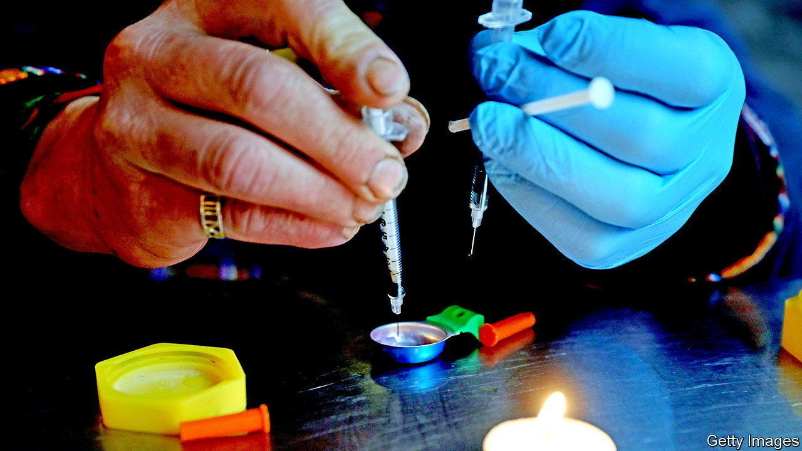

###### A small, necessary step

# One Canadian province has decriminalised drugs 

##### British Columbia’s bold experiment will be watched closely elsewhere 

 

> Feb 23rd 2023 

Illegal drugs are common in Downtown Eastside, a poor neighbourhood of Vancouver, the biggest city in British Columbia. Users regularly shoot up on the street. Overdoses are common. In 2016 British Columbia declared a public-health emergency after the number of people dying from illicit drugs more than doubled between 2009 and 2015, to 474. That figure has only kept rising. Last year, at least 2,272 British Columbians died from drugs.

Campaigners hope that this year could see a dip in those deaths. On January 31st British Columbia became the first province in Canada to decriminalise certain illegal drugs. Anyone aged 18 and older can now legally possess a combined 2.5 grams of illicit substances, including cocaine, opioids such as heroin, methamphetamine and ecstasy (or MDMA). Owners will no longer be arrested, charged or have their drugs seized. Police will hand out leaflets with treatment suggestions instead. 

Originally the provincial government had requested a threshold of 4.5 grams. But that amount was not supported by law-enforcement agencies, the local police and the Royal Canadian Mounted Police. Importing, selling or giving away drugs remains illegal. Canada’s armed forces are still not allowed to possess drugs. 

Carolyn Bennett, the federal minister of mental health and addictions, called it a “monumental shift in drug policy”. In 2019 Justin Trudeau, the Liberal prime minister, had twice rejected calls by Kennedy Stewart, then mayor of Vancouver, for the exemption from federal law. Opinions began to shift during the pandemic, says Mr Stewart. Overdose numbers increased. And the state of Oregon in the United States decriminalised almost all drugs in 2020. 

Not all are convinced. “This is a very small step,” says Leslie McBain, whose son Jordan died of an opioid overdose in 2014. “It’s not going to stop the deaths.” Sarah Blyth of the Overdose Prevention Society, an advocacy group, would like it to be accompanied by a safer supply of drugs. Others want more radical change: for drugs to be legalised, rather than decriminalised. Canada created a regulated legal cannabis market in 2018. Eris Nyx, co-founder of a “compassion club” which sells illegal drugs after they have been tested in a lab, thinks: “[If] they can do it with one drug, why can’t we do it for heroin, or cocaine, or methamphetamine?” ■

