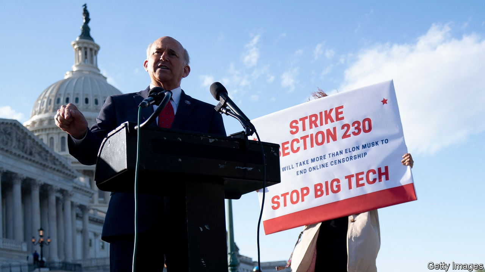

###### The Economist explains

# What is Section 230? 

##### A law regulating web communications comes before the Supreme Court 

 

> Feb 20th 2023 

IN JANUARY PRESIDENT JOE BIDEN took to the op-ed pages of the to inveigh against “big-tech abuses” and suggest, among other things, an overhaul of  of the Communications Decency Act of 1996. Mr Biden’s predecessor, Donald Trump, was no fan of Section 230 either. In 2020 Mr Trump ordered the Federal Communications Commission (FCC) to confront “online censorship” and consider the law’s role in facilitating it. A flurry of proposals to revise Section 230 have been proposed in Congress but none has come up for a vote in either the House of Representatives or the Senate. This week the third branch of the federal government weighs in on the issue. On February 21st inthe Supreme Court will consider whether Section 230 insulates YouTube, a video platform owned by Google, from liability for algorithms that allegedly recommended terrorist-training videos. The family of Nohemi Gonzalez, an American woman who was killed in an Islamic State  in Paris in 2015, say those those lines of code contributed to her death. What is Section 230, and why is it attracting so much criticism?

Section 230 was passed nearly 30 years ago, when websites were young and perceived to be vulnerable. The provision ensured that the companies that hosted them would not get bogged down in lawsuits if users posted material to which others might object, such as bad restaurant reviews or complaints about neighbours. The law has been interpreted by federal courts to do two things. First, it immunises both “provider[s]” and “user[s]” of “an interactive computer service” from liability for potentially harmful posts created by other people. Second, it allows platforms to take down posts that are “obscene…excessively violent, harassing or otherwise objectionable”—even if they are —without risking liability for any such content they happen to leave up. 

But today’s internet dwarfs its ancestor. The number of Americans regularly using the internet has grown from 9.5m in 1996 to more than 300m today. Powerful platforms like Facebook, Google and  are in the crosshairs of politicians and the public. Section 230 has become a scapegoat for critics’ gripes with large internet companies. Democrats believe that it has allowed online untruths and hate speech to spread and failed to make internet platforms accountable or give them incentives to to take swift action to stop it. Republicans blame Section 230 for censorship of conservative viewpoints and giving online platforms too much power over what content is given prominence on their sites.

It is hard to predict how the justices will handle  as the two sides in the case do not map neatly onto the Supreme Court’s ideological divide. The court could push for broad changes in the ways tech platforms build and use recommendation algorithms, but that is far from certain. If it declines to disrupt the status quo now, the justices may soon have another chance if they opt to consider a pair of cases related to the issue of “moderation”, ie, how platforms decide which posts to leave up and which to take down. At issue is the constitutionality of laws enacted by the conservative legislatures of Texas and Florida that bar platforms from choosing which ideas to host. They are a consequence of conservatives’ belief that the platforms suppress their voices. (Louie Gohmert, pictured, a Republican who until January was a member of the House of Representatives, led the campaign in favour of Texas’s law.) These cases could come to the court’s docket in the autumn.  is the only justice so far to have formally weighed in on this aspect of Section 230. Digital platforms wield “enormous control over speech”, Justice Thomas noted in 2021. Courts, he wrote, should be wary of that power lest users’ expression is “smothered”. That suggests that at least one justice will vote to uphold the states’ restrictions on the platforms’ power to decide what content to allow. 

Politicians will also have a say in the future of Section 230. They have three options, says Blair Levin, a former official at the FCC: leave Section 230 as it is, repeal it or modify it. Repeal would probably not allay all the concerns of the provision’s critics. It would increase the risk of censorship, because  would police content more actively and take posts down for fear of being sued for defamation. Removing Section 230 could also put significant burdens on smaller platforms that host user-generated content such as Etsy and Yelp. They lack the resources of sites like Google or Facebook. The impact on Wikipedia, an extremely popular non-profit platform, might be the most onerous of all. Disgruntlement with Section 230 is bipartisan, but the remedy is not straightforward. ■

