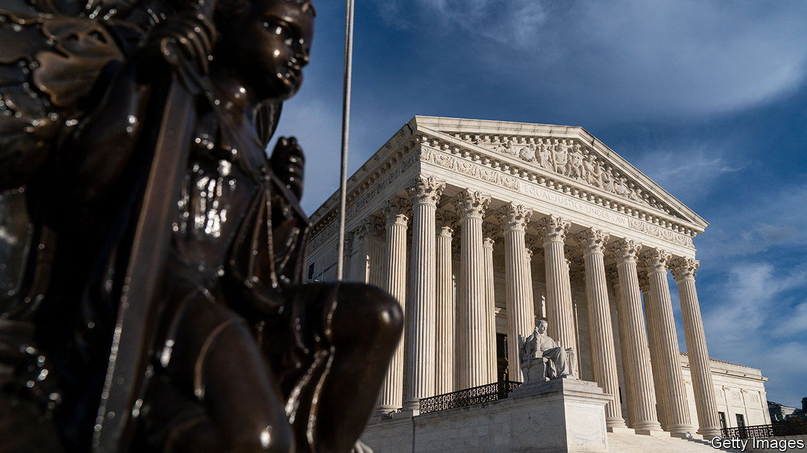
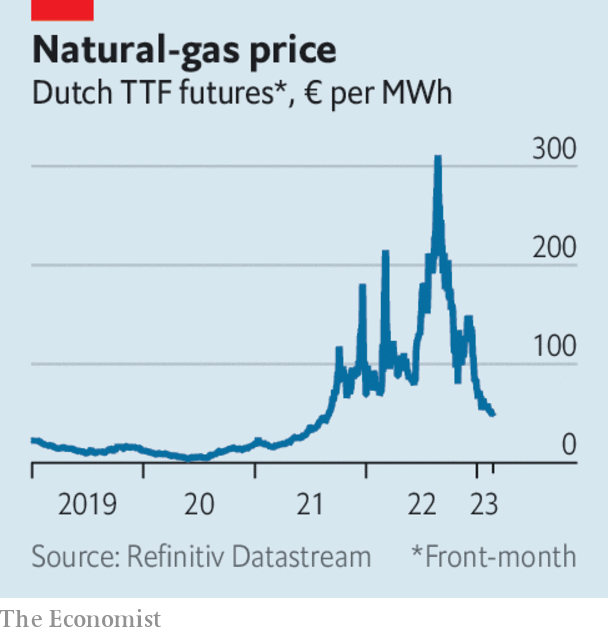

###### The world this week

# Business 

#####  

 

> Feb 23rd 2023 

America’s Supreme Court heard arguments in two cases that could potentially undermine the business model of . In  the parents of a woman who was killed in a terror attack on Paris in 2015 claim that  aided the terrorists by recommending the group’s videos to users. The case focuses on the legal protection from liability given to internet companies under Section 230 of the Communications Decency Act of 1996. In  the family of a man killed in an attack in Istanbul in 2017 allege that Twitter, Google and Facebook should be held accountable for spreading terrorist propaganda. The court’s decisions are expected in June. 

Pay for your security

  on Facebook and Instagram that verifies the authenticity of accounts and protects users from impersonation. The service, which is being tested in Australia and New Zealand, is similar to Twitter’s blue-tick system. Social-media companies are looking for ways to increase revenue to offset smaller returns from advertising. 

The disappearance in China of the head of a bank that has invested heavily in the country’s big tech firms sent a chill across the industry and the business elite.  was reported missing by China Renaissance, which he founded in 2005. It is not unusual for businessmen to be suddenly detained by the Chinese authorities when an investigation has begun into a company. Officials have so far kept tight-lipped about Mr Bao’s whereabouts. 

The lifted its main interest rate by half a percentage point, to 4.25%. It was the eighth consecutive rise, prompting a rebuke from Israel’s foreign minister, who called on the government to put a stop to the increases. Binyamin Netanyahu, the prime minister, said he had no intention of messing with the central bank’s independence. 

Switzerland’s financial regulator is reportedly investigating the chairman of for potentially misleading markets when he said that a run of huge client outflows at the bank had stopped. A subsequent earnings report showed that the outflows had continued. News of the investigation sent Credit Suisse’s share price to a new low.

 


The benchmark price for  futures in Europe fell below €50 ($53) a megawatt hour for the first time in 18 months. A mild winter and the switch to liquefied natural gas imports have helped offset the shock from Russia withholding its supplies. Storage levels remain high. However, prices could shoot up if power companies turn back to gas to fire their plants, and away from the current cheaper alternatives, such as coal.

The price of permits on the EU’s  hit €100 ($107) a tonne for the first time. The price of the permits, which allow companies to emit pollutants, subject to a cap, has risen by a fifth this year. Traders are betting that cheaper natural gas and a resilient economy will lead to higher industrial output. 

 reported solid quarterly earnings: pre-tax profit soared as higher interest rates helped push up revenues. The bank increased its shareholder dividend, which may help it fend off a demand by Ping An, a Chinese insurer and its biggest investor, to hive off its Asian business. That business accounted for 78% of HSBC’s profit last year. 

Revenue and profit rose sharply in 2022 at , which saw global sales of its electric models rise by 41%. Like others in the industry the maker of Fiat Chrysler and Peugeot cars benefited from higher retail prices for its vehicles. It thinks those prices will now level off. Tesla is busily discounting prices for its cars to shore up demand. 

Lower forecasts of annual revenue from  and  unsettled stockmarkets. Walmart reported strong sales in its latest quarter as shoppers, including higher-income families, looked for cheaper food options. But non-food goods, such as toys and homeware, struggled. The company warned that economic uncertainties would affect consumer behaviour later in the year. Home Depot told a similar tale, but added that customers are warier of paying the higher prices that sustained its business amid soaring inflation. 

Marking the days

The results of a six-month trial in Britain that tested the viability of a  showed that employers and staff were happy with it; most firms in the trial said they would continue working four days. Researchers from the University of Cambridge helped conduct the study. They found that 71% of workers reported lower levels of burnout, sick days were reduced by 65% and generated revenue barely changed. Company meetings, which seem to exist merely to fill out a five-day week, were “cut short or ditched completely”. 

