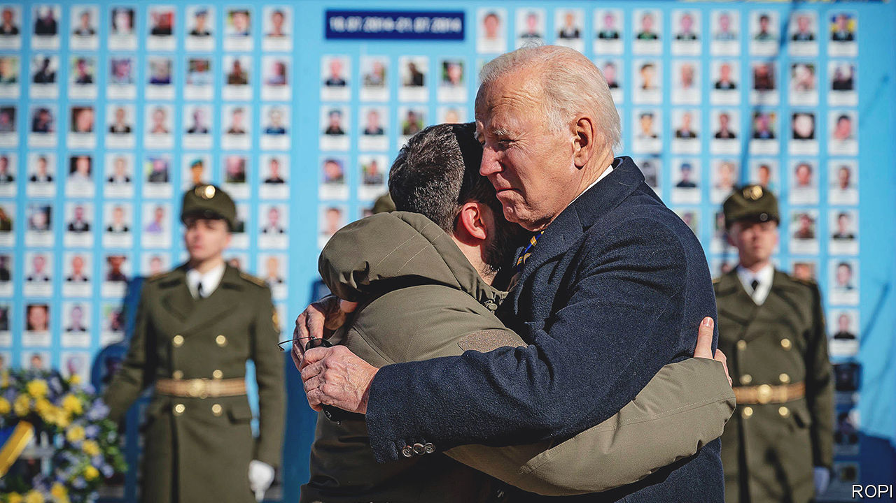
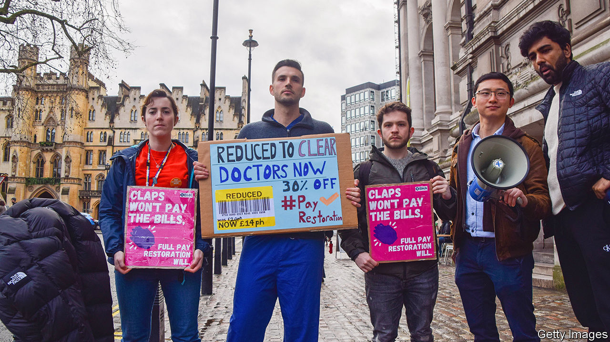

###### The world this week

# Politics 

#####  

 

> Feb 23rd 2023 

Joe Biden gave a speech in Warsaw ahead of the one-year . The American president called on the West to continue supporting Ukraine, and tore into Vladimir Putin for committing atrocities in the war. A day earlier Mr Biden visited Kyiv. He pledged more military aid, including radars and anti-armour systems, but not the fighter jets that Ukraine has asked for. Air-raid sirens accompanied his walkabout with Volodymyr Zelensky, though no missiles fell on the city. The Russians were told in advance that Mr Biden would be in Kyiv. 

On the day Mr Biden was in Warsaw  gave a rambling speech that predictably blamed the West for Russia’s aggression. He also suspended Russia’s participation in the New START nuclear-arms control agreement, the last remaining nuclear treaty with America, which Mr Putin had pressed America to renew in 2020. Mr Putin’s war has killed tens of thousands of civilians and Ukrainian and Russian troops. More than 8m refugees have fled Ukraine.

Wang Yi,  top diplomat, wrapped up an eight-day tour of Europe with. Mr Wang said China wanted to be part of peace efforts in Ukraine. But he spent much of his time criticising America. America warned that China was considering sending arms to Russia. The European Union’s foreign-policy chief said that would be a “red line”.

The Belarusian dictator, Alexander Lukashenko, announced the creation of a domestic defence force of 150,000 “volunteers” who will be trained how to handle weapons. This is in case  comes under attack, he said, though such a force could easily be used in another brutal crackdown on pro-democracy protesters.

Russia has been trying to gather information that would enable it to sabotage  in the North Sea, according to MIVD, the military intelligence agency of the Netherlands. One Russian ship was escorted out of the region when it tried to survey offshore wind farms. 

Another strong  hit the Turkey-Syria border, two weeks after a quake of magnitude 7.8 killed 50,000 people. The WHO thinks that 26m people in Turkey and Syria are in need of assistance. 

The most senior transport official inand the head of the state rail company both resigned, after €258m ($275m) was spent on designing new commuter trains that could not fit through tunnels in the country’s north. One regional leader described it as “an unspeakable botch”. 

 


 health service braced for more industrial action as junior doctors voted to strike. Nurses were due to strike again at the beginning of March, but have put this on hold amid talks with the government. In December nurses walked out for the first time in over 100 years, joining other unionised workers as high inflation erodes pay. Public opinion is split on the strikes, but a majority of people think the government’s handling of them has been poor.

A police detective who has investigated attacks by militant nationalists in  was shot and wounded. He is the first police officer to be targeted in a number of years. Suspicion fell on the New IRA, a small dissident group, for the attack. 

Please don’t come

The Biden administration  to deter  from crossing the Mexican border ahead of an anticipated surge in arrivals when Title 42, a pandemic measure that allowed for their swift expulsion, ends in May. To try to gain entry migrants must first make an appointment with a border official using an app. 

A court in the United States convicted Genaro García Luna, a former Mexican security minister, of aiding the  in exchange for millions of dollars in bribes. The verdict highlights long-running concerns in the US about corruption within the Mexican state. 

 Senate passed a bill that overhauls the country’s elections regulator, a long-sought goal of the president, Andrés Manuel López Obrador. Opponents say the reform will undermine democracy. Huge protests against the bill took place last November. 

 forces killed 11  in a raid on Nablus, in the occupied West Bank. The Israeli army said it had targeted Palestinian terrorists. The following day Israel carried out air strikes in the Gaza Strip after rockets were fired from the area. Meanwhile Israel announced a temporary pause in building new settlements in the West Bank, though it has also announced the legalisation of nine unauthorised outposts and approved the construction of 10,000 new homes in existing settlements. 

 lost her appeal against a decision to strip her of her British citizenship after she travelled to Syria, aged 15, to join. Ms Begum remains in a refugee camp in northern Syria.

Civilians continued to flee fighting between the regional government and local militias in the self-declared republic of . The UN says as many as 80,000 people may have crossed the border into Ethiopia in the past month.

 began ten days of drills with ships from the Russian and Chinese navies. The exercises coincided with the first anniversary of Vladimir Putin’s invasion of Ukraine. South Africa insisted that the exercises were planned two years ago.

In  Imran Khan secured a court order preventing his arrest for two weeks. The former prime minister has been charged under anti-terrorism laws for allegedly threatening officials in a speech. He launched a campaign this week to “fill the jails” with his protesting supporters. This is a distraction for the government, which is still negotiating with the IMF over an assistance package. Pakistan is already bankrupt, according to the defence minister. 

 annual rate of inflation stood at 53% in January, down slightly from the previous month. The government is also trying to secure a bail-out from the IMF. It recently raised electricity prices by 66% to plug a gap in its finances. 

Troubled waters

Russia warned  that its ban on Russian ships entering Bangladeshi ports “may adversely affect” co-operation between the two countries. Bangladesh says it is merely complying with international sanctions. 

 fired more missiles from its east coast, including an intercontinental ballistic missile. Kim Yo Jong, sister of the country’s dictator, Kim Jong Un, said the army would use the Pacific Ocean as a “firing range” if America stepped up its military presence in the region. 

The High Court in Seoul found that the state health insurer must provide insurance to gay couples. It is the most important legal recognition yet of the rights of same-sex partners in , where gay marriages are not recognised. The decision will be challenged in the Supreme Court. 

