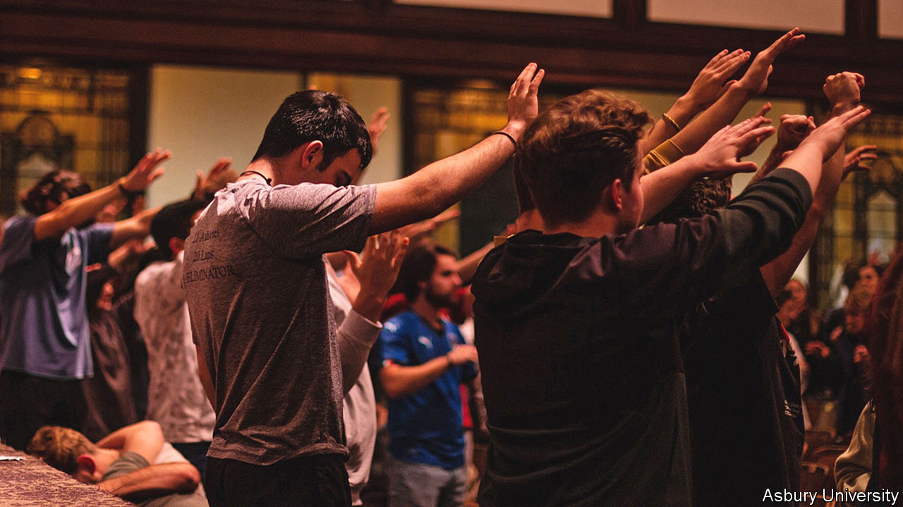

###### A new awakening

# A Christian college in Kentucky has experienced a religious awakening 

##### The revival suggests young evangelicals see faith differently than their parents 

 

> Feb 23rd 2023 

WILMORE, KENTUCKY, is the kind of quaint town (population 6,027) you might drive through and forget. Perhaps if you stop at the intersection of Main Street and Lexington Avenue you may notice a white Presbyterian chapel and a redbrick Baptist church on opposite corners—reminders of a bygone era when America was staunchly Christian. But over the past two weeks this sleepy town has turned into a pilgrimage site for tens of thousands of people who believe God’s presence has descended on the campus of Asbury University, a private Christian school where students have been worshipping nonstop for days. They are calling it a spiritual revival.

To an outsider the scenes inside Asbury may seem perplexing. Students are crying, jumping, praying, shouting and singing. News of an unending worship service on campus went viral online. On TikTok, a social-media app, the hashtag #asburyrevival has been posted nearly 100m times. Joel Podeszwik, an insurance salesman and a lay minister from San Diego, California, travelled to Wilmore to see it with his own eyes. “I wanted to be in a place where God is pouring his spirit,” he says. An Asbury spokesperson estimates that up to 70,000 people from across America and even overseas have come to experience the numinous air inside the university’s chapel.

Generation Zers—those born between 1997 and 2012—are not known for their piety.  and nearly one in five are , the most of any generation. They grew up in less devout homes and start questioning their beliefs at a younger age, according to the Survey Centre on American Life, part of AEI, a think-tank. But it would be premature to conclude they are giving up on faith. The Barna Group, a research firm, reports that over half of Gen Zers aged 13-17 say they want to learn more about Jesus. Another survey, by the American Bible Society, a religious outfit, found that over 70% of Gen Zers express interest in the Bible. And the Pew Research Centre found in a poll published in 2020 that four in ten teenagers believe in God with “absolute certainty”.

Kevin Brown, Asbury’s president, thinks younger folk prize authenticity above all else. He says they are not asking, “What do you believe?”, but “Does this work?” Research from a global study of Gen Zers by the Barna Group backs his hunch: respondents were more likely to say they wanted to see Jesus’s teachings promote good than know whether they were true. 

Take the revival at Asbury, which began on February 8th. The service that preceded it was “unremarkable”, says Mr Brown. The volunteer preacher who spoke that night confessed he had “totally whiffed” the sermon—a sports term for missing the mark. The music is simply vocals, a piano and acoustic guitars. There is no programme, no one calling the shots—a point Asbury’s spokespersons stress. The revival seems the opposite of organised religion.

In some ways, it is also a rebuttal of religious politics. When Tucker Carlson, a popular Fox News host, requested permission to visit the campus, the university declined. What is happening on campus is purely spiritual, a university spokesperson told Mr Carlson’s crew. “Jesus doesn’t care about politics,” says Alexandra Presta, a senior at Asbury and editor of the university’s newspaper. “He just wants you no matter who you are, and he loves you no matter what political party you identify as.”

Younger Christians, though conservative, seem tired of their parents’ —polls suggest they rate LGTBQ issues, , lower than gun violence and racial justice. They have witnessed moral failures of church leaders and the rise of extremists who identify as Christians. Ryan Burge, who studies religious trends, says Gen Zers have grown wary of institutions, and reckons this is why so many are religiously unaffiliated.

After two weeks the university has decided to move services off campus. The revival, Mr Brown believes, will continue elsewhere. (Students at other colleges are reported to be trying to start revival meetings.) Some curmudgeons say this is prematurely ending a movement from God. Ms Presta disagrees: “We can’t stop something we didn’t start.”■


