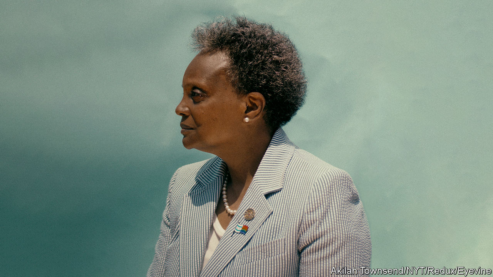

###### Ghost of the machine

# Chicago may throw Mayor Lori Lightfoot out in the first round 

##### Incumbency no longer confers many electoral advantages 

 

> Feb 23rd 2023 

Standing on a stage at the National Museum of Mexican Art in Pilsen, a fast-gentrifying corner of south-eastern Chicago, Jesús Chuy García, a congressman, explains why he is running for mayor, in nostalgic terms. “Chicago 40 years ago saw an opportunity to make history by undoing a barrier, by electing someone who was different,” he says. In 1983, ten electoral cycles ago, Mr García was part of the movement that helped elect Harold Washington, the city’s first black mayor, with a “rainbow coalition” of ethnic-minority voters and white liberals fed up with corruption. His election inspired Barack Obama to move to the city. Now Mr García says he wants to repeat the trick to become Chicago’s first Latino mayor. Yet Chicago in 2023 is a  to what it was.

The first round of the election takes place on February 28th. Nine candidates are standing, all Democrats. Unless one wins over 50% of the vote, which nobody thinks is likely, the top two will compete in a run-off on April 4th.

The polling is inconsistent, but suggests that at most four of the nine have a credible chance. As well as Mr García, there is Paul Vallas, a former chief executive of the schools system who has the backing of the police union; Brandon Johnson, a member of the Cook County commission who is supported by the ; and, of course, Lori Lightfoot, the incumbent, who after just one term is facing an especially challenging re-election campaign. Many suspect she will not even make it into the final two.

That partly reflects a difficult time for incumbent mayors generally, in the wake of the pandemic and . But it also reflects how, over the past decade or so, the Windy City’s politics have become more like those of other American cities. For most of the post-war period, Chicago was a place of ruthlessness and corruption, with votes bought by means of jobs and favours. Even as patronage declined, corporate donations and enormous spending on TV ads took its place, to the benefit of incumbents. Almost every Chicago election for the past 70 years has been characterised by a fight between the “machine” and an insurgent—including the one that in 2019 brought Ms Lightfoot to power, defeating Toni Preckwinkle, the president of the Cook County commission.

This election is different. The closest Ms Lightfoot has come to patronage politics was an ill-advised email her campaign sent to some teachers to try to recruit teenage volunteers. She has struggled even to raise much money, something presumably not helped by her abrasive style (she has a habit of being rude even to allies). Together, the nine have raised a total of around $24m, including $6m that a no-hoper candidate, , has donated to his own campaign. Rahm Emanuel, the mayor until 2019, raised more on his own in 2015. 

Instead, with no favourite and limited money, the election is a scrap. That there are six black candidates helps to explain partly why Ms Lightfoot is struggling, and why Mr García and Mr Vallas are favourites (the city’s  is very roughly one-third black, one-third Latino and one-third white). On February 18th the mayor suggested at a rally of mostly black voters that any vote “for somebody not named Lightfoot is a vote for Chuy García or Paul Vallas”. But ideological splits matter, too. Mr Johnson jokes that, in this election, “everyone seems to want to identify as a progressive.” That includes Ms Lightfoot, who ran as one in 2019, but now finds herself squashed between Mr Vallas on the right and Mr García and Mr Johnson on the left.

The real question is whether any of them can break through to an exhausted electorate. Crime has dominated the debates so far, and all of the candidates back increasing the police budget. Other pressing issues, such as the city’s deep pensions deficit, or its rather dysfunctional transport system, have featured less. In 1983, over three-quarters of Chicagoans turned out to vote. “What happens in Chicago will have reverberations across the country and the world,” says Mr García, about this election. In 1983 that was true. This time Chicagoans may just shrug. ■


