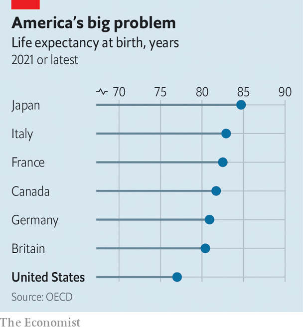
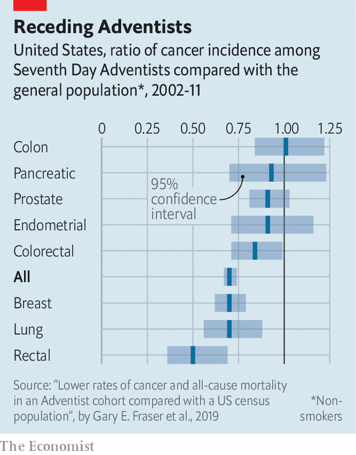

###### Land of the fat

# Christian Californians may have a solution to America’s obesity 

##### Lessons in longevity from Seventh Day Adventists 

 

> Feb 19th 2023 

At 96 years old, Paul Damazo still works nine-hour days, six days a week. He has a recurring spot on a radio show and occasionally appears on television. He can still sport his army uniform from the second world war. For seven years until he was 94, Mr Damazo delivered meals to pensioners for Meals on Wheels. How does he stay so sprightly? Some would say it started with a message from God.

Mr Damazo is a Seventh Day Adventist, a Protestant denomination that observes the Sabbath on Saturday and hopes for the imminent second coming of Christ. In the mid-19th century one of its prophets and founders, Ellen White, had a vision. She and her brethren should eat food as it grows out of the ground, the vision said. They must also be mindful of animal products and avoid smoking and alcohol.

 


“Seventh Day Adventists believe God made the body as a temple to hold the soul,” says Hans Diehl, a best-selling author on health and nutrition, and a lifelong Adventist. At 77, Mr Diehl is still teaching workshops on . “We believe that taking care of the body is proper. It’s honouring God,” he says. Devout followers eat mostly plants—vegetables, fruits, nuts, legumes and whole grains. Some eat animal products, but most do so sparingly.

By some accounts, Seventh Day Adventists are the healthiest people in America. They have lower rates of cancer, a longer life expectancy, and better physical and mental health throughout their lives. This has sparked interest among researchers. 

One Seventh Day Adventist community, Loma Linda, California, has been dubbed a “Blue Zone”—an area of the world with a large share of centenarians—by two researchers, Michel Poulain and Giovanni Mario Pess, and by Dan Buettner, an author. (The other four Blue Zone areas are Okinawa in , Sardinia in Italy, Nicoya in Costa Rica and Ikaria in Greece.) A study published over 20 years ago found that Adventists who follow the religion’s healthy lifestyle could expect to live ten years longer than others who do not. The research also found that female Californian Adventists live four years longer than other female Californians, and men bested non-Adventists by seven years.

 


The health advantage also holds true for black members, who make up nearly one-third of the group. White people typically outlive black people in America, but black male Adventists live longer than non-Adventist white men. Women also tend to live about five years longer than men, but this gap closes to only two years among vegetarian Adventists. 

Does one need to become a religious zealot to live a long life? Maybe not. Since the 1970s the federal government has given Loma Linda University, which specialises in health sciences, over $30m for the Adventist Health Study, a survey of 96,000 Adventists in America and Canada, to understand why they live so long. According to the study, people who regularly consume red and processed meat had an 18% higher risk of mortality in a given year. In other words, for every 118 deaths of people who regularly ate red meat, 100 people would also die that year who did not regularly eat red meat.

Adventism also discourages eating ultra-processed foods, such as white bread. People who consume these foods for half of their total calories have a 14% increase in mortality compared with those who eat such foods for a small portion of their diet. “The differences [between vegetarians and non-vegetarians] are actually quite stark, and much greater than I would have anticipated 30 or 40 years ago before we started this work,” says Gary Fraser, a lead researcher for the study.

Is the God part necessary? Some might say yes. Americans certainly have not figured out how to stay slim without Him. America is the fattest country in the OECD, a club of rich countries. One in five children and 42% of adults are obese. American life expectancy has decreased by almost three years since 2019. Much of this dip is attributable to covid-19. Many Americans were vulnerable due to their weight.

“The food environment in the US is certainly much more obesogenic,” says Frank Hu, a public-health researcher at Harvard University. “If you just compare the portion size of certain foods and beverages, it is much bigger in the US than in European or Asian countries.” He points to other barriers—access to nutritious foods and health care, and confusing food labels. Nearly 58% of calories consumed by Americans come from ultra-processed foods, and as many as 75% of people eat red or processed meat on any given day. And richer countries tend to be fatter. Despite public-health messaging encouraging healthy living, Americans are getting heavier.

To help Americans get healthier Mr Buettner, the writer who popularised the Blue Zones, has created the Blue Zones project, which applies principles from Blue Zones to ordinary American towns. Since 2009, over 70 communities in America have joined the programme. It has had promising results. Its first community—Albert Lea, Minnesota—had a 35% drop in smoking between 2010 and 2016. Corry, a small town in Pennsylvania, joined the project in 2019. In three years, the number of residents reporting high cholesterol decreased from 27% to 12%. A study published in the  found that the programme improved life satisfaction and optimism among residents of the Beach Cities (Hermosa Beach, Manhattan Beach and Redondo Beach) in California.

The initiative has nine principles that focus on healthy eating, movement, connection with others and having the proper outlook on life. “Wine at five gets people to take a second look,” says Deb Logan, the director for the Blue Zones project in south-west Florida, referring to the principle of drinking one to two glasses of alcohol a day. (In contrast to the Seventh Day Adventists, the other four Blue Zone areas get merry on moderate amounts of alcohol.) Mr Buettner requires broad buy-in from local leaders before working with a community. Restaurants sign up to add plant-based options to their menus. Schools promise to serve healthy lunches and teach pupils about nutrition. Workplaces improve cafeteria options and remove junk-food vending machines. Pavements are widened and bike lanes constructed to encourage walking and cycling.

Rhapsody in blue?

The Blue Zone project has faced its fair share of obstacles. Some changes made in south-west Florida were unexpectedly controversial. Roundabouts, built to slow traffic and improve street walkability, created mayhem. Things also got political with the children. One school board initially blocked the healthy-eating programme. “People thought ‘Blue Zones is coming to mandate what you are putting into your lunch boxes’,” says Ms Logan, the scheme’s director. A project to convert an old railway into a bike trail is currently facing opposition. Residents near the abandoned tracks are concerned that the new traffic will bring crime.

Despite such snags, the programme has delivered some impressive results. The south-west Florida Blue Zone region recently reported a fall in obesity rates; they are now almost a quarter lower than those in the rest of the state. Following the teachings of a niche Christian denomination is not the only way to live a long, healthy American life. But it does seem to work. ■


