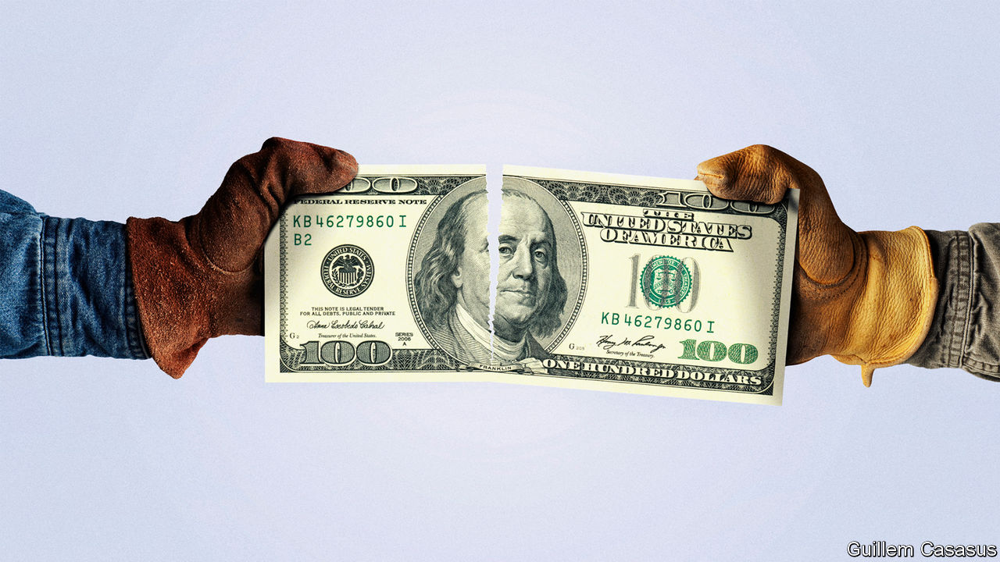

###### America’s industrial policy

# State subsidies fuel America’s EV boom but risk overcapacity 

##### Individually, states are acting sensibly. Collectively, risks are growing 

 

> Feb 23rd 2023 

An hour east of Atlanta, turn off the interstate highway and drive into a postcard scene of rural Georgia—a road lined by tall pines, country homes and a cluster of churches—when suddenly a vast expanse of clear-cut land appears. Big yellow trucks are flattening the earth and large transmission lines run along its edge. What makes it especially attractive for an industrial investor cannot be seen: tax breaks, direct grants and other assistance that, all in, come to $1.5bn. When Georgia announced this incentive package last May for Rivian, a California-based startup that makes , it was the biggest corporate subsidy given by the state. Not for long, though. In July it promised an even bigger package, worth $1.8bn, to Hyundai, also for an electric-vehicle (EV) facility.

Subsidies in the EV industry are . On February 13th Michigan approved incentives of more than $1bn for a Ford battery factory. On February 8th Ohio’s private development agency gave nearly $240m to Honda. Last year brought $1bn-plus deals for firms in Kansas, Michigan and North Carolina, adding to dozens of smaller dollops. Globally, concern is rife about America’s rapid emergence as a competitive threat in the EV industry, thanks to the federal government’s hefty investments and domestic-content rules. Within America the competition can feel even fiercer, as states battle with one another to lure investors. “But for the right incentive, the project would go elsewhere,” says a spokesperson for the Georgia Department of Economic Development.

States are not neophytes at business handouts, but the current boom is remarkable for its scale and speed. In a report last year Good Jobs First, a corporate-subsidies watchdog, tallied 51 state-level EV subsidy packages, which helped make for the biggest mega-subsidy spree in its records dating back to 1980. One state consultant estimates that, historically, incentives work out to $5,000 per created job, but that the EV ones run to about $30,000.

In part state governments have been emboldened by strong finances: covid-19 stimulus payments left most with chunky budget surpluses. They also have extra urgency because of the  (IRA), the cornerstone of the Biden administration’s new industrial-policy push, which will give billions of dollars in tax credits to both buyers and makers of EVs. The IRA expires in 2032, so companies have to move fast to take advantage of it. Adam Jonas, head of global auto research at Morgan Stanley, a bank, explains it with a fishing analogy: “The IRA stocks the lake full of trout. And now the states are there trying to attract the trout with chum.” 

Given the rush of subsidies, a looming question is how many will end up being wasted. Georgia’s package for Rivian has shone a spotlight on the risks. Residents near its future plant site challenged the bonds that are needed to make the deal work, pointing to Rivian’s record as a loss-making startup. “The government is basically investing in this company as a speculative investor,” says John Christy, a lawyer for the opponents. The trial judge concurred and refused to validate the bonds. The government has appealed, with Rivian’s plans hanging in the balance.

Yet a closer look at Georgia’s package shows how states are trying to guard against waste. Tax credits are contingent on performance. In Rivian’s case the firm has to meet at least 80% of its commitments to invest $5bn and create 7,500 jobs by the end of 2028, and then stay at that threshold until 2047; if it slips, the state can claw back benefits. Tax breaks are also just one element. Nearly $200m will go to acquiring the land, preparing it for development and building road and rail links. Another $90m will go towards training for employees, adding to the local skills base.

Other states are designing incentives with similar structures, typically featuring a mix of site preparation, infrastructure, worker training and tax breaks. Even if the target company fails, the states still stand to reap benefits. “They’ll get a return because they’re investing in their people. They’re investing in their land and infrastructure. And another user could quickly come along and absorb the capacity,” says Eric Stavriotis, a site-selection specialist with CBRE, a property broker.

Still, there is a risk that, in aggregate, national and state subsidies will result in excesses. As of November, announced plans would increase America’s  from 55 gigawatt-hours a year in 2021 to about 900 by 2030. That would support the production of some 10m all-electric vehicles a year—more than half the cars now bought annually in America, a vast amount, especially when factoring in imports. Moreover, investments are only increasing. The implication is that America could be headed towards EV overcapacity. And given how young the technology is, plants being built now may soon be obsolete. “Even before the completion of many of these projects, you might have breakthroughs in companies that don’t need government money,” says Mr Jonas.

From a national perspective, that may not necessarily be a bad outcome. Before the boom began, America was facing a severe undercapacity in EVs and batteries. The prospect of reliance on China, its chief rival, for vehicles of the future alarmed officials. Far better to have manufacturing heft, even at the cost of overcapacity, in such a critical industry.

For individual states, however, the challenge will be how to avoid hangovers. In the traditional auto market America’s manufacturing hubs had a solid half-century of prosperity before decline slowly set in. The EV investment cycle, like much else these days, may go much faster. Some of the states now throwing money at gleaming new projects will rue their largesse before the decade is over. ■


