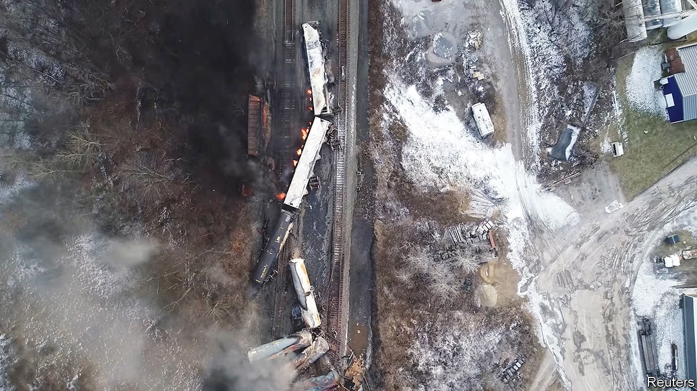

###### The fire and the fury

# The Ohio train derailment is turning into a political circus 

##### Will Donald Trump’s opportunism do anything to help? 

 

> Feb 23rd 2023 

When your correspondent arrived in East Palestine, at around ten in the morning on February 22nd, the only person on Market Street, the town’s main drag, was Eric Walleck, holding a sign reading “Walleck 2024”. Sheltering from the rain under a shop’s awning, Mr Walleck explained that he had come from his home in Illinois to this part of eastern Ohio as part of his independent campaign to become president. “I came to talk to the citizens about the train wreck,” he said. “I’ve got food, I’ve got water in my truck, and I am going to hand it out.” He then admits that so far it hasn’t gone very well. “You’re the first person I have talked to,” he says.

Later that day a rather better-known  would appear in the town, also with plans to distribute food and water, and limited plans to speak to locals. By 1pm at least 100 people were gathered on Market Street awaiting the arrival of Donald Trump. Two stands had been set up to sell T-shirts, hoodies and flags. Dozens of journalists, YouTubers and TikTok influencers wandered up and down conducting interviews and performing pieces to camera. When Mr Trump finally arrived, just visible through the darkened tint of his SUV, the crowd cheered and broke into a chant of “Let’s Go Brandon”, a meme that means, roughly, “Fuck Joe Biden”. 

The proximate cause of this circus was a calamity that happened almost three weeks earlier. On February 3rd a Norfolk Southern freight train derailed in East Palestine, a town of a little less than 5,000 people on the Ohio-Pennsylvania border. Its cargo included dangerous chemicals such as vinyl chloride and butyl acrylate, both of which are used to create plastics. Apparently fearing an explosion, on February 5th Ohio state officials evacuated the town and then burned the spilled chemicals, creating an enormous black cloud over the place. A few days later residents were allowed to return. State and federal officials have declared that the local tap water is safe to drink and the air is safe to breathe. Yet few trust them.

Turning toxic

There are plenty of legitimate questions about the of the chemicals that leaked into the local environment, and about the safety of freight trains in America. But it is a lack of trust in government that has turned a disaster into a political farce. Within days of the disaster right-wing political pundits were busy arguing that the town was not being paid enough attention because its residents are mostly white and voted for Mr Trump. One Fox News presenter suggested that the Environmental Protection Agency was happy with “spilling toxic chemicals on poor white people in Ohio” because it was a way of “fighting environmental racism”. 

Many people in the town share the feeling that they are being ignored. “Anybody who voted for Donald Trump doesn’t believe the government,” says Traci Ketchum, who lives just outside the town. “And here, that’s 71% of the population.” She says it is thrilling to see her home being discussed on Fox News, though she resents the assertion that its people are poor. Joy Mascher, who runs a florist on Market Street, says the government’s response was hardly quick enough. “The federal government has not stepped up,” she says. “Do we just not matter because we’re in the Rust Belt? This would not have happened in somewhere like Potomac, Maryland.”

Mr Trump deftly exploited this sentiment. “You are not forgotten,” he told a small group of locals during his visit on February 22nd. He drew a contrast between his presence in Ohio and the whereabouts of President Joe Biden, who had been in Poland that day, after an earlier stop in Ukraine. Richard Lloyd, who lives around three miles away from where the train derailed, stood waiting for Mr Trump wearing a hazmat suit and a gas mask. “They should be giving these to everyone in this town,” he said. The air is far too unsafe to breathe, he observed, before removing his mask to light a cigarette.

Will Mr Trump’s visit do anything to help (not counting the McDonald’s meals the former president purchased for firefighters and the bottles of water he donated)? It does seem to have kept attention on East Palestine. 

Hours before Mr Trump arrived there, Pete Buttigieg, the transport secretary, announced that he would come to the town the next day. Mr Buttigieg had earlier promised that his department would hold Norfolk Southern “accountable for any safety violations found to have contributed to the disaster”. The results of a preliminary investigation by the National Transportation Safety Board were also due to be published on February 23rd (after went to press). The Senate’s environment committee has pledged to investigate, too. Mr Trump claims none of that would have happened without his promise, made at the end of the previous week, that he would visit the place.

Preventing another disaster like this will take more than Mr Trump’s brio. In recent decades the  has in fact improved. Compared with a decade ago there are half as many incidents annually involving hazardous-material spills, and roughly 20% fewer derailments. 

But Ian Naish, a former safety inspector on Canadian railways, says he worries about the future. In recent years profits on the railways have soared, as firms have reduced their headcount and increased the length of trains. With railway safety, you have “got to have a continual chronic sense of unease,” he says. Because even if, overall, safety is improving, the next disaster might happen somewhere more densely populated than East Palestine. ■


