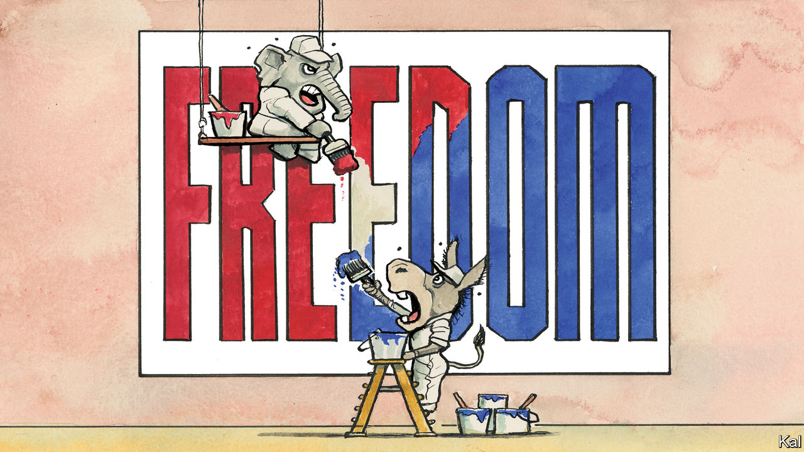

###### Lexington

# “Freedom” is America’s latest political football 

##### But on the right and left, politicians are groping for a new definition of what it means 

 

> Feb 23rd 2023 

Democrats and Republicans are competing over which party is the true defender of freedom in American life, but the claims of both have become muddy. What the debate really illuminates is how far the parties have  about liberty in American economic and social life, without yet articulating where they are headed, if they know.

As evidence of their commitment to freedom, Republicans fall back on , while Democrats point to . But their fights over how history should be taught, what words people should use and which behaviours and investments the government should demand from industry reveal rising anxiety about how Americans’ use their freedoms and a new, shared willingness to inject the state into those choices.

There is no more vigorous or confusing claimant to the mantle of freedom’s champion than Ron DeSantis, the Republican governor of Florida and . He calls his new budget a “Framework for Freedom”. It succeeded the “Freedom First” budget. In case anyone has missed the point, his forthcoming book is “The Courage to be Free”. 

But even conservatives sympathetic to Mr DeSantis have trouble squaring his branding with an agenda that includes enhancing the state’s control over local schools and substituting its judgment for that of corporations over how to serve their customers. He signed a law tightening restrictions on what materials teachers can use, prevented cruise-ship companies from requiring passengers to be vaccinated and sought new government control over Disney because he disapproved of its exercise of speech. Whatever you make of the policies, as a framework for freedom they pinch. 

Gavin Newsom, the Democratic governor of California, calls his home “a true freedom state” because of its commitment to abortion rights and children’s freedom to receive “gender-affirming” medical treatment. But California’s severe regulatory environment makes it an awkward match for the title. 

In the mixed messages of both parties, Michael Sandel, a political philosopher at Harvard University, hears not something new in American politics, but the halting return of something old. “They’re both gesturing toward a larger civic purpose, but the terms of public discourse are impoverished, and have been for some time, and so the language that they reach for doesn’t readily capture the civic aspirations they are trying to articulate,” he says. “Another way of describing what they are reaching for, in their different ways, is a politics of becoming good.”

Back in 1996, Mr Sandel anticipated Donald Trump in the book “Democracy’s Discontent”. Writing that Americans feared they were losing control over their lives and their communities were disintegrating, he warned of reaction “from those who would banish ambiguity, shore up borders, harden the distinction between insiders and outsiders, and promise a politics to ‘take back our culture and take back our country’”. (He recently brought out a new edition to recount what came next.)

Mr Sandel traces the vulnerability in American democracy to the rise, in the wake of the New Deal, of what he calls “the procedural republic”. Americans made peace with centralised power by embracing an idea of liberty that called for a government that maximised citizens’ freedom to pursue their own ends and an economy that uncorked consumption. The government would deliver economic growth and Americans would debate how to distribute it, but politicians would stay out of questions about individuals’ values or notions of the good life. In one sign of this shift the Supreme Court in 1943 blocked local governments from compelling schoolchildren to salute the flag. 

This idea of the relationship of government to freedom has become such a core assumption of American politics that it seems always to have been there. Over the past 70 years, concerns about Americans’ morality became the parched province of religious fundamentalists, while socialists and militiamen on the lookout for black helicopters did most of the fretting about globalisation. 

Yet from the Founders through Teddy Roosevelt and Woodrow Wilson, leaders were preoccupied with how to create virtuous citizens capable of self-government. They saw that as the essence of freedom. Even Alexander Hamilton, that apostle of growth, thought the economy should serve political aims, not the reverse.

Free to be me and me

Since Mr Trump grabbed hold of America’s political framework and shook it, these ideas have begun popping out again. Whether they realise it or not, this older tradition is what leaders from Mr DeSantis to Joe Biden are often talking about when they talk about freedom. In his recent , Mr Biden stressed not just creating good jobs to honour “the dignity of work”, but making sure that to find them young people did not have to abandon their communities—the foundation, in the Founders’ view, of self-government. Mr DeSantis also takes an instrumental view of growth. He favours free enterprise, he has said, but only “as a means to an end”.

The fight over  is, at bottom, a battle over how to instil virtue. So is the fight over what words Americans should use. In delivering the Republican response to Mr Biden’s state of the union, Sarah Huckabee Sanders, the governor of Arkansas, cast herself as a defender of free speech while boasting she had banned the “derogatory term LatinX in our government”. That is a risible contradiction under the definition of free speech she seemed to have in mind. Yet it points towards an older idea about the grounding of liberty. 

Like Ms Huckabee Sanders, politicians of both parties are mouthing words about freedom they no longer quite mean, while gesturing at new definitions that have yet to cohere. On right and left, an old idea of American freedom is struggling to be reborn. ■


