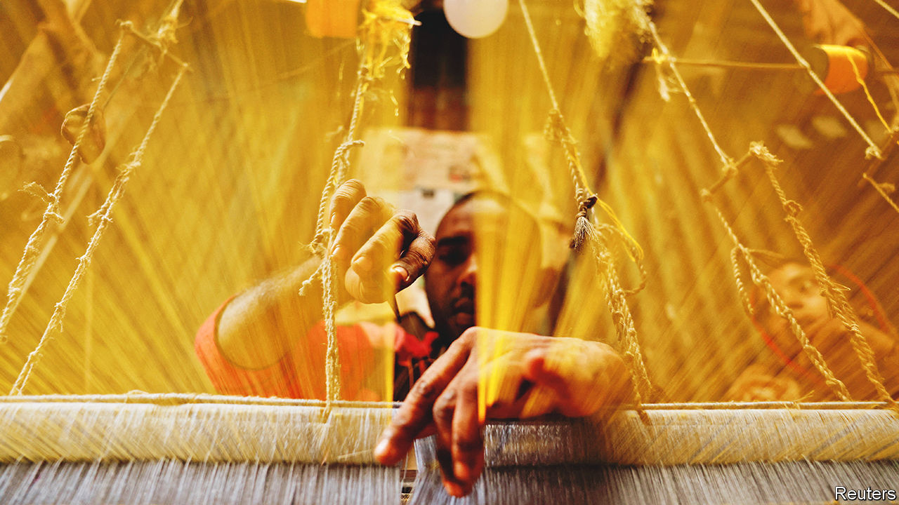
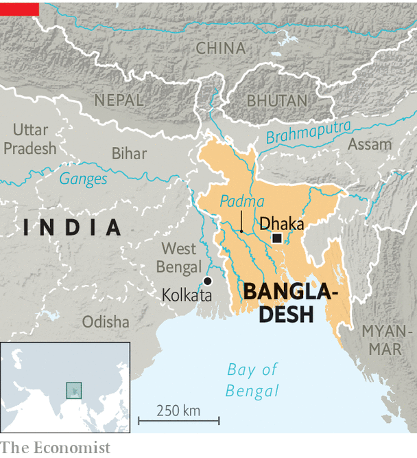
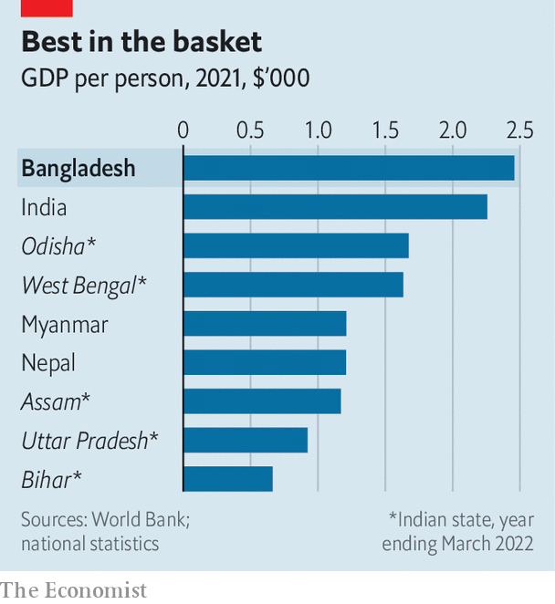

###### Fruit of the loom

# Bangladesh’s economic miracle is in jeopardy 

##### Corrupt politics has become a bigger threat to the country than poverty 

 

> Mar 1st 2023 

SQUEEZED ON three sides by India and on the fourth by the Bay of Bengal, Bangladesh, the world’s eighth-most populous country, is both a much-praised model of development and a significant regional economy. Since a brutal war of independence from Pakistan in 1971, it has made remarkable social and economic progress.

A billiard-table-flat land on the combined floodplain of some of Asia’s biggest rivers, the country was once a byword for poverty, famine and natural disasters. Today, with a population of 170m, devastating human losses to cyclones are, thanks to shelters and warning systems, a . So, too, are widespread food shortages. Child mortality rates are slightly better than the global average and half those of Pakistan. Female literacy, not long ago abysmal, is now 73%. The share of women in paid work has climbed from 4% at independence to 35%, largely thanks to a thriving garment industry.

 


In the decade before covid-19, Bangladesh grew at an average annual rate of 7%, only slightly slower than China. Its GDP per person, around $2,500 at market prices, is higher than India’s. It is expected to graduate from the UN’s ranks of least developed countries (LDCs) in late 2026. It aims be an upper-middle-income country by 2031.

Yet hard-won optimism about Bangladesh’s trajectory is now being tested. The pandemic and Russia’s invasion of Ukraine have caused a serious economic shock to the country. It is gripped by a cost-of-living crisis. One manifestation is that the streets of Dhaka, the teeming capital, have this winter been filled with huge numbers of rough sleepers wrapped in flimsy shawls. Another is that at the central bank, the country’s foreign-currency reserves have been alarmingly run down.

On the political front, an election is due by the beginning of next year. Its outcome is not in serious doubt: Sheikh Hasina, the increasingly autocratic prime minister, has done what she can to destroy the opposition. Yet her zero-sum approach to politics has raised tensions that are likely to spark violence as the vote looms. Down but not quite eliminated, leaders of the opposition Bangladesh Nationalist Party (bnp) are already in the streets. Meanwhile, the stench of corruption in Dhaka is as acrid as the capital’s polluted air. Far from stepping into a bright future, Bangladesh appears in key respects to have lost its way. 

 


The energy and bustle of Bangladeshis are still on display in the malls and factories of Dhaka and beyond. Such dynamism is the engine of the country’s unpredicted success. After the war, many of its people returned from abroad to help rebuild. One launched a charity, , which focused on women’s and children’s health, ran schools and set up microfinance schemes. NGOs performed wonders to boost gender equality, which in turn improved many social, health and economic outcomes. Some developing states, including India and Pakistan, view NGOs as political threats. Bangladesh’s overstretched government embraced them. Now BRAC is an export success, running services in Asia, Africa and the Caribbean. 

Two-fifths of the population still work on the land. Yet road-building by the World Bank and others has connected villages with towns, boosting local farm markets. The garment industry that sprang up around Dhaka is world-class. The government helped by scrapping duties and outdated labour laws.

Sheikh Hasina, in power since 2009, has sought to drive a new phase of growth by splurging on infrastructure. Power has long been patchy. The capital has satanic levels of traffic congestion and air pollution. Crossing the riverine country is a challenge. But last year a huge road (and, soon, rail) bridge opened across the Padma River, the main channel in Bangladesh of the mighty Ganges, transforming the country’s economic geography. In Dhaka, a Japan-backed elevated metro is going up, along with a new airport terminal. Everywhere, power plants are being built. Much of this construction is only worsening congestion in the short term. Longer-term, the bottlenecks should ease.

Despite such visible progress, foreign diplomats, independent analysts and even thoughtful members of the ruling Awami League (AL) in private express serious concerns. These run along several fronts, economic and political, though all are related. One is balance-of-payments vulnerabilities. Another is an overreliance on the garment industry. Overarching all is a grave worry about governance. A web of state capture and decay has spread through the country’s institutions.

These weaknesses have been laid bare by a familiar set of woes, including the fuel- and food-price inflation and fleeing capital that the war in Ukraine has visited upon the developing world. Bangladesh’s foreign-currency reserves have slumped to under $30bn. Last year the government called in the IMF as a precaution. In January a $4.7bn loan was agreed. Yet the local currency, the taka, remains wobbly. And as the government puts the brakes on imports, in part by doubling down on the requisite inspections and permits, exporters are finding it hard to bring in the foreign inputs they need. They are also struggling to get hard currency to back letters of credit. Without those, they cannot trade.

The garment industry poses a longer-term concern. Overreliance on it, says Fahmida Khatun of the Centre for Policy Dialogue, a think-tank in Dhaka, represents a “serious weakness”. The sector’s future is uncertain. Graduating from LDC status will mean losing some tariff exemptions in Western markets. Lower-cost producers, such as in Cambodia and Ethiopia, threaten to take the same bite out of Bangladesh’s market share that it took from China’s.

Other export industries struggle to grow. Bangladesh is a member of no major regional trade pact. It has attracted little of the other sorts of production being moved out of China. Though some domestic sectors such as pharmaceuticals and electronics have potential, appalling bureaucracy and uneven customs duties hold them back. The EIU, a sister company of , ranks Bangladesh’s business environment 15th out of 17 Asian countries. 

That speaks to the country’s biggest concern. Its dire governance touches nearly every corner of the country’s affairs—even the external account. Bangladesh’s rich and corrupt have made it a money-laundering world leader. Bangladeshis have a slang for those upscale districts of Toronto and other Western cities where their rich have parked money: , or “begum [”high-ranking woman”] areas”If it were not for a remarkable, 10m-strong army of mainly poor Bangladeshis, toiling in the Gulf, South-East Asia and elsewhere and remitting money home, the country’s balance of payments would be even worse.

Business and politics are conjoined. Non-performing loans have risen, thanks to banks favouring the politically connected with loans they do not repay. A powerful cabal of politicians, bureaucrats and the security services extorts fees that are the downpayment for accomplishing anything—from getting off an unfair traffic fine, to winning a government contract, to joining the coastguard, to applying to be a primary-school teacher. Far from being valued as they dearly deserve to be, those overseas-remittances workers are routinely shaken down at immigration.

Sheikh Hasina claims she is cracking down on corruption. In truth, the state is rotting from the head. She has constructed a personality cult around her late father, Sheikh Mujibur Rahman, the country’s independence hero—and by extension around herself. Her patronage system and demand for loyalty underpin her power, while destroying independent institutions. The police and the courts are in the service of the AL and its cronies. The press is not free. Dissidents are in jail; some have been murdered. Even on punchy university campuses the AL rules by fear, via its swaggering, sometimes violent student wing. A first-year undergraduate says he had to toady to its leaders to get a dorm room. Bright young Bangladeshis say they yearn to move abroad.

Sheikh Mujibur tried to make Bangladesh a one-party state before, in 1975, he and much of his family were assassinated. His daughter has all but completed the task. This is the context for the coming election. Sheikh Hasina long ago dispensed with the practice of holding elections under an impartial caretaker government. That way, the AL can more easily control the results.

Sheikh’s rattle and roll

With her arch-rival, Khaleda Zia, under house arrest and her party, the bnp, hounded, the election’s outcome is already known. Yet the BNP, no less thuggish now than when it was in power, has recently recovered sufficiently to launch mass protests in Dhaka. It raises the risk of mob violence, and deepening political divisions.

It is only one of several worrying scenarios. Sheikh Hasina is 75 and has not anointed a successor. Younger family members lack either the experience or will to take over. If a stroke were to take the prime minister tomorrow, the country could fall into chaos.

Not all is gloom. Impressive to any visitor is how cheerfully and relentlessly young Bangladeshis look to themselves to solve problems. Theirs, says one Dhaka observer, is “a country of side-hustles”. People run e-commerce businesses from their bedrooms. A journalist keeps a dozen buffaloes outside the capital and supplies mozzarella to upmarket pizzerias. Over dinner in such places, people speak of their hopes for a better, more representative Bangladesh, one that gives opportunities rather than takes them away. At the moment, though you say it in public at your peril, the main obstacle to that future is the apparatus of wasted opportunities presided over by their prime minister. ■

