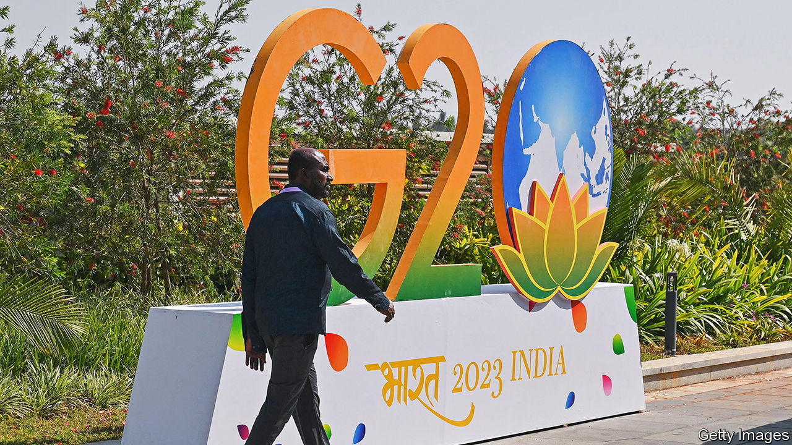

###### Global India

# India’s G20 presidency will be a win for Narendra Modi 

##### But a summit this week will expose bitter global divisions 

 

> Feb 28th 2023 

VENTURE out into any big Indian city these days and you might think India’s G20 presidency is the country’s main preoccupation. Roundabouts, historic monuments and airports are plastered with posters displaying its logo, a green-and-saffron rendering of “G20”. The “0” is represented by a globe cradled within a flowering lotus. It looks like the insignia of the ruling Bharatiya Janata Party (BJP). Images of Narendra Modi, India’s prime minister, are in close attendance, gazing benignly down.

The advertising blitz reflects the Modi government’s ambition for India’s year-long turn at the wheel of the 20-member club—which started last week with a meeting of finance ministers in Bangalore. India wants to promote the G20, whose members account for 85% of the world’s gDP, as a forum for solving big problems. As the self-styled “Voice of the Global South”, it especially wants to stress the importance of powerful developing countries in that effort. Perhaps above all, it wants to use the G20 as a stage for Mr Modi to show off the strides India has made to visiting bigwigs and, with a general election due next year, also to Indian voters.

The official agenda for India’s G20 presidency emphasises the demands of poor countries: for inclusive growth, climate finance, more “representative” multilateral institutions and progress on the UN’s Sustainable Development Goals, which has been set back by the fallout from covid-19. “India will probably never get the permanent seat on the UN Security Council that it wants, so it’s trying to work through other forums,” says Mohan Kumar, a former Indian ambassador to France who leads research on the G20 at the Jindal School of International Affairs, near Delhi.

How realistic are these ambitions? In some ways, geopolitics is working in Mr Modi’s favour. Western governments also want India to play a bigger global role. They view it as a potential bridge to the developing world, as Joe Biden implied last week by nominating Ajay Banga, an India-born American citizen and former ceo of Mastercard, to head the World Bank. They also see it as a democratic counterweight to China (notwithstanding the bjp’s anti-democratic harassing of its domestic critics). On a visit to India last week, Olaf Scholz, Germany’s chancellor, said he was “convinced that our countries are closely linked, that we have common views, especially when it has to do with democracy”.

India’s G20 presidency seems sure to win the country many more such plaudits. Yet it seems unlikely to inspire much progress towards its goals. An informal grouping with no charter and no secretariat, the G20 relies on consensus among its members to get things done. Formed in 1999 in the wake of the Asian financial crisis as a more inclusive forum to discuss economic co-operation than the G8 (now G7) of rich industrialised countries, it achieved its one standout success in April 2009, when its members, fearing an impending depression, agreed on measures to stabilise global financial markets. These days they are not comparably united on any issue.

Anyway, thanks for coming…

The club is divided by several geopolitical faultlines. America and some of its allies are embroiled in an economic and ideological conflict with China. They are also supplying Ukraine with money and weapons while slapping sanctions on Russia. Some poor and middle-income countries, including India, also worry about China. But when it comes to Ukraine, they, with India again to the fore, are mainly concerned about the damaging effect of Western sanctions on food and energy security and on their public finances.

There is little to suggest India will make a serious effort to bridge such gaps. Forging consensus requires horse-trading and compromise, neither of which is prominent in Indian foreign policy. It elevates the pursuit of narrow self-interest, issue by issue and never mind the contradictions, to the level of doctrine. For example, even as India is deepening its ties with America and its many pro-India allies, Mr Modi’s government is playing to its domestic supporters by accusing the same countries of pushing an “anti-India” agenda.

In an interview last week Subrahmanyam Jaishankar, India’s razor-sharp foreign minister, suggested a BBC documentary critical of Mr Modi’s role during a bloody pogrom against Muslims in his native state of Gujarat was an attack on India by foreign powers. “There is a phrase called ‘war by other means’. This is politics by other means…I don’t know if election season has started in India, but for sure it has started in London and New York,” he said. India’s Western admirers are to a great extent willing to overlook such nonsense. Still, grandstanding and paranoia are not conducive to global leadership.

The G20’s divisions over Ukraine helped ensure the gathering of finance ministers in Bangalore achieved little. The representatives of China and Russia refused to sign a painfully non-judgmental statement on the war and its economic consequences that India had pre-cooked; it stressed the existence of “other views and different assessments of the situation”. Ahead of a meeting of foreign ministers in Delhi this week, Russia accused the West of “destabilising” the G20 by using “blackmail” to impose an anti-Russian “diktat”. “It’s becoming difficult for the G20 to engage in constructive discussion because of Russia’s invasion of Ukraine,” Japan’s finance minister, Suzuki Shunichi, told reporters in Bangalore.

Restructuring sovereign debt is also a sticking-point, says Heribert Dieter of the German Institute for International and Security Affairs, in Berlin. “China has made it clear it will not participate in restructuring, and Western countries will not accept haircuts only for the money to be spent on paying China back.” So is another Indian priority, climate finance, which has been stymied by Western countries’ failure to honour long-standing undertakings on the issue, even as developing countries pile up additional demands for compensatory “loss and damage” payments. The G20 looks extremely unlikely to reach consensus, let alone take action, on any significant item on India’s agenda.

It will burnish Mr Modi, though. Over the course of the year, cities across India, all decorated in G20 and Modi paraphernalia, will host foreign delegates at some 200 meetings. The slogan of India’s presidency is: “Vasudhaiva Kutumbakam”, or “One Earth, One Family, One Future”. And one leader, an Indian observer might add. ■

