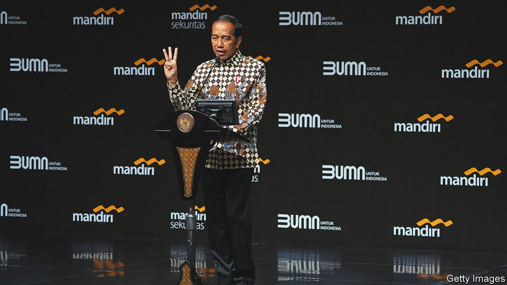

###### Indonesia and ASEAN

# South-East Asia is crying out for regional leadership 

##### Joko Widodo, Indonesia’s president, is unlikely to provide it 

 

> Mar 2nd 2023 

Last november, as the war in Ukraine raged, there were fears that the G20 summit in Bali would be ruined by no-shows and walkouts. But the talkfest was a modest success. China’s leader Xi Jinping met Joe Biden for the first time in person since he had become America’s president. The 20-member club issued a joint statement (the most debated paragraph, about Russia’s invasion of Ukraine, declared that most members condemned the war). Can Indonesia work the same magic as the new chair of the ten-member Association of South-East Asian Nations (ASEAN)?

The region could use some leadership. In the past two years Myanmar’s civil war is estimated to have cost 30,000 lives and displaced 2m people. China continues to bully its South-East Asian neighbours in the South China Sea. And ASEAN has struggled to exude the sense of purpose of the Pacific’s newer groupings, including the Quad, an initiative of America, Australia, India and Japan, and aUKUS, consisting of America, Australia and Britain. 

Indonesia’s year-long turn at the helm should at least give asean more prominence. The country is the region’s biggest economy and asean’s so-called “first among equals”. Under President Joko Widodo, Indonesia, long a bystander in world affairs, has also exerted itself a bit more abroad. Jokowi, as the president is known, is a fan of “down to earth” diplomacy, which mainly translates as prioritising Indonesia’s economic advantage.

According to Rizal Sukma, a former Indonesian ambassador to Britain, the country’s diplomats are given three orders: to boost exports, foreign investment and tourism. The slogan of Indonesia’s Asean leadership is “epicentrum of growth”.

Yet that approach does not promise much action against China’s regional aggression. Jokowi’s signature economic policy is to extract more value from Indonesia’s rich mineral deposits. And no country is contributing more to that effort than China, which has invested billions of dollars into helping Indonesia process its nickel reserves, among the world’s largest. This has sometimes caused frictions within Indonesia. Chinese and Indonesian workers have come to blows at some Chinese projects. A China-backed high-speed rail project is running over deadline and budget. Still, Chinese investment of over $8bn in Indonesia in 2022 is a powerful reason for Jokowi not to push back at China to anything like the degree that some asean members and America (which invested $3bn) would like him to.

The president is mainly concerned to protect Indonesian waters from Chinese maritime aggression. With that in mind, Indonesia recently signed a deal with Vietnam to demarcate their exclusive economic zones, which the two countries had previously contested. Jokowi is additionally keen to defend Indonesia’s sovereignty against China around the Natunas, east of Singapore. Though China does not claim the Indonesian islands directly, the “nine-dash-line” it has drawn around nearly the entire South China Sea bisects their waters.

Yet though this is an issue that affects most of Asean‘s members, Jokowi is not likely to rally them on it. In truth, he appears to have no particular ambitions for Indonesia’s ASEAN helmsmanship beyond attracting more investment and trade.

His attitude toward Myanmar’s ruling junta will be a test of this. Last year ASEAN banned the generals from attending its meetings, pending progress on a notional peace plan, which would include a cessation of violence and the appointment of a regional envoy to the war-torn country. Myanmar has not implemented the plan. And ASEAN is split on how to respond.

Thailand tried to negotiate with the junta in December, through an unofficial dialogue which was boycotted by Indonesia, Malaysia, the Philippines and Singapore. Some ASEAN countries may argue that the election that the junta plans to hold in August should lead to a broader regional re-engagement. Jokowi has given conflicting signals. He says ASEAN will not be “held hostage” by the junta; also that Indonesia will send a general to Myanmar to hold talks. This does not augur a serious effort to end the country’s misery.

Indonesia is meanwhile gearing up for a presidential election due in February 2024. After two terms in office, Jokowi is not running for re-election. But the domestic issues that will dominate the campaign could still bleed into his foreign policy, one way or another. Fresh conflict between Chinese and Indonesian workers might put pressure on the president to push back on Chinese aggression a little harder. Or, perhaps more likely, it may persuade him to make his thorny regional leadership role even less of a priority than he otherwise would. ■

