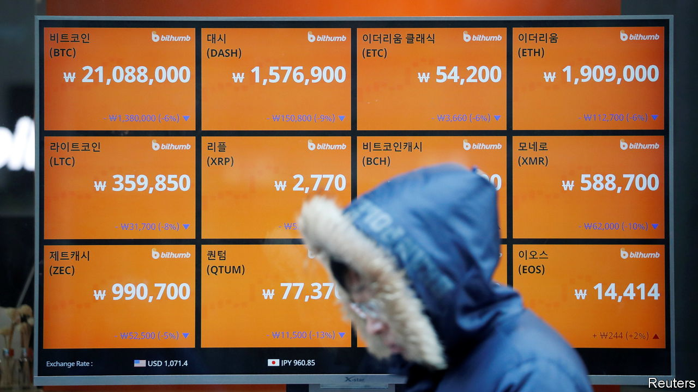

###### Micro YOLO

# Young South Koreans are embracing fractional investing 

##### Tiny shares of non-traditional assets represent a beguiling, not entirely safe, entry-level investment 

 

> Mar 2nd 2023 

WHEN A video of the Brave Girls performing “Rollin’” went viral in early 2021, Kim Seong-min saw an opportunity. He knew and liked the K-pop group from his time in the army, during which it had often performed for the troops. He therefore logged onto Musicow, a platform launched in 2016 where users can buy a small percentage of the rights to music royalties, and got himself some shares to the song for 670,000 won ($506) apiece. A few months later their value had doubled. Encouraged, he bought more.

Young South Koreans are unusually keen to put their meagre savings to work—perhaps because the country’s lacklustre jobs market makes it hard for them to buy property or support a family. A survey in 2021 found that eight in ten people in their 20s and 30s invest in stocks, cryptocurrencies or other assets. And they start young; 7% of shareholders in Samsung Electronics, a tech manufacturer, are in their teens.

Particularly in vogue are fractional investment platforms, which allow buyers to hold very small stakes in assets. Such investments exist worldwide, real estate being a particularly popular fractional-investing target. But South Korea, ever the fast adaptor, has been unusually adventurous in its offerings. Musicow’s 1.2m users trade rights to song royalties, hoping to pick the next chart-topper or  (karaoke-room) classic. Tessa is one of several platforms trading in fragments of fine art, included works by Banksy and David Hockney. For as little as 1,000 won, investors can secure a tiny return when their painting is rented to a gallery or auctioned. On Bancow, users invest in calves; when their animal is sold, they split the profit with the farmer who reared it. “It’s the only way to get rich and make honest money without breaking the law,” says Mr Kim. 

Enthusiasts argue that fractional investments are safer than digital coins or traditional stocks. Crypto has had a horrendous run, starting last May with the crash of Luna, a South Korean coin. The kOSPI, an index of companies on the South Korean stockmarket, dropped by over 20% in 2022. That makes Musicow’s returns of nearly 9% in 2022 look appealing.

But this perception is often misplaced, says Hong Ki-hoon of Hongik University. Fractional investors are buying assets no “safer in terms of the financial risk than traditional assets”. Mr Kim is now learning this the hard way; “Rollin’” fragments are currently worth 334,000 won.

The Financial Services Commission (FSC), South Korea’s regulator, agrees with Mr Hong. It has classified the assets traded on Musicow as securities, and may take similar steps to constrain other fractional-investing platforms. It will be guided by the Howey test, an American rating of financial instruments, under which most fractional investments could in theory be classified as securities.

Yet the government wants to see the industry grow. The FSC has also deemed Musicow an innovative financial service. On February 5th it announced plans to allow the issuance of security tokens, a blockchain-based asset that facilitates fractional investment. The finance ministry has ruled that profits generated from fractional shares will not be subject to dividend or capital-gains taxes. Securities firms, encouraged by these developments, are rushing to strike deals with fractional-investing platforms. Entry-level investors should proceed more cautiously. ■

