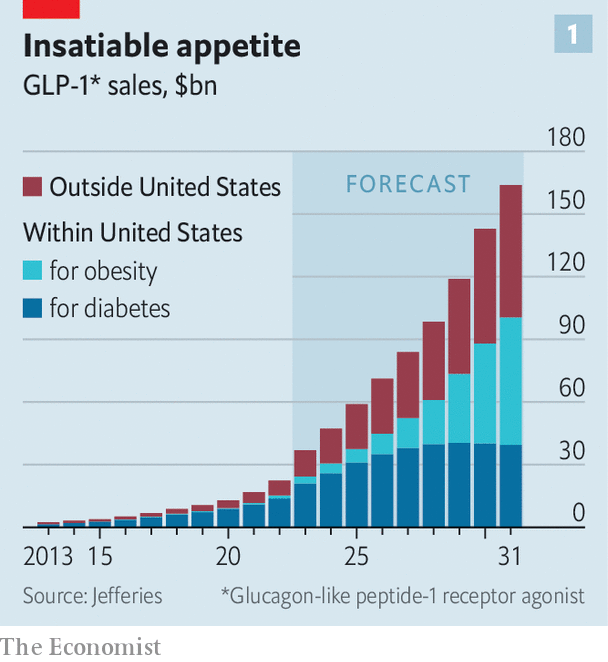
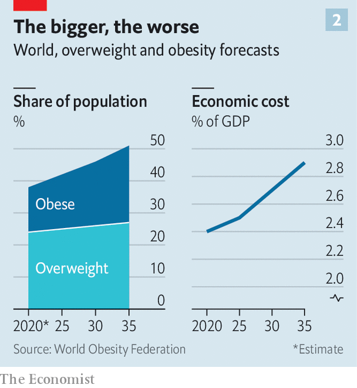
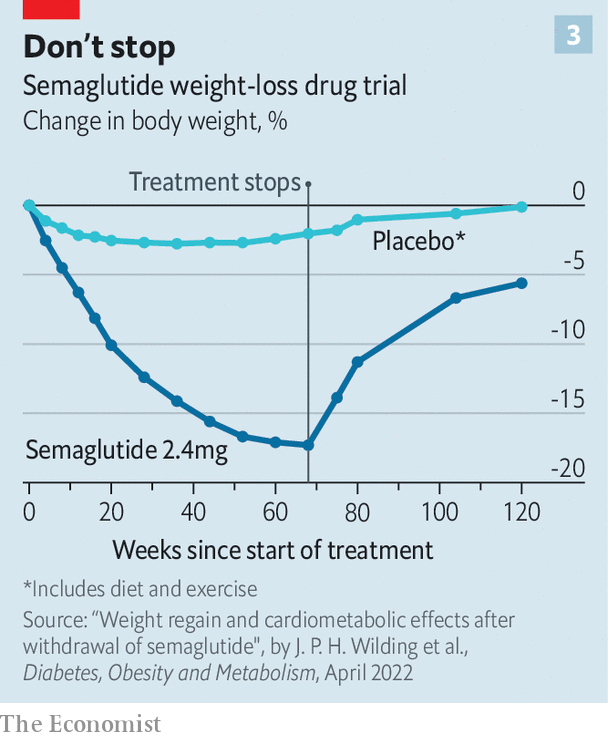

###### Big shots

# A new class of drugs for weight loss could end obesity 

##### They promise riches for drugmakers, huge savings for health systems and better lives for millions 

 

> Mar 2nd 2023 

How did Kim Kardashian, a reality tv star, lose enough weight to fit into a slinky dress once worn by Marilyn Monroe? She has talked about a diet and exercise, but lots of her fans think it could also be thanks to new weight-loss drugs that many far-from-fat celebrities are said to be taking to keep their figures supremely svelte. There is no need to speculate about Elon Musk, a famed entrepreneur: he readily admits that one such drug, Wegovy (semaglutide), has helped him shed weight. In fact, social media are awash with pictures of delighted patients flaunting before-and-after snaps that prove just how effective these novel medicines are. 

Investors and analysts are as excited as the gossip columnists. Some estimate that Novo Nordisk, the Danish pharmaceutical firm that makes Wegovy, will sell $3bn-4bn of it in America alone this year. The firm plans to launch the drug in many more countries in the coming months. Its share price is up by 40% over the past year and has doubled over the past two. 

 


Eli Lilly, another pharmaceutical firm, hopes to start selling a similar treatment for obesity, called Mounjaro (tirzepatide), as early as this summer. In trials, recipients shed an astonishing 20% of their weight on average. UBS, a bank, thinks it could become the “biggest drug ever”. Jefferies, an investment bank, says that by 2031 the market for these drugs, collectively known as GLP-1 agonists, will exceed $150bn (see chart 1). That is on a par with all drugs to treat cancer, sales of which amounted to about $185bn in 2021. 

Even such head-turning numbers do not fully capture the drugs’ potential, however. Obesity is a problem of staggering global proportions—and one that afflicts few celebrities, but legions of ordinary people. In 2023 the World Obesity Federation (wof), an NGO, says 1.1bn people aged older than five, or roughly 14% of all people in that age bracket, were obese. A further 1.6bn, or 24% of all the world’s over-fives, were overweight. In a report to be published on March 3rd, to mark World Obesity Day, the federation projects that 4bn people—half of everyone over five—are likely to be overweight or obese by 2035 (see chart 2, left-hand panel).

 


The report estimates that the annual cost of humanity’s growing paunch will reach $4trn in 2035, of 2.9% of global gdp, in the form both of spending on health care and of working time lost to illness and premature deaths (see chart 2, right-hand panel). That is the equivalent of another covid-19 pandemic every year.

Moreover, obesity is not just a first-world problem. The costs are growing faster in poor and middle-income countries than they are in rich ones. By 2035, the wof projects that 47% of Mexicans, 46% of Iranians and South Africans and 42% of Malaysians will be obese. Spiralling health-care costs in these countries will be a drag on economic growth. Any treatment that can reduce these numbers could potentially improve the health of billions, and also make the world wealthier.

Tummy trouble

Obesity is typically determined using a ratio of weight to height known as the body-mass index (BMI). A BMI over 25 is normally considered overweight; one over 30 is the standard definition of obesity. Thus an American man of average height (175cm or 5’9”) is considered overweight if he tips the scales at 77kg (170lbs) or more and obese if his weight is 92kg (203lbs) or more. (There are exceptions, such as bodybuilders, who weigh a lot thanks to copious muscles.)

Excess weight is not simply a matter of appearance. Obesity is associated with such grave illnesses as diabetes, strokes and heart disease. John Speakman of the University of Aberdeen notes that women with a BMI of 35 are 90 times more likely to have diabetes than those with a BMI of 23. For men, the risk is five times greater. Obesity also increases the risk of 13 types of cancer, including those of the breast, bowel, womb and oesophagus. More recently, it was found to raise the odds of a patient dying from covid-19. In these and other ways, it causes the deaths of around 4m people a year. 

The solution might seem obvious: to eat less and exercise more. To those of a judgmental nature, the failure to lose weight reflects a lack of willpower. But Louise Baur, a professor at the University of Sydney and president of the wof, rejects the idea that the obesity epidemic represents “the moral failure of hundreds of millions of people”. Fatima Stanford, who studies obesity at Massachusetts General Hospital and Harvard Medical School, notes that attempts to lose weight through diet and exercise work for only 10-20% of the population: “For most people we don’t see a dramatic drop.”

Fat-linger error

The reason almost certainly lies in the evolutionary past. In a state of nature food is rarely plentiful, so  has evolved to hang on to fat. One adaptation is that, when a body’s caloric intake is reduced, its resting metabolism slows. Another is that it releases extra ghrelin, a hormone which signals to the brain to increase food intake. 

Worse, from the point of view of the would-be dieter, a body that has lost weight appears to “remember” its previous level and fights to regain it. “Your entire biology reacts in a way to make you want to go back and eat,” laments Ahmed Ahmed, a British bariatric surgeon. A study of contestants in “The Biggest Loser”, a television show in which participants competed to lose the most weight, found that even six years after their appearance, their metabolisms were still slower than they had been before they started dieting. The amount they could eat without prompting an increase in weight had, in effect, diminished. Diets, in other words, get progressively harder to sustain.

What is more, obesity has a sizeable genetic component, and so is partly inherited. Dr Speakman says between 45% and 65% of an individual’s risk of becoming obese is passed down in this way. A predisposition, though, needs encouragement to manifest itself. It is not just people’s genes, but also the “obesogenic” circumstances in which so many of them live that is adding to the species’ girth. As Dr Baur puts it, obesity is “a physiological response to what has become a pathological environment”.

The most notable feature of that environment is an abundance not simply of food but, more specifically, of processed food. Merely grinding and reconstituting the food given to lab rats causes them to put on weight. In 2019 a similar experiment on people by Kevin Hall of America’s National Institutes of Health and colleagues showed that, under controlled conditions, people consume more calories if offered mainly processed rather than unprocessed food.

And gaining fat is easy in a mechanised world. Work used to consist of arduous manual labour for the vast majority of humanity—but not any more. For most people in the rich world, and a fast-growing proportion in developing countries, physical exercise is no longer a necessity, but an entirely voluntary pastime, to be pursued in leisure moments, if at all. A study published in 2011 looked at how active people’s work had been in America over the previous five decades. Between 1960 and 2006 there was a reduction in energy expended of 100 calories a day, on average—an amount that turned out to account for much of the increase in Americans’ weight over that period. 

Processed food and sedentary lifestyles are the principal elements of today’s obesogenic environment, but other things are involved as well. Depression and other mental-health conditions—and some of the drugs used to treat them—encourage weight gain. Dr Stanford says that 20% of America’s obesity problems are tied to medications such as lithium, antidepressants and anti-insomnia drugs. For women, the menopause is also reckoned obesogenic.

The steady growth of human waistlines has defied the efforts of doctors, dieticians, pharmacologists and policymakers for decades. Ever more elaborate rules about how food is labelled or marketed have not made a dent in the problem. Taxes on unhealthy ingredients are unpopular, in part because they place a far higher burden on the poor than on the rich. A good indication of how desperate so many people are to lose weight is the nearly $250bn the world spent on dieting last year, even though it tends not to work.

Drug companies have offered a series of ineffective and sometimes dangerous treatments. There was dinitrophenol, used in diet pills during the 1930s, which caused perhaps 25,000 people to lose their sight. Later on amphetamines became popular (and effective) slimming aids—until the risk of addiction and other side-effects became apparent. Ephedra, a herbal medicine containing a substance like amphetamines, was banned in America in 2004 after it was tied to heart attacks and strokes. A few years later two other treatments, rimonabant and sibutramine, were withdrawn from sale, amid concerns about their safety. 

Staple diet

In extremis, the seriously fat can turn to bariatric surgery, in which their stomachs and small intestines are rearranged to reduce the amount of food absorbed, and to accelerate the feeling of being sated. This, says Dr Ahmed, can reduce body weight by 30% to 50% in the first six months, and potentially more after that. It also brings improvements in blood pressure, breathing, sleep, cholesterol and back pain. And many patients will no longer be diabetic after surgery.

Surgery, though, is a drastic response to the problem, and is limited by the number of surgeons. Hence the excitement about GLP-1 agonists, which can be administered by patients themselves as weekly injections. The new drugs were first devised as treatment for diabetics. They mimic hormones the body produces naturally after a meal, which stimulates the release of more of a second hormone, insulin, and less of a third, glucagon. Together, these effects regulate the level of glucose in the blood.

In addition, however, GLP-1 agonists slow down the rate of “gastric emptying”, which means food stays in the stomach for longer, so people feel fuller and want to eat less. The drug also affects the hypothalamus, the part of the brain that controls hunger. What is more, GLP-1 has an effect on fat, too, making the body more likely to break it down.

Novo Nordisk began selling semaglutide, the first GLP-1 agonist, in 2017 under the brand name Ozempic, to treat diabetes. But having noticed how many of the recipients slimmed down dramatically, it soon began testing the drug as a weight-loss treatment. In a 40-week trial a third of patients lost more than 10% of their body weight after taking a weekly dose of 1mg. A second trial, of a 2.4mg weekly dose for 68 weeks, brought an average weight loss of 15%. That is the dose Wegovy provides; it has been on sale in America since 2021. In December America’s Food and Drug Administration approved its use for 12- to 18-year-olds as well. 

Mounjaro, meanwhile, activates the same GLP-1 receptors as Wegovy, but also mimics a second hormone involved in the regulation of appetite. In trials it stimulated an astonishing 20% reduction in body weight on average. Many other drug companies, sensing a possible bonanza, are working on similar products. 

Not to everyone’s taste

The new treatments are not without their flaws. For one thing, there are side-effects, including vomiting and diarrhoea, which were severe enough to cause 3% of patients to stop using them in a survey conducted by the Mayo Clinic, an American hospital. In addition, they are supposed to be taken as part of a broader programme of dieting and exercise—although it is not clear how essential this is to the weight loss. Semaglutide, specifically, appears to increase the risk of a rare type of pancreatitis. There are also concerns over the use of the drugs during or just before pregnancy. And studies in animals have shown a higher incidence of thyroid cancer.

 


For many these risks will be worth running. A bigger drawback, however, is that those who start taking the new drugs are likely to depend on them for life. Stop, and the weight piles back on, just as with most conventional diets. In the first year after stopping a 2.4mg dose of semaglutide, people regain two-thirds of the weight they lost (see chart 3). And, as with dieting, some people even put on more weight than they started with. 

The need to keep injecting is fine with drug companies, but it makes doctors more cautious, given the lack of data on the effects of lifelong use. Britain’s draft national guidelines say semaglutide should not be taken for more than two years for weight loss. But as more data on the drugs’ long-term effects become available, it is possible that they will become like statins, a medicine to lower cholesterol that is commonly prescribed for life.

 


Lifelong commitments can be expensive, however. Taking Wegovy costs around $1,300 a month in America and Ozempic about $900. The market will clearly bear this: so great is the demand for the drugs for weight loss, many diabetics complain, that they cannot get hold of them for their original purpose.  has set up a page on its website to reassure potential customers who are struggling to find any Wegovy. “We are taking significant measures to increase our production capacity,” it declares. The firm has hired a second contract manufacturer to make the drug; the first is expanding its output.

Insurers and governments will presumably be able to negotiate discounts to drugmakers’ list prices. And as rival products come to market, prices should come down eventually. In the very long run the new drugs will lose their patents, and become available in generic form.

But at the moment, in America, relatively few insurance policies cover Wegovy—mainly those backed by employers. (This still leaves Wegovy a potential American market of 40m patients, notes Lars Jorgensen, Novo Nordisk’s chief executive.) Governments are even more hesitant. Although the drug has been licensed in Denmark and Norway, it is not provided through the state health system in either country. Britain’s National Health Service has been reviewing the drug; it seems likely to make it available soon, but only to the most obese patients and only through specialised clinics.

This caution will presumably evaporate if it becomes clear that widespread use of the drugs will bring big cost savings to insurers or governments in the form of avoided treatments for conditions related to obesity. Daniel Chancellor of Citeline, a market-research firm, says GLP-1 agonists have reduced strokes and heart attacks in those taking them for diabetes by 14%, deaths from all causes by 12% and hospital admissions for heart problems by 11%. Novo Nordisk is sponsoring a formal trial looking at semaglutide’s impact on cardiovascular disease among overweight and obese patients. It started in 2018 and is due to conclude later this year.

A frantic spate of haggling will doubtless follow. Insurers and health systems will need to weigh the massive cost of treating diseases linked to obesity, and the improved quality of life the new drugs will bring, against the prices drugmakers are demanding, multiplied across the lifetimes of likely recipients. But the scope for savings is enormous.

Reducing the global numbers of the overweight and obese by five percentage points below the current trend would bring annual savings of $429bn, according to a study published in, a medical journal (that figure includes the benefits of the obese living longer, more productive working lives). The potential benefits would extend to middle-income countries, too. The study expects the costs of obesity to rise by 3.6% a year between now and 2060 in Australia, but by 6.6% in Thailand and 7.6% in India.

The fact that a growing share of humanity has more than enough to eat and no need to exhaust itself through constant, gruelling physical labour should be cause for celebration. Indeed, to most people, it would seem an obvious sign of progress. Yet those same heartening trends are also entombing billions of people in a shroud of fat. The misery associated with this global epidemic of obesity is vast. It kills millions, makes many more sick, costs huge sums—and is an unfathomable well of stigma and shame for those afflicted. If the new drugs being deployed against obesity can reduce this unhappy tally by even a small amount, they should be welcomed with open arms. ■

