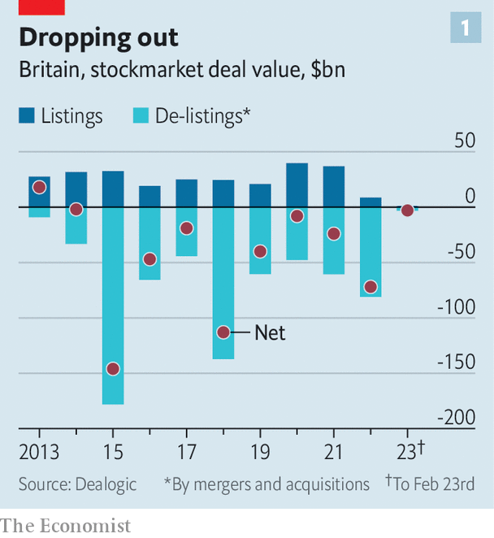
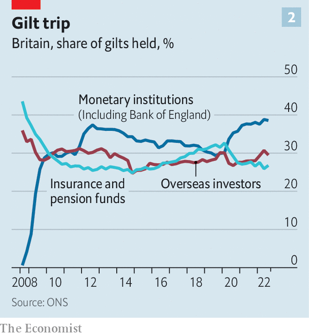

###### Capital flight

# Britain’s stockmarket has languished. Its gilt market may be next 

##### Over the next few decades, demand is set to slowly leak away 

 

> Mar 2nd 2023 

Look at britain’s ftse 100 share index and you might think that the City of London is once again on top of the world. Investors around the globe had a terrible time in 2022, but those who stashed their money in London’s bourse were spared. America’s tech-heavy nasdaq index fell by a third, making it one of the worst years on record. Meanwhile, the ftse 100 hit a new record high last month. While rising interest rates and higher commodity prices hammered many stocks, they flattered the banks, miners and energy giants of London’s once-unfashionable stock exchange.

Even Britain’s sovereign-debt, or “gilt”, market has settled down. Just months ago a by Kwasi Kwarteng, then chancellor of the exchequer, threatened it with catastrophe. But under Jeremy Hunt, Mr Kwarteng’s more competent and responsible successor, a repeat seems out of the question. As Mr Hunt prepares to unveil a new budget on March 15th, government borrowing is set to be £30bn ($36bn, or 1.3% of GDP) lower this fiscal year than forecast in November.

Yet the benign headlines mask a long-running exodus from Britain’s capital markets. The 21st century has seen  shrivel compared with those in the rest of the world, from accounting for 13% of global equity value to just 4%. Initial-public offerings (ipos), though thin on the ground everywhere during last year’s market crash, were nearly unheard of in the City. Less than 1% of the capital raised through global ipos was raised in London, down from 18% in 2006. 

 


Meanwhile, barely a month has gone by without another ftse 100 or ftse 250 firm deciding to leave London’s bourse. Recent examples include Aveva, Avast, HomeServe, Micro Focus and Ultra Electronics. All told, some £80bn-worth of shares were de-listed from Britain’s public market last year in favour of private ownership or corporate takeovers (see chart 1).

Big firms are ditching their British listings. Flutter, the world’s largest listed betting company, wants its shareholders to approve a secondary listing in New York, in part to give it the choice of later moving its primary listing there. Arm, one of Britain’s most successful tech companies, was taken private in 2016 but is poised to re-enter the public markets. Its owner’s chief executive describes the nasdaq, rather than the London Stock Exchange, as the “most suitable” venue. Even Shell, an energy giant and the largest firm listed in Britain, is reported to have mused about moving its listing to America.

The causes of this decline are now largely self-reinforcing. Because  exciting ipos, its stockmarket is associated with laggards and investors assign it a low valuation. That nudges promising firms towards other, more illustrious exchanges where they can raise more money. The good businesses that remain in London, meanwhile, look like cheap and enticing takeover targets for foreign buyers. So Britain’s bourse loses more good companies, and the cycle starts again.

This vicious circle was kicked into motion by the gradual disappearance of a key buyer of domestic stocks. Defined-benefit (db) pension schemes, today worth £1.5trn, have gone from having around a quarter of their assets invested in London-listed shares in 2008 to less than 2% in 2022.A combination of regulatory incentives and the db schemes’ increasing maturity drove them away from the risk and growth potential of stocks and towards the safety of bonds. As a result, Britain’s stockmarket lost part of its natural capital base, setting it on its downward path.

 


Raj Mody of PwC, a consultancy, argues that a worryingly similar dynamic may now be at play in Britain’s sovereign-debt market. Pension and insurance funds own 27% of gilts by market value (see chart 2). db schemes are particularly strongly incentivised to hold them, as regulations allow them to match the cash flows generated by gilts to their future liabilities. That eliminates the risk that future market movements will push them into deficit.

After decades of underfunding, PwC estimates that db schemes now, in aggregate, have sufficient assets to pay insurers to take on their liabilities. For the employers responsible for the schemes, this is attractive: it allows them to offload all their remaining risk, and between £40bn and £50bn of such “buyouts” now take place annually. Yet insurance funds, subject to different regulations to db schemes, are less inclined to load up on gilts, preferring higher-yielding assets like corporate bonds, leases and infrastructure. The investment in riskier assets is a boon. But it also sets the stage for the long, slow exit of one of the gilt market’s biggest buyers.

To make matters worse, an even bigger buyer of gilts is departing at the same time. Through successive waves of quantitative easing, or large-scale purchases of government bonds with newly created money, the Bank of England has amassed an enormous portfolio of gilts. Now it, too, is in exit mode. The bank began selling its holdings in November, aiming to reduce them by £80bn per year. The result is a vast increase in the amount of gilt issuance the rest of the market will be asked to absorb. Citigroup, a bank, estimates that in the coming fiscal year Britain’s government will need to borrow twice as much net cash from private investors (as opposed to its central bank) as it has in the past eight years combined.

With such important buyers of Britain’s sovereign debt departing, who is left to sell to? Foreign investors make up most of the rest of the market. But following the country’s near meltdown last autumn, they are increasingly wary. And in any case, British assets no longer seem like a must-have for a global investor’s portfolio. Buying long-dated gilts, says one American hedge-fund manager, means buying a long-term stream of sterling income “and what the hell am I going to do with the sterling?”

Britain’s government-debt market, then, may see demand steadily leak away over the next few decades in the same way the stockmarket has over the past few. Both declines have consequences, but those of the second may be felt more keenly. A stagnant stockmarket is a totemic blow to the City of London’s status as a global financial centre. And if overseas listings pull innovative firms elsewhere, they are less likely to contribute to Britain’s future prosperity. A lack of demand for sovereign debt makes borrowing more expensive for taxpayers at a time when public services are already creaking and demands on government spending only likely to grow. Meanwhile, as the Treasury finds it harder to issue long-dated debt its exposure to short-term interest-rate changes will rise.

As backbench Tory mps press Mr Hunt to revive their tax-cutting agenda in his coming budget, they might pay more heed to Britain’s increasingly fragile capital markets. His predecessor’s mistakes provided a stark reminder that investors’ appetite for sterling assets has hard limits under a fiscally irresponsible government. Britons could do without another one. ■


